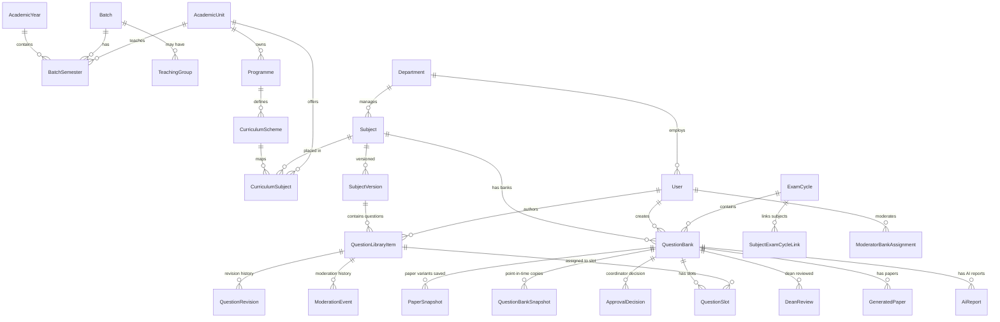
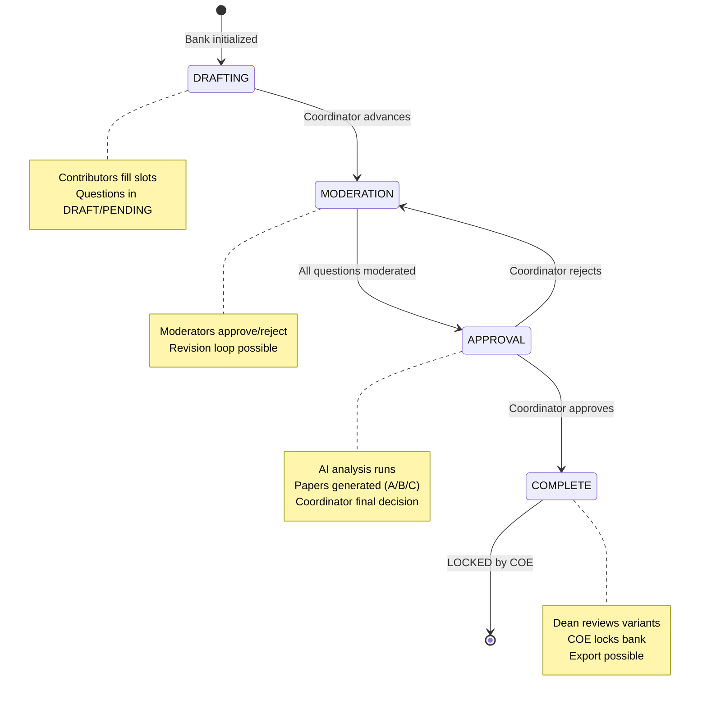

# EMQPGS — Engineering Handoff Document

> **Prepared:** 18 June 2026  
> **Codebase:** `emqpgs-platform` v0.1.0  
> **Stack:** Next.js 16 · Prisma ORM 6 · MySQL 8 · MinIO S3 · Auth.js v5 · Ollama (optional)  
> **Repository:** `C:\Users\Raunak\Documents\code\emqpgs`

---

## 1. Project Overview

### What This Application Does

EMQPGS (Examination Management & Question Paper Generation System) manages the complete lifecycle of academic examination question papers. It controls the workflow from subject setup through question contribution, moderation, AI analysis, paper generation, dean review, and final export.

**Core value proposition:** A university examination department (Controller of Examination) can manage question banks across multiple departments, enforce quality control through moderation and AI analysis, generate randomized paper variants, and produce downloadable exam packets — all without spreadsheets or email chains.

### Target Users (5 Roles)

| Role | Abbr | Typical User | Primary Concern |
|---|---|---|---|
| Controller of Examination | COE | Exam department admin | System configuration, user management, audit, final production |
| Coordinator | COORD | Department academic head | Subject/bank setup, moderator assignment, final approval |
| Contributor | CONTR | Faculty member | Writing and submitting questions |
| Moderator | MOD | Senior faculty | Reviewing questions for quality and coverage |
| Dean | DEAN | Academic dean | Selecting final paper variants from generated options |

### Overall Workflow

```
COE creates Academic Year → COE creates Batches & Semesters
    → COE creates Exam Cycle for a (Batch × Semester)
    → Coordinator links Subjects → initializes Question Banks
    → Coordinator assigns Contributors & Moderators
    → Contributors write questions → assign to bank slots
    → Moderators approve/reject/request revision
    → Coordinator triggers AI analysis (deterministic + optional LLM)
    → Coordinator reviews → approves bank (→ COMPLETE phase)
    → Coordinator generates 3 paper variants (A/B/C)
    → Dean selects: which variant for Regular, Supplementary, KT
    → COE exports final packets → locks bank
```

### Major Modules

| Module | Files | Purpose |
|---|---|---|
| `coordinator/` | 6 files | Coordinator dashboard, subject management, bank workflows, reporting |
| `question-banks/` | 6 files | Bank CRUD, phase transitions, slot summaries, mutability guard |
| `question-library/` | 3 files | Question CRUD, ownership transfer, revision/usage history |
| `question-slots/` | 3 files | Slot assignment (positioning questions within a bank) |
| `moderation/` | 1 file | Approve/reject/request revision on questions |
| `reports/` | 6 files | Paper generation, AI analysis, PDF service |
| `readiness/` | 1 file | ReadinessEngine — gates phase transitions |
| `production/` | 3 files | Dean review, export artifacts, document service |
| `exam-cycles/` | 3 files | Exam cycle CRUD + batch linking |
| `notifications/` | 2 files | In-app notification + email sending |
| `curriculum-subjects/` | 3 files | Subject-to-semester mapping (curriculum placement) |
| `batch-semesters/` | 2 files | Per-batch semester lifecycle |
| `batches/` | 2 files | Cohort/student group management |
| `ai/` | 1 file | Ollama LLM integration |
| `users/` | 2 files | CRUD + credential verification |
| `storage/` (lib) | 3 files | MinIO presigned URL file management |

### Current Development Status

- **Backend:** All 26 API endpoint groups implemented. ~70 route files.
- **Frontend:** All 5 role dashboards implemented with server components.
- **Database:** 41 models, 28 enums, 11 migration files (with schema drift).
- **Tests:** 17 unit test files, 1 e2e validation script, 1 integration test.
- **Seed:** Recently rewritten to generate 3 academic years of realistic COMP data. Has a known runtime error (schema drift — see §11).
- **Known Issues:** `Subject.semesterNumber` column exists in DB but not in schema (drift). `createSubject` doesn't write `semesterNumber` (bug). Seed fails on databases with the full migration chain applied.

---

## 2. Architecture

### Folder Structure

```
emqpgs/
├── app/                          # Next.js App Router
│   ├── (protected)/dashboard/    # Role-based dashboards (server components)
│   │   ├── coe/                  #   COE: 21 sub-pages
│   │   ├── coordinator/          #   Coordinator: 7 sub-pages
│   │   ├── contributor/          #   Contributor: 4 sub-pages
│   │   ├── moderator/            #   Moderator: 5 sub-pages
│   │   └── dean/                 #   Dean: 4 sub-pages
│   ├── api/                      # 26 API endpoint groups
│   ├── login/                    # Auth page
│   ├── forgot-password/          # Password reset
│   └── layout.tsx                # Root layout + auth/session
├── src/
│   ├── lib/                      # Shared utilities (20 files)
│   │   ├── storage/              #   MinIO providers (3 files)
│   │   ├── api-handler.ts        #   Route wrapper: auth, CSRF, rate-limit, audit, error handling
│   │   ├── api-context.ts        #   Cookie-based user resolution
│   │   ├── auth.ts               #   NextAuth.js v5 config
│   │   ├── jwt.ts                #   Custom JWT sign/verify (15min access + 7d refresh)
│   │   ├── audit.ts              #   SHA-256 chained audit log
│   │   ├── csrf.ts               #   HMAC-signed double-submit cookie
│   │   ├── errors.ts             #   5 error classes
│   │   ├── env.ts                #   Zod-validated env
│   │   ├── optimistic-lock.ts    #   Version-based concurrency control
│   │   ├── db-helpers.ts         #   Unique constraint error messages
│   │   └── constants.ts          #   Labels, enums, RBAC matrix, entity types
│   ├── modules/                  # 28 service modules (thin service–repository–validation pattern)
│   ├── components/               # Shared UI components
│   │   ├── ui/                   #   Primitive UI kit (button, card, input, select, etc.)
│   │   ├── forms/                #   SubjectForm, question-form
│   │   ├── dashboard/            #   Dashboard layout components
│   │   ├── exam-cycles/          #   Exam cycle wizard
│   │   ├── production/           #   Dean review workspace
│   │   └── {role}/               #   Role-specific component groups
│   └── types/                    # Shared types
├── prisma/
│   ├── schema.prisma             # 833 lines, 41 models, 28 enums
│   ├── migrations/               # 11 migrations + 1 pending (manual)
│   └── seed.ts                   # 741-line production seed
├── tests/
│   ├── unit/                     # 17 test files (Vitest)
│   ├── integration/              # 1 integration test
│   └── e2e-validation.mjs        # End-to-end validation script
├── docs/                         # 8 documentation files
└── scripts/                      # Dev/start helper scripts
```

### Database Architecture



**Key design notes:**
- No student table exists. `Batch` is a cohort descriptor only.
- `Subject` and `CurriculumSubject` are separate concerns: Subject = course offering, CurriculumSubject = placement in a semester.
- Question banks are unique per `(subjectId, examCycleId)`.
- Slots follow `@@unique([questionBankId, moduleNumber, marks, slotNumber])`.

### Service Layer Pattern

Every module follows the same structure:

```
src/modules/{domain}/
├── service.ts        # Business logic, orchestrates repository + other services
├── repository.ts     # Prisma queries only (thin wrapper)
└── validation.ts     # Zod schemas
```

**Exceptions:** `reports/` has 6 files (most complex domain), `coordinator/` has 4 service files, `production/` has 3 service files.

### API Layer

Every API route uses the `withApiHandler()` wrapper which provides:

1. **Rate limiting** — per (method × path × IP), 120 req/min
2. **CSRF protection** — double-submit cookie pattern, HMAC-signed
3. **Authentication** — cookie-based JWT access token (15min) with refresh token (7d)
4. **Authorization** — role check via `roles` option
5. **Audit logging** — optional, SHA-256 chain-linked
6. **Error handling** — Zod → 400, Prisma → translated, AppError → passthrough, else → 500
7. **Correlation ID** — every request gets a UUID

### UI Layer

- All dashboard pages are **React Server Components** (no `"use client"` except where interactivity is needed)
- Client components are in `src/components/`
- Data fetching uses `apiFetch()` from `src/lib/client-fetch.ts`
- State management: React state + URL params. No Redux/Zustand.
- Styling: Tailwind CSS v4 with CSS variables (custom design tokens in `globals.css`)
- UI primitives: custom components built on Radix UI primitives

---

## 3. Complete Workflow

### Question Bank Lifecycle



### Role: COE

**Responsibilities:** System configuration, user management, curriculum setup, batch management, final export, monitoring.

**Pages visited (21 routes):**

| Route | Purpose |
|---|---|
| `/dashboard/coe` | Overview: stats, active cycles, recent locks |
| `/dashboard/coe/academic-setup` | Academic year + batch semester setup wizard |
| `/dashboard/coe/academic-years` | Academic year CRUD |
| `/dashboard/coe/academic-units` | Academic unit CRUD |
| `/dashboard/coe/batches` | Batch (cohort) CRUD |
| `/dashboard/coe/batches/[id]/semesters` | Per-batch semester management |
| `/dashboard/coe/batch-semesters` | Batch semester CRUD |
| `/dashboard/coe/curriculum` | Curriculum subject mapping |
| `/dashboard/coe/curriculum-schemes` | Scheme CRUD |
| `/dashboard/coe/curriculum-subjects` | Bulk subject-to-semester assignment |
| `/dashboard/coe/programmes` | Programme CRUD |
| `/dashboard/coe/departments` | Department CRUD |
| `/dashboard/coe/users` | User CRUD |
| `/dashboard/coe/coordinator-assignments` | Assign coordinators to departments |
| `/dashboard/coe/exam-cycles` | Exam cycle CRUD + timetable |
| `/dashboard/coe/exam-cycles/[id]` | Exam cycle detail |
| `/dashboard/coe/production` | Export packets from locked banks |
| `/dashboard/coe/audit` | Audit log viewer |
| `/dashboard/coe/monitoring` | System health (MinIO, DB, backups) |
| `/dashboard/coe/teaching-groups` | Teaching group assignment |
| `/dashboard/coe/semesters` | Semester management |

**APIs used (19 groups):**
`/api/academic-years`, `/api/academic-units`, `/api/batches`, `/api/batch-semesters`, `/api/programmes`, `/api/curriculum-schemes`, `/api/curriculum-subjects`, `/api/departments`, `/api/users`, `/api/coordinator-departments`, `/api/exam-cycles`, `/api/exports`, `/api/subject-versions`, `/api/teaching-groups`, `/api/audit-logs`, `/api/backups`, `/api/monitoring`, `/api/health`, `/api/dashboard`

**Key workflows:**

1. **Academic Setup:** Create AcademicYear → Create Programme → Create CurriculumScheme → Create Batch → Create BatchSemesters → AcademicUnit setup → Create Subjects → Map CurriculumSubject
2. **Exam Cycle:** Create ExamCycle (picks up curriculum subjects) → Opens ENDSEM/ISE cycles → Monitor bank progress → Lock banks → Export packets

### Role: Coordinator

**Responsibilities:** Subject management, question bank initialization, contributor/moderator assignment, phase advancement, AI report review, paper generation trigger.

**Pages visited (7 routes):**

| Route | Purpose |
|---|---|
| `/dashboard/coordinator` | Dashboard: bank status, phase distribution, attention items, recent activity |
| `/dashboard/coordinator/subjects` | List/manage subjects |
| `/dashboard/coordinator/subjects/[id]` | Subject detail + exam cycle links |
| `/dashboard/coordinator/question-banks` | List/manage all question banks |
| `/dashboard/coordinator/question-banks/[id]` | Bank detail: slots, moderation status, papers, dean review |
| `/dashboard/coordinator/assignments` | Assign moderators/contributors to banks |
| `/dashboard/coordinator/exam-workspace/[id]` | Full exam workspace: questions, moderation, papers |
| `/dashboard/coordinator/questions` | Question library viewer |
| `/dashboard/coordinator/coverage` | Coverage analysis (CO/RBT/Difficulty per subject) |

**APIs used (8+ groups):**
`/api/subjects`, `/api/subjects/[id]`, `/api/question-banks`, `/api/question-banks/[id]/*`, `/api/moderator-assignments`, `/api/exam-cycles`, `/api/coordinator-departments`, `/api/dashboard`

**Key workflow — full cycle:**

```
1. Link subject to exam cycle              POST /api/subjects/[id]/exam-cycles
2. Initialize question bank                POST /api/question-banks
3. Assign contributors                      POST /api/moderator-assignments
4. Assign moderators                        POST /api/moderator-assignments
5. Wait for contributions (monitor via dashboard)
6. Advance DRAFTING → MODERATION           POST /api/banks/[id]/advance
7. Wait for moderation
8. Advance MODERATION → APPROVAL           POST /api/banks/[id]/advance
9. Trigger AI analysis                     POST /api/question-banks/[id]/ai-reports
10. Review AI report                        GET /api/question-banks/[id]/ai-reports
11. Make decision (approve/reject)          POST /api/question-banks/[id]/coordinator-decision
    → APPROVED: phase → COMPLETE
    → REJECTED: phase → MODERATION (loop)
12. Generate papers (A/B/C)                POST /api/question-banks/[id]/generate-papers
13. Wait for dean review
14. Lock bank                               POST /api/question-banks/[id]/lock
```

### Role: Contributor

**Responsibilities:** Write questions, assign to slots, respond to revision requests.

**Pages visited (4 routes):**

| Route | Purpose |
|---|---|
| `/dashboard/contributor` | Dashboard: assigned banks, pending/recent questions |
| `/dashboard/contributor/my-subjects` | Subject list with bank status |
| `/dashboard/contributor/questions` | Submitted questions with status |
| `/dashboard/contributor/submit-question` | Question creation form |

**APIs used:** `/api/question-library`, `/api/question-banks/[id]/slots`, `/api/dashboard`

**Key workflow:**

```
1. View assigned banks via dashboard
2. Write question                                    POST /api/question-library
3. Assign question to bank slot                     POST /api/banks/[id]/slots
4. Submit for moderation                             POST /api/questions/[id]/submit
5. If revision requested → edit + resubmit
```

### Role: Moderator

**Responsibilities:** Review questions assigned to their banks, approve/reject/request revision.

**Pages visited (5 routes):**

| Route | Purpose |
|---|---|
| `/dashboard/moderator` | Dashboard: pending review count, recent activity |
| `/dashboard/moderator/questions` | All questions pending moderation |
| `/dashboard/moderator/questions/[id]` | Question detail + moderation actions |
| `/dashboard/moderator/approved` | Previously approved questions |
| `/dashboard/moderator/rejected` | Previously rejected questions |
| `/dashboard/moderator/question-banks` | Assigned bank list |

**APIs used:** `/api/moderation/*`, `/api/dashboard`

**Key workflow:**

```
1. View pending questions
2. Open question → review text, CO, RBT level, difficulty
3. Approve / Reject (with reason) / Request Revision (with instructions)
                                        POST /api/moderation/questions/[id]/{approve|reject|revision}
4. Notification sent to contributor
```

### Role: Dean

**Responsibilities:** Review generated paper variants, select which variant for which exam type.

**Pages visited (4 routes):**

| Route | Purpose |
|---|---|
| `/dashboard/dean` | Dashboard: pending/completed reviews |
| `/dashboard/dean/review` | Review workspace: compare A/B/C side-by-side |
| `/dashboard/dean/readiness-overview` | Overall readiness metrics |
| `/dashboard/dean/reports` | View AI reports |

**APIs used:** `/api/dean/*`, `/api/dashboard`

**Key workflow:**

```
1. View pending reviews (locked banks with generated papers)
2. Open review workspace → see A/B/C variants with metrics
3. Select: Regular = A, Supplementary = B, KT = C   POST /api/dean/review/[bankId]
4. Confirmed → COE notified for export
```

---

## 4. Database Relationships

### Core Tables

#### `AcademicYear`
- **Purpose:** Defines a single academic year (e.g., "2026-2027")
- **Key fields:** `code` (unique), `startDate`, `endDate`, `status` (ACTIVE/CLOSED)
- **Relations:** has many `BatchSemester`, many `SubjectVersion`
- **Lifecycle:** Created by COE at start of year. Only one is ACTIVE.

#### `Batch`
- **Purpose:** Describes a student cohort (e.g., "BE Computer 2025-29")
- **Key fields:** `name`, `code`, `programmeId`, `curriculumSchemeId`, `admissionYear`, `graduationYear`, `currentSemesterNumber`
- **Lifecycle:** Created when a batch enters. Status ACTIVE until graduation.

#### `BatchSemester`
- **Purpose:** Per-batch instance of a semester (not a global one)
- **Key fields:** `batchId`, `semesterNumber` (1-8), `academicYearId`, `academicUnitId`, `status` (UPCOMING/ACTIVE/COMPLETED)
- **Relations:** belongs to `Batch`, `AcademicYear`, `AcademicUnit`; has many `ExamCycle`
- **Unique:** `@@unique([batchId, semesterNumber])`

#### `Subject`
- **Purpose:** A course offering (e.g., "Database Management System")
- **Key fields:** `subjectCode`, `subjectName`, `credits`, `departmentId`, `semesterNumber` (⚠️ schema drift — see §11), `questionBankDueDate`
- **Relations:** belongs to `Department`; has many `QuestionBank`, `SubjectVersion`, `CurriculumSubject`, `ExamCycle`

#### `CurriculumSubject`
- **Purpose:** Maps a Subject to a position in a curriculum (which semester, which teaching group)
- **Key fields:** `curriculumSchemeId`, `subjectId`, `semesterNumber`, `academicUnitId`, `groupAssignment` (ALL/GROUP_1/GROUP_2)
- **Lifecycle:** Created when building a curriculum scheme. This is the canonical home for semester information.

#### `ExamCycle`
- **Purpose:** A specific examination instance (e.g., "ENDSEM Sem V 2026-27")
- **Key fields:** `examType` (ISE_1/ISE_2/ENDSEM/SUPPLEMENTARY/KT), `batchSemesterId`, `status` (DRAFT/ACTIVE/CLOSED), timetable JSON fields
- **Unique:** `@@unique([batchSemesterId, examType])`
- **Lifecycle:** DRAFT → ACTIVE → CLOSED

#### `QuestionBank`
- **Purpose:** Container for all questions prepared for a (Subject × ExamCycle)
- **Key fields:** `subjectId`, `examCycleId`, `phase` (DRAFTING/MODERATION/APPROVAL/COMPLETE), `recordStatus` (ACTIVE/LOCKED/ARCHIVED), `createdById`, `version` (optimistic lock)
- **Unique:** `@@unique([subjectId, examCycleId])`
- **Lifecycle:** Follows the state machine in §3. Locking is irreversible.

#### `QuestionSlot`
- **Purpose:** Position within a bank defined by (module, marks, slotNumber)
- **Key fields:** `questionBankId`, `moduleNumber`, `marks` (2/5/10), `slotNumber` (1-7), `assignedQuestionId`, `reservedById`, `isLocked`
- **Unique:** `@@unique([questionBankId, moduleNumber, marks, slotNumber])`
- **Lifecycle:** Created with pattern on bank init. Assigned a question. Can be reserved by a contributor.

#### `QuestionLibraryItem`
- **Purpose:** A standalone reusable question. Belongs to a SubjectVersion.
- **Key fields:** `subjectVersionId`, `moduleNumber`, `marks`, `questionText`, `coMapping` (CO1-CO6), `rbtLevel` (L1-L6), `difficultyLevel`, `status` (DRAFT/PENDING/APPROVED/REJECTED/REVISION_REQUESTED/REVISION_SUBMITTED)
- **Lifecycle:** Drafted → Submitted (PENDING) → Moderated (APPROVED/REJECTED/REVISION_REQUESTED) → Possible revision loop → Terminal APPROVED or REJECTED.

#### `ApprovalDecision`
- **Purpose:** Coordinator's final decision on a question bank
- **Key fields:** `questionBankId` (unique), `decision` (APPROVED/REJECTED), `decidedById`
- **Unique:** `@@unique([questionBankId])` — one per bank, write-once
- **Lifecycle:** Created when coordinator makes decision in APPROVAL phase. Immutable.

#### `DeanReview`
- **Purpose:** Dean's selection of paper variants for each exam type
- **Key fields:** `questionBankId` (unique), `regularPaper`, `supplementaryPaper`, `ktPaper`, `reviewedById`, `status` (PENDING/SUBMITTED/CONFIRMED)
- **Unique:** `@@unique([questionBankId])` — one per bank
- **Lifecycle:** Created after papers generated → immutable after creation.

#### `AuditLog`
- **Purpose:** Immutable, tamper-evident audit trail
- **Key fields:** `actorId`, `action`, `entityType`, `entityId`, `metadata` (JSON), `previousHash`, `integrityHash` (SHA-256)
- **Special:** SHA-256 chain linking. Serializable isolation level. Retry on P2034/P4001.

---

## 5. Current Business Rules

### Question Bank Phase Transitions

```
DRAFTING → MODERATION   (coordinator advances)
MODERATION → APPROVAL   (coordinator advances)  
APPROVAL → MODERATION   (coordinator rejects via ApprovalDecision)
APPROVAL → COMPLETE     (coordinator approves via ApprovalDecision)
COMPLETE → [LOCKED]     (COE locks — no phase transition, recordStatus change)
```

### Slot Assignment Rules

1. Each slot is uniquely identified by `(questionBankId, moduleNumber, marks, slotNumber)`.
2. A question can be assigned to multiple slots across different banks, but only ONE slot within a single bank (app-layer enforcement).
3. Slot assignment is optional — the `assignedQuestionId` is nullable.
4. Filled slots with only DRAFT status questions do NOT count as "ready" for phase transitions.

### Moderation Rules

1. Only questions in PENDING or REVISION_SUBMITTED status can be moderated.
2. Only questions in banks in MODERATION phase can be moderated.
3. Rejection requires a reason (non-empty string).
4. Revision request requires instructions (non-empty string).
5. Approval is final — no unapprove action exists.
6. Moderation creates a `ModerationEvent` record.

### Readiness Engine Rules

When advancing to **MODERATION**:
- All slots must have questions assigned (no empty slots).

When advancing to **APPROVAL**:
- At least 1 question assigned.
- All assigned questions must have at least 1 moderation event.
- AI report must exist and be COMPLETED.
- Warnings (non-blocking): < 3 COs represented, < 3 RBT levels.

When advancing to **COMPLETE**:
- No engine checks — gated entirely by the Coordinator's ApprovalDecision.

### Locking Rules

1. Only COE can lock a question bank.
2. Bank must be in COMPLETE phase.
3. Exam cycle must be ACTIVE and have an end date.
4. Locking creates a `QuestionBankSnapshot`.
5. Locked banks reject ALL mutations (via `ensureQuestionBankMutable`).

### Paper Generation Rules

1. Only runs on APPROVAL or COMPLETE phase banks.
2. Candidate questions: only APPROVED status, from filled slots.
3. Previous paper generation runs are excluded from reuse.
4. Each variant (A/B/C) picks one question per (module × marks) combination.
5. Selection prioritizes: MEDIUM difficulty first, then EASY, then HARD.
6. Generates PDF + creates `GeneratedPaper` + `PaperSnapshot` records.

### Dean Review Rules

1. Only dean can access.
2. Only LOCKED banks with COMPLETED papers are visible.
3. Must select exactly 3 distinct variants (Regular/Supplementary/KT, each different).
4. Selections must exist among generated variants.
5. Decision is immutable after creation.
6. Notifies COE and Coordinator upon submission.

### AI Report Rules

1. Deterministic analysis always runs (CO/RBT/difficulty distribution, coverage, duplicates, quality assessment).
2. Ollama LLM analysis is optional — failure falls back to deterministic-only report.
3. Minimum 3 filled slots required to trigger.
4. Creates notification to coordinators.

### Export Rules

1. Only exports from locked, dean-reviewed banks.
2. Retention: 30 days (configurable).
3. Formats: PDF, DOCX, ZIP.
4. MinIO buckets: 5 buckets (`question-bank-attachments`, `generated-papers`, `exports`, `audit-files`, `system-backups`).

### Authentication Rules

1. Two parallel auth systems: NextAuth.js session (browser) + custom JWT (API).
2. Access token: 15 minutes. Refresh token: 7 days with idle timeout (30 min).
3. CSRF: HMAC-signed double-submit cookie, 24h expiry, strict same-site.
4. Rate limiting: 120 requests per 60s window per (method × path × IP).
5. Password hashing: bcrypt, 12 rounds.

---

## 6. Current UI Audit

### COE Dashboard (21 routes)

| Route | Components | APIs | Strengths | Weaknesses / Debt |
|---|---|---|---|---|
| `/` | DashboardIndexPage | cookies | Clear role-based redirect | Single-card landing page — thin |
| `/coe` | PageHeader, stat cards, tables | `/api/dashboard/coe` | Good overview of active items | Some totals hardcoded (`activeSubjects: 0`) |
| `/coe/exam-cycles` | Table, filter, CreateWizard | `/api/exam-cycles` | Full CRUD with wizard | Wizard is complex, error handling fragile |
| `/coe/exam-cycles/[id]` | Detail card, timetable view | `/api/exam-cycles/[id]` | Good detail page | No edit-in-place |
| `/coe/users` | Table, UserForm | `/api/users` | Standard CRUD | No bulk operations |
| `/coe/batches` | Table, forms | `/api/batches` | Standard CRUD | No teaching group merge UI |
| `/coe/curriculum` | Table, bulk import | `/api/curriculum-subjects` | Good sem/subject mapping | `semesterNumber` filter broken on Subject |
| `/coe/production` | Export list, trigger buttons | `/api/exports` | Working export flow | No export status polling |
| `/coe/audit` | Table, search, filter | `/api/audit-logs` | Full audit trail | Pagination could be better |
| `/coe/monitoring` | Health check cards | `/api/health`, `/api/monitoring` | Quick system view | No alerting (no Sentry integration yet) |
| `/coe/academic-setup` | Wizard-like form | Multiple | Good for initial setup | Limited re-configuration |

### Coordinator Dashboard (9 routes)

| Route | Components | APIs | Strengths | Weaknesses / Debt |
|---|---|---|---|---|
| `/coordinator` | Phase distribution chart, attention items, bank status table | `/api/dashboard/coordinator` | Rich dashboard with status tracking | No export for bank data |
| `/coordinator/subjects` | Table, status badges | `/api/subjects` | Shows links, banks count | `semesterNumber` filter doesn't work |
| `/coordinator/subjects/[id]` | Detail + exam cycle links | `/api/subjects/[id]` | Good linked-entity view | No version history shown |
| `/coordinator/question-banks` | Filterable table | `/api/question-banks` | Comprehensive status | Pagination doesn't persist filters |
| `/coordinator/question-banks/[id]` | Slot grid, papers, AI reports | `/api/question-banks/[id]` | Rich bank detail | Heavy page — 4+ embedded queries |
| `/coordinator/assignments` | Dropdown/toggle assignments | `/api/moderator-assignments` | Simple UX | No bulk assign |
| `/coordinator/exam-workspace/[id]` | Full workspace with tabs | Multiple | Comprehensive workflow | Slow — loads everything at once |

### Contributor Dashboard (4 routes)

| Route | Components | APIs | Strengths | Weaknesses / Debt |
|---|---|---|---|---|
| `/contributor` | Assigned banks, recent questions | `/api/dashboard` | Clear focus on action items | No "start here" guidance |
| `/contributor/submit-question` | QuestionForm | `/api/question-library` | Clean form | No rich text editor (plain textarea) |
| `/contributor/questions` | Status table | `/api/question-library` | Clear status tracking | No search/filter |

### Moderator Dashboard (5 routes)

| Route | Components | APIs | Strengths | Weaknesses / Debt |
|---|---|---|---|---|
| `/moderator` | Pending count, recent history | `/api/dashboard/moderator` | Focused | No priority sorting |
| `/moderator/questions` | Question list | `/api/moderation` | Paginated | No inline moderation |
| `/moderator/questions/[id]` | Read-only question + actions | `/api/moderation/*` | Clean review UI | No diff from previous revision |

### Dean Dashboard (4 routes)

| Route | Components | APIs | Strengths | Weaknesses / Debt |
|---|---|---|---|---|
| `/dean` | Pending/completed lists | `/api/dashboard/dean` | Clear split view | No urgency indicators |
| `/dean/review` | Paper comparison cards | `/api/dean/review/[bankId]` | Side-by-side variant view | No scroll-remember, heavy page |
| `/dean/readiness-overview` | Metrics | `/api/dashboard/dean` | Summary | Limited drill-down |

---

## 7. Current Technical Debt

### Critical

| # | Issue | Where | Why Exists | Solution |
|---|---|---|---|---|
| 1 | **Schema drift: `Subject.semesterNumber` in DB but not in schema** | `prisma/schema.prisma` vs migration `20260616120000` | Migration added column; later schema refactor removed it without a reverse migration | Create migration to `ALTER TABLE Subject DROP COLUMN semesterNumber` |
| 2 | **`createSubject` ignores `semesterNumber`** | `src/modules/coordinator/subject.service.ts:122-129` | The method validates `semesterNumber` in payload (line 107) but never passes it to the Prisma `create` call. Meanwhile `updateSubject` DOES write it (line 161). Creates inconsistency. | Add `semesterNumber` to the `tx.subject.create()` data — OR, if dropping the DB column, remove the field from `SubjectPayload`/`SubjectUpdatePayload`/filters entirely |
| 3 | **Seed fails on existing DB** | `prisma/seed.ts`, `prisma.subject.create()` | Schema drift (#1) causes null constraint violation | Fix #1 first, then seed works |

### High

| # | Issue | Where | Why Exists | Solution |
|---|---|---|---|---|
| 4 | **`listSubjects` filter by `semesterNumber` always returns empty for new subjects** | `src/modules/coordinator/subject.service.ts:51` | Since `createSubject` doesn't write `semesterNumber`, the filter never matches. Only `updateSubject` can populate it. | Fix #2 |
| 5 | **No cascade delete across QuestionBank → Slot → LibraryItem** | `prisma/schema.prisma` | Prisma schema has no `onDelete: Cascade` on `QuestionSlot.assignedQuestionId` or `QuestionBank` → `QuestionSlot` | Add cascade deletes or app-level cleanup |
| 6 | **Dean review notification uses hardcoded static IDs** | `src/modules/production/dean-review.service.ts:350-376` | Uses `prisma.notification.upsert` with `id: \`dean-ready-${questionBank.id}-${actor.id}\`` which conflicts if multiple notifications needed | Use auto-generated IDs, not custom upsert IDs |
| 7 | **Paper generator requires 1 question per (module × marks) combination** | `src/modules/reports/paper-generator.ts:48-62` | This means 18 questions minimum per variant, with no overlap. For smaller question pools, generation fails with insufficient inventory | Add a fallback: allow module-level gaps with warnings |

### Medium

| # | Issue | Where | Why Exists | Solution |
|---|---|---|---|---|
| 8 | **`createSubject` doesn't create a `CurriculumSubject` record** | `src/modules/coordinator/subject.service.ts:119-148` | The method creates Subject + SubjectVersion but skips CurriculumSubject. Semester info is duplicated on both tables | Create CurriculumSubject in the transaction |
| 9 | **Optimistic lock not used everywhere** | Various `service.ts` files | Only `lockQuestionBank` and `advancePhase` use optimistic locking. Other mutation endpoints lack version checks | Add `version` field to relevant mutations |
| 10 | **No question text search** | `src/modules/question-library/repository.ts:44-45` | Uses `contains: query` which is basic. No full-text search | Add MySQL FULLTEXT index or use Prisma's `search` |
| 11 | **Duplicate `DEFAULT_PATTERNS` definition** | Both `coordinator/question-bank.service.ts:249-255` and seed | The seed redefines the same slot patterns | Import from a shared constants file |

### Low

| # | Issue | Where | Why Exists | Solution |
|---|---|---|---|---|
| 12 | **`activeSubjects: 0` hardcoded** | `src/modules/coordinator/service.ts:304` | Placeholder for a feature not yet implemented | Implement or remove |
| 13 | **Dead code: `src/lib/storage/s3-compatible-provider.ts`** | `src/lib/storage` | Exists alongside `minio-provider.ts` but never imported anywhere | Remove or document |
| 14 | **Several test python scripts in root** | `test-recon.py`, `test-login-debug.py`, etc. | Exploratory testing scripts left behind | Move to `tests/scripts/` or delete |
| 15 | **`test-api.py` and `test-recon*.py` in root** | Project root | Same — temporary test harnesses | Clean up |
| 16 | **`.codegraph/` directory committed** | `.codegraph/` in git | Contains AI code analysis cache | Add to `.gitignore` |

---

## 8. Recent Major Changes

### Seed Generation Rewrite (June 2026)

**What:** Replaced the 77-line stub seed with a 741-line production seed for TCET Computer Engineering.

**Why:** The original seed created 1 subject, 1 batch, 1 exam cycle. The new seed generates 3 academic years × 3 batches × 38 subjects × realistic workflow states across 6 semesters (III–VIII). This enables realistic UI testing and demo scenarios.

**What changed:**
- `prisma/seed.ts` — complete rewrite
- Added: all COMP subjects (TCET curriculum), 13 users with role-specific expertise, realistic question text per subject, phase-state distribution per semester, AI reports, dean reviews, paper generation, audit logs, notifications

**Status:** Compiles cleanly. Fails at runtime on databases with the `Subject.semesterNumber` column (schema drift — see §7 #1).

### Curriculum Domain Integration (June 2026)

**What:** Added the full academic domain model: `AcademicUnit`, `Programme`, `CurriculumScheme`, `CurriculumSubject`, `Batch`, `BatchSemester`, `TeachingGroup`.

**Why:** The original schema had a flat `Department` + `Subject` model that couldn't represent multi-batch, multi-scheme curriculum structures required for autonomous university accreditation.

**Migrations added (in order):**
1. `20260617190824_add_academic_domain` — creates 7 new tables
2. `20260617192737_refine_academic_domain` — adds academic unit relation
3. `20260617193717_add_batch_current_semester_and_groups` — current semester tracking
4. `20260617201131_add_batch_fields_to_exam_cycle` — batch-aware exam cycles
5. `20260617202534_simplify_exam_cycle_domain` — removes duplicated fields from ExamCycle

### Question Bank Improvements (June 2026)

**What:** Restructured question bank to separate phase from record status, added slot templates, pattern-based initialization.

**Why:** The original design conflated workflow phase with locking. The new design makes locking orthogonal to phase progression.

**Key changes:**
- `QuestionBankPhase` (DRAFTING/MODERATION/APPROVAL/COMPLETE) + `RecordStatus` (ACTIVE/LOCKED/ARCHIVED) as independent axes
- `PaperPattern` model for slot templates (3 modules × 3 marks × 7 slots = 63 for ISE, 6×3×7 = 126 for ENDSEM)
- `QuestionBankSnapshot` for point-in-time capture on lock
- `PaperSnapshot` for variant preservation

### API Handler Cleanup (June 2026)

**What:** Unified all API routes under the `withApiHandler()` wrapper.

**Why:** Previous routes had inconsistent auth checks, error handling, and logging. The wrapper enforces CSRF, rate limiting, auth, role check, audit logging, correlation ID, and standardized error responses in one place.

---

## 9. Incomplete Work

### Partially Implemented Features

| Feature | What's Done | What Remains | Priority |
|---|---|---|---|
| **Teaching Groups** | Table created, CRUD routes exist | No UI for assigning subjects to groups. `CurriculumSubject.groupAssignment` is always `ALL` | Medium |
| **Student Records** | No student table exists by design | Batch-level not student-level system. Intentionally absent. | N/A |
| **Password Reset Flow** | `forgot-password/` and `reset-password/` routes exist | Flow not plumbed to email. `resetTokenHash`/`resetTokenExpiry` on User model unused | Medium |
| **Ollama AI Analysis** | Integration exists, deterministic report always runs | Ollama is optional — falls back to deterministic. No model health checking. No retry logic. | Low |
| **Email Service** | `email-service.ts` exists, SMTP env vars configured | Falls back to `console.log` silently. No email templates. No queue. | Low |
| **Export Service** | ExportArtifact model, file upload to MinIO | No DOCX generation. ZIP bundling is untested. No progress tracking. | Low |
| **Backup System** | SystemBackup model, MinIO upload configured | No auto-backup scheduler. Only manual trigger via API. No restore functionality. | Low |
| **Supplementary/KT Exam Cycles** | ExamType includes SUPPLEMENTARY and KT | No specific workflow for these. Same ENDSEM slot pattern reused. | Low |
| **Bulk Question Import** | No bulk upload | Only single question creation via form or API | Low |
| **Multiple Timetables per Cycle** | Timetable JSON stored on ExamCycle | Only one timetable per cycle. No versioning. | Low |

### UI Placeholders

| Page | Issue |
|---|---|
| `/dashboard/coe/academic-setup` | Returns `currentSemester = semesters[0]` — no real "setup wizard" |
| `/dashboard/coordinator/question-banks/[id]` | `examCycleLabel` shows empty string if batch semester has no academic year |
| `/dashboard/dean/review` | Heavy page — loads ALL paper data at once with no lazy loading |
| Contributor dashboard | No "getting started" or empty state guidance |

### Hardcoded Values

| File | Line | Value | Issue |
|---|---|---|---|
| `src/modules/coordinator/service.ts` | 304 | `activeSubjects: 0` | Hardcoded placeholder |
| `src/modules/production/dean-review.service.ts` | 17 | `DEAN_REVIEW_REMINDER_DAYS` | Uses `process.env` but no Zod validation |
| `prisma/seed.ts` | 44 | `MARKS_PATTERN = [2, 5, 10]` | Duplicated from `coordinator/question-bank.service.ts` |
| `src/modules/reports/paper-generator.ts` | 29-30 | `modules = [1,2,3,4,5,6]`, `marksPattern = [2,5,10]` | Hardcoded — doesn't read from pattern |

---

## 10. Known Bugs

### Bug 1: Seed fails with "Null constraint violation on semesterNumber" (CRITICAL)

- **Reproduction:** Run `npm run prisma:seed` on a database with all 11 migrations applied.
- **Root cause:** Migration `20260616120000_subject_semester_number` added `semesterNumber INT NOT NULL` to `Subject`. Schema was later updated to remove this field (moving semester info to `CurriculumSubject`), but no migration was created to drop the column. The Prisma client (generated from schema) doesn't include `semesterNumber` in `SubjectCreate`, so the DB receives NULL.
- **Affected files:** `prisma/schema.prisma` (Subject model), `prisma/migrations/20260616120000_subject_semester_number/migration.sql`, `prisma/seed.ts` (subject create)
- **Proposed fix:** Create migration `ALTER TABLE Subject DROP COLUMN semesterNumber`. Then fix `src/modules/coordinator/subject.service.ts` to remove `semesterNumber` from `SubjectPayload`, `SubjectUpdatePayload`, filters, and update logic — OR retain the column and add it back to the schema.

### Bug 2: `SubjectManagementService.createSubject` ignores `semesterNumber` (HIGH)

- **Reproduction:** Create a subject via UI or POST `/api/subjects` with a `semesterNumber` value. The value is accepted and validated (line 107) but the stored Subject has NULL.
- **Root cause:** Line 122-129 (`tx.subject.create`) omits `semesterNumber` from the data object despite it being in the payload.
- **Affected files:** `src/modules/coordinator/subject.service.ts:122-129`
- **Proposed fix:** Add `semesterNumber: payload.semesterNumber` to the create data. Or, if dropping the column, remove from payload types.

### Bug 3: Duplicate notification IDs for dean reminders (MEDIUM)

- **Reproduction:** If a dean has multiple question banks pending review, the notification upsert uses hardcoded IDs like `dean-ready-${questionBank.id}-${actor.id}`. If a bank gets re-processed, the notification ID conflicts.
- **Affected files:** `src/modules/production/dean-review.service.ts:350-376`
- **Proposed fix:** Use Prisma's auto-generated IDs for notifications. Remove the hardcoded `id` from `upsert.where`.

### Bug 4: `listSubjects` filter by `semesterNumber` is broken (HIGH)

- **Reproduction:** GET `/api/subjects?semesterNumber=3` returns no results even though subjects for semester 3 exist.
- **Root cause:** Bug #2 — `createSubject` never writes `semesterNumber`, so filtering by it finds nothing.
- **Affected files:** `src/modules/coordinator/subject.service.ts:51`
- **Proposed fix:** Fix Bug #2.

### Bug 5: Paper generator requires full 18-question inventory per variant (MEDIUM)

- **Reproduction:** Generate papers on a bank with fewer than 18 unique APPROVED questions meeting the (module × marks) matrix.
- **Root cause:** `paper-generator.ts:48-62` iterates all 6 modules × 3 marks patterns and requires a unique question for each. It throws on the first missing cell.
- **Affected files:** `src/modules/reports/paper-generator.ts:56-58`
- **Proposed fix:** Add a fallback mode: fill available slots, skip missing ones, include warnings in output.

---

## 11. Current Schema State

### Schema Verification

**Verified on 18 June 2026** — Comparison of `prisma/schema.prisma` vs migration chain vs actual database.

**Prisma schema (`schema.prisma`)**
- 41 models, 28 enums
- Subject model does NOT have `semesterNumber`
- CurriculumSubject model HAS `semesterNumber`

**Migration chain (11 migrations, applied to dev DB in order):**

| Migration | Date | What it does | Applied? |
|---|---|---|---|
| `20260615184411_init` | 15 Jun | Initial schema (all original tables) | ✅ |
| `20260615200000_drop_timetable_branch` | 15 Jun | Remove timetable branch feature | ✅ |
| `20260615201000_department_scoped_exam_cycles` | 15 Jun | Add department scope to exam cycles | ✅ |
| `20260616000001_add_audit_log_actor_action_idx` | 16 Jun | Add audit log index | ✅ |
| `20260616073849_add_active_semester_type` | 16 Jun | Add active semester type | ✅ |
| `20260616120000_subject_semester_number` | 16 Jun | **Adds `semesterNumber` to Subject** | ✅ |
| `20260617190824_add_academic_domain` | 17 Jun | Adds AcademicUnit, Programme, CurriculumScheme, CurriculumSubject, Batch, BatchSemester | ✅ |
| `20260617192737_refine_academic_domain` | 17 Jun | Academic unit relation fixes | ✅ |
| `20260617193717_add_batch_current_semester_and_groups` | 17 Jun | Current semester tracking | ✅ |
| `20260617201131_add_batch_fields_to_exam_cycle` | 17 Jun | Batch fields on exam cycle | ✅ |
| `20260617202534_simplify_exam_cycle_domain` | 17 Jun | Remove duplicated batch fields from ExamCycle | ✅ |

### Schema Drift

**Confirmed drift:** `Subject.semesterNumber` column exists in the database (added by migration `20260616120000`) but is absent from `prisma/schema.prisma`.

**Trace:**
1. Migration `20260616120000` added `semesterNumber INT NOT NULL` to Subject, dropped old `semesterId` foreign key, added index.
2. Migration `20260617190824` created `CurriculumSubject` with its own `semesterNumber`.
3. At some point, the schema file was edited to remove `semesterNumber` from `Subject`, but **no migration was generated to drop the column** from the database.
4. The `_prisma_migrations` table shows migration `20260616120000` as applied, so the column exists.

**Impact on seed:** The Prisma client is generated from `schema.prisma` (which lacks `semesterNumber` on Subject). When the seed calls `prisma.subject.create({...})`, it doesn't include `semesterNumber`. The MySQL database rejects the insert because the column is `NOT NULL`.

**Additional unverified changes detected by `prisma migrate dev` (may exist):**
- "You are about to drop the column `activeSemesterType` on the `AcademicYear` table"
- "A unique constraint covering the columns `[questionBankId]` on the table `ApprovalDecision` will be added"
- "A unique constraint covering the columns `[batchSemesterId,examType]` on the table `ExamCycle` will be added"

These warnings suggest additional drift between schema and DB beyond `Subject.semesterNumber`. A full `prisma migrate dev` was attempted but refused (non-interactive mode).

---

## 12. Seed Status

### How Seeds Work

`npm run prisma:seed` → `tsx prisma/seed.ts` → Creates everything from scratch.

### Generated Entities

| Entity | Count | Notes |
|---|---|---|
| Academic Years | 3 | 2024-25 (CLOSED), 2025-26 (CLOSED), 2026-27 (ACTIVE) |
| Academic Units | 2 | ESH, Computer Engineering |
| Departments | 1 | Computer Engineering |
| Programmes | 1 | BE Computer Engineering |
| Curriculum Schemes | 2 | 2024 Scheme, 2025 Scheme |
| Subjects | 38 | All COMP subjects Sem III-VIII |
| Subject Versions | 38 | One per subject |
| Users | 13 | 1 COE, 1 coordinator, 3 moderators, 7 contributors, 1 dean |
| Batches | 3 | BECOMP2023-27, BECOMP2024-28, BECOMP2025-29 |
| Batch Semesters | 10 | Various statuses per workflow distribution |
| Exam Cycles | ~8-10 | ENDSEM + ISE for active semesters |
| Question Banks | ~25-30 | Across all semesters and workflow states |
| Questions | ~500+ | With realistic text, CO/RBT mapping |
| AI Reports | ~10-15 | Deterministic reports |
| Generated Papers | ~30-45 | 3 variants × ~10-15 complete banks |
| Dean Reviews | ~10-15 | For complete/locked banks |

### Workflow Distribution

| Batch | Sem | Phase | Record Status | Fill % |
|---|---|---|---|---|
| BECOMP2023 | III | COMPLETE | LOCKED | 100% |
| BECOMP2023 | IV | COMPLETE | LOCKED | 100% |
| BECOMP2023 | V | COMPLETE | LOCKED | 100% |
| BECOMP2023 | VI | COMPLETE | LOCKED | 90% |
| BECOMP2023 | VII | APPROVAL | ACTIVE | 65% |
| BECOMP2024 | III | COMPLETE | LOCKED | 100% |
| BECOMP2024 | IV | COMPLETE | LOCKED | 85% |
| BECOMP2024 | V | MODERATION | ACTIVE | 50% |
| BECOMP2025 | III | DRAFTING | ACTIVE | 20% |

### Current Failure

**Runtime error:** `PrismaClientKnownRequestError: Null constraint violation on the fields: (semesterNumber)` when creating subjects.

**Cause:** Schema drift (see §11). The database expects `semesterNumber` on Subject but the Prisma client doesn't provide it.

**Fix:** Create the migration to drop `Subject.semesterNumber` (see §7 #1 and §10 #1), then seed works.

---

## 13. Recommended Next Priorities

### Priority 1 — Fix Schema Drift, Make Seed Runnable

**Why:** The seed is the foundation for all development, testing, and demo workflows. Until it runs successfully, every engineer must manually create test data.

**Tasks:**
1. Create migration: `ALTER TABLE Subject DROP COLUMN semesterNumber`
2. Fix `SubjectManagementService` — remove `semesterNumber` from `SubjectPayload`, `SubjectUpdatePayload`, filters, and update logic (or add it back to schema + fix createSubject)
3. Regenerate Prisma client
4. Run seed — confirm success
5. Verify `npm run dev` works with seeded data

### Priority 2 — Fix Subject.semesterNumber Active Code Dependencies

**Why:** `src/modules/coordinator/subject.service.ts` has 3 references to `Subject.semesterNumber` (filter, validate, update). The UI form sends it. The API routes pass it. These must either:
- (Option A) Be migrated to use `CurriculumSubject.semesterNumber` (cleaner, aligns with architecture)
- (Option B) Keep the column (less clean but faster)

**Recommendation:** Option A — refactor to use `CurriculumSubject` for semester info. This aligns with the architectural intent.

### Priority 3 — UI Polish and Missing Features

**Why:** Several dashboards have placeholders and rough edges that affect user experience.

**Tasks:**
1. Fix `activeSubjects: 0` placeholder
2. Add proper empty states to all pages
3. Add question text search/filter to contributor and moderator pages
4. Add loading skeletons (currently shows nothing until data loads)
5. Fix dean review notification ID collision

---

## 14. Engineering Recommendations

### Architecture Improvements

| # | Recommendation | Impact | Effort | Notes |
|---|---|---|---|---|
| A1 | **Introduce shared constants for slot patterns** | Medium | Low | Currently duplicated between `coordinator/question-bank.service.ts` and `seed.ts`. Extract to `src/lib/constants.ts`. |
| A2 | **Remove dead code: `s3-compatible-provider.ts`** | Low | Minimal | Exists but unused. Delete or document. |
| A3 | **Add cascade deletes for QuestionBank → Slots → LibraryItems** | High | Medium | Currently no cascade means orphaned records on bank deletion. |
| A4 | **Make `QuestionSlot.assignedQuestionId` a proper FK with cascade** | Medium | Low | Currently nullable, no cascading delete on question removal. |

### Performance Improvements

| # | Recommendation | Impact | Effort | Notes |
|---|---|---|---|---|
| P1 | **Add pagination/filter caching to bank list pages** | High | Medium | Currently every filter change re-fetches all data. Use URL params + SWR/React Query. |
| P2 | **Lazy-load dean review workspace** | High | Low | Load paper metadata first, show full text on demand. Currently loads everything. |
| P3 | **Add MySQL FULLTEXT index for question search** | Medium | Low | Currently uses `contains: query` (LIKE). Fulltext index scales better. |

### Maintainability Improvements

| # | Recommendation | Impact | Effort | Notes |
|---|---|---|---|---|
| M1 | **Remove root-level test python scripts** | Low | Minimal | 6 scripts in project root. Move to `tests/scripts/`. |
| M2 | **Add `.codegraph/` to `.gitignore`** | Low | Minimal | AI analysis cache committed accidentally. |
| M3 | **Document the 5 MinIO buckets** | Medium | Low | `storage-service.ts` allows 5 buckets. Document naming/purpose. |
| M4 | **Add optimistic locking to all mutation endpoints** | High | Medium | Currently only bank lock/advance use version checks. Subjects, questions, exam cycles don't. |

### UI Improvements

| # | Recommendation | Impact | Effort | Notes |
|---|---|---|---|---|
| U1 | **Add empty states to all list pages** | Medium | Low | Currently shows empty table with no guidance. |
| U2 | **Add loading skeletons** | Medium | Low | All server components show nothing during fetch. |
| U3 | **Add search/filter to contributor question library** | Medium | Low | Currently no way to find existing questions. |
| U4 | **Add "start here" guidance for new contributors** | Low | Low | New users need onboarding steps. |

### Testing Improvements

| # | Recommendation | Impact | Effort | Notes |
|---|---|---|---|---|
| T1 | **Add e2e tests (Playwright)** | High | High | Currently only unit tests and one e2e validation script. No browser testing. |
| T2 | **Add seed-dependent integration tests** | High | Medium | After seed works, write tests that verify seed data shapes. |
| T3 | **Increase unit test coverage for coordinator workflows** | High | Medium | `coordinator/` has 4 service files but only 1 test file (subject-management). |

### Developer Experience Improvements

| # | Recommendation | Impact | Effort | Notes |
|---|---|---|---|---|
| D1 | **Add Docker compose overrides for local dev** | High | Medium | Currently must manually configure MySQL/MinIO. A `docker-compose.dev.yml` would help. |
| D2 | **Add `.vscode/launch.json` for debugger** | Medium | Low | Next.js debugger config for VS Code. |
| D3 | **Add API documentation generation (OpenAPI)** | Medium | High | Currently docs are manual markdown. |
| D4 | **Add pre-commit hook for lint + typecheck** | Medium | Low | Currently no pre-commit validation. |

---

*End of handoff document. All statements verified against the current codebase at commit `HEAD` on 18 June 2026. Where something is uncertain (marked with ⚠️ or "unverified"), it is explicitly noted.*
