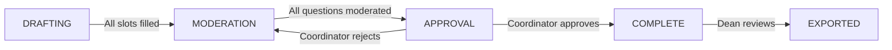
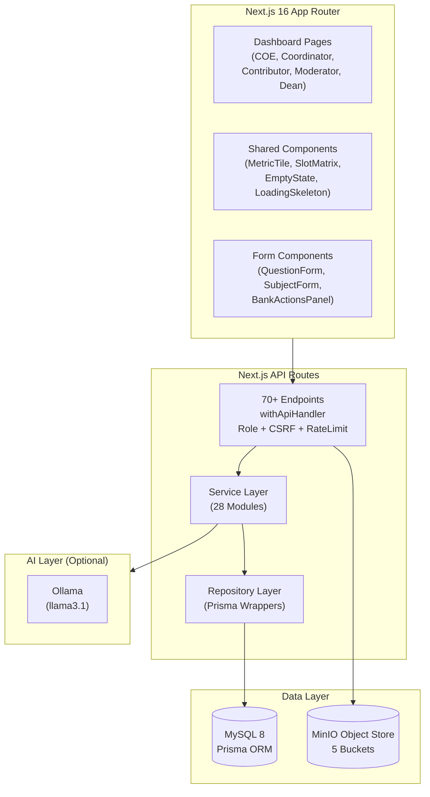
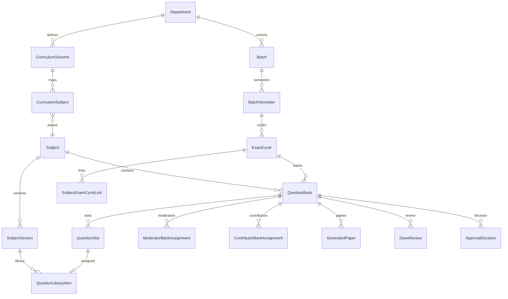
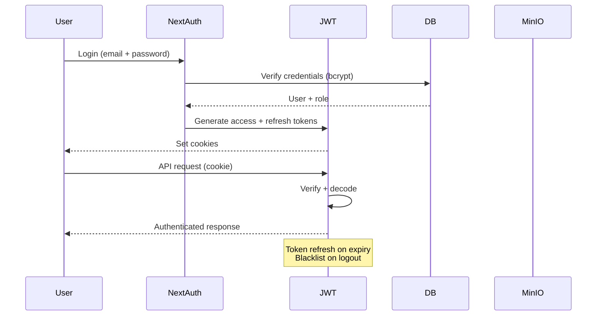
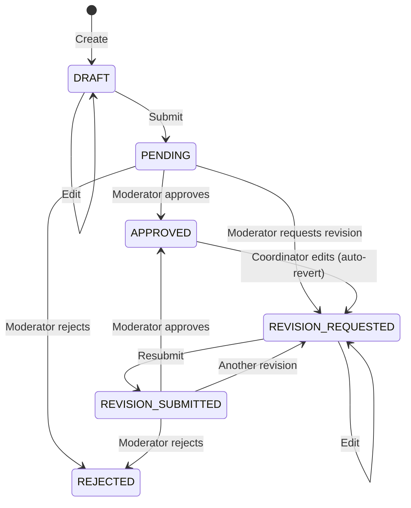

# EMQPGS — Examination Management & Question Paper Generation System

A full-stack web application for managing the complete lifecycle of academic examination question papers — from subject setup and question contribution through moderation, AI analysis, paper generation, dean review, and export.

**Stack:** Next.js 16 (App Router) · Prisma ORM · MySQL 8 · MinIO object storage · Auth.js v5 + Custom JWT · Ollama (optional)

---

## Features

- **Five-role hierarchy**: COE (admin), Coordinator (academic manager), Contributor (question author), Moderator (quality reviewer), Dean (final reviewer)
- **Four-phase question bank lifecycle**: DRAFTING → MODERATION → APPROVAL → COMPLETE
- **126-slot template**: Structured question paper pattern per exam type (ISE-1, ISE-2, ENDSEM, Supplementary, KT)
- **AI-powered analysis**: Optional Ollama integration for bank coverage, RBT level distribution, and quality scoring
- **Automated paper generation**: Balanced paper variants (A, B, C) with coverage, difficulty, and duplicate risk scoring
- **Dean review workspace**: Side-by-side paper comparison with variant selection
- **Export pipeline**: PDF/DOCX/ZIP packet generation with MinIO storage
- **Audit trail**: SHA-256 hash-chained immutable audit logs
- **Complete RBAC**: Department-scoped coordinator access, role-gated APIs

---

## Role Hierarchy

```
COE (System Admin)
 └── Coordinator (Department Manager)
      ├── Contributor (Question Author)
      └── Moderator (Quality Reviewer)
           └── Dean (Final Approver)
```

---

## Question Bank Lifecycle



---

## Architecture Overview



---

## Database Domain Relationships



---

## Authentication Flow



---

## Question Lifecycle



---

## Paper Generation Workflow

```mermaid
flowchart LR
    A[Coordinator selects questions] --> B[AI analysis runs]
    B --> C[Deterministic report built]
    C --> D{Ollama available?}
    D -->|Yes| E[AI overlay added]
    D -->|No| F[Deterministic only]
    E --> G[Paper generated (A, B, C)]
    F --> G
    G --> H[PDF stored in MinIO]
    H --> I[Dean reviews variants]
    I --> J[Papers assigned: Regular, Supp, KT]
    J --> K[COE exports packets]
```

---

## Tech Stack

| Layer | Technology |
|---|---|
| Framework | Next.js 16 (App Router) |
| Language | TypeScript 5 (strict mode) |
| ORM | Prisma 6 |
| Database | MySQL 8 |
| Auth | NextAuth v5 + Custom JWT (jose) |
| Object Storage | MinIO (AWS S3 compatible) |
| AI (Optional) | Ollama (llama3.1) |
| PDF Generation | pdf-lib |
| DOCX Generation | docx |
| UI | Tailwind CSS 4 + shadcn/ui |
| Icons | Lucide React |
| Testing | Vitest |
| Validation | Zod 4 |

---

## Demo Credentials

All passwords: `Password@123`

| Email | Role | Department |
|---|---|---|
| `coe@emqpgs.local` | COE | — |
| `coordinator.aids@emqpgs.local` | COORDINATOR | AIDS |
| `moderator.aids@emqpgs.local` | MODERATOR | AIDS |
| `contributor1.aids@emqpgs.local` | CONTRIBUTOR | AIDS |
| `dean@emqpgs.local` | DEAN | — |

---

## Quick Start

### Prerequisites

- Node.js 24+
- Docker (for MySQL + MinIO)
- npm

### Setup

```bash
# Clone and install
git clone https://github.com/your-org/emqpgs.git
cd emqpgs
npm ci

# Configure environment
cp .env.example .env
# Edit .env with your secrets (see .env.example for guidance)

# Start infrastructure
docker compose up -d mysql minio minio-init

# Run migrations and seed
npm run prisma:migrate
npm run prisma:seed

# Start development server
npm run dev
```

Open `http://localhost:3000`. Login with any demo credential above.

### Docker Deployment

```bash
# Full stack (app + MySQL + MinIO)
docker compose up -d --build

# Run migrations
docker compose exec app npm run prisma:deploy

# Seed data
docker compose exec app npm run prisma:seed
```

---

## Project Structure

```
emqpgs/
├── app/
│   ├── api/                 # 70+ API route files
│   ├── login/               # Authentication pages
│   └── (protected)/
│       └── dashboard/
│           ├── coe/          # COE dashboard (21 pages)
│           ├── coordinator/  # Coordinator dashboard (9 pages)
│           ├── contributor/  # Contributor workflow (4 pages)
│           ├── moderator/    # Moderator dashboard (7 pages)
│           └── dean/         # Dean dashboard (6 pages)
├── src/
│   ├── components/          # UI components
│   │   ├── ui/              # shadcn/ui primitives
│   │   ├── forms/           # Business form components
│   │   ├── layout/          # App shell, sidebar, navigation
│   │   └── dashboard/       # Dashboard-specific components
│   ├── lib/                 # Utilities, auth, audit, errors
│   └── modules/             # 28 service modules
├── prisma/
│   ├── schema.prisma        # 34 models, 26 enums
│   ├── migrations/          # 2 production migrations
│   └── seed.ts              # Demo data seeder
├── tests/
│   ├── unit/                # 19 test files, 126 tests
│   └── e2e-validation.mjs   # API-level workflow validation
├── docs/
│   ├── architecture.md      # Domain model, RBAC, invariants
│   ├── workflow.md          # Phase transitions, state machines
│   ├── database.md          # All models, relationships, enums
│   ├── api.md               # API reference
│   ├── deployment.md        # Environment, production setup
│   ├── developer-guide.md   # Onboarding, patterns, debugging
│   └── glossary.md          # Domain terminology
└── docker-compose.yml       # MySQL 8 + MinIO + App
```

---

## Commands

| Command | Purpose |
|---|---|
| `npm run dev` | Start dev server |
| `npm run build` | Production build |
| `npm run start` | Production start |
| `npm run test` | Run all tests (Vitest) |
| `npm run test:watch` | Watch mode |
| `npm run lint` | ESLint |
| `npm run prisma:migrate` | Apply pending migrations (dev) |
| `npm run prisma:deploy` | Apply migrations (production) |
| `npm run prisma:seed` | Seed demo data |

---

## Testing

```bash
# Unit tests
npm run test

# Watch mode
npm run test:watch

# E2E validation (requires running server)
node tests/e2e-validation.mjs
```

---

## Security

- **Password hashing**: bcrypt with cost factor 12
- **JWT**: HMAC-SHA256 with separate secrets for access and refresh tokens
- **CSRF**: Double-submit cookie pattern (HMAC-signed tokens)
- **Rate limiting**: Per-IP, per-endpoint (configurable window)
- **Audit trail**: SHA-256 hash-chained immutable log entries
- **Authorization**: Role-based gate per API route via `withApiHandler`
- **Input validation**: Zod schemas on all mutation endpoints
- **Department isolation**: CoordinatorDepartmentAssignment scopes access
- **Session management**: Idle timeout, refresh token rotation, blacklist

---

## Future Roadmap

- Async paper generation pipeline
- ContributorBankAssignment UI for coordinator bulk assignment
- Cross-paper comparison in dean review workspace
- Moderator queue prioritization with urgency indicators
- COE institutional readiness dashboard (phase distribution, stalled detection)
- Redis-backed rate limiting for multi-process deployments
- Gradual question bank locking and archival workflow

---


