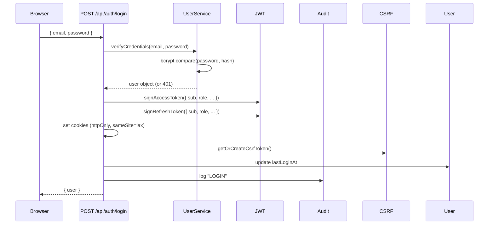

# System Architecture

> **Part of the EMQPGS engineering handoff set**  
> Companion to: `PROJECT_HANDOFF.md` · `DATABASE_REFERENCE.md` · `UI_UX_REDESIGN.md` · `PRODUCTION_RUNBOOK.md`

---

## 1. Module Dependency Graph

```
                              ┌─────────────┐
                              │   lib/      │
                              │ (shared)    │
                              └──────┬──────┘
                    ┌─────────────────┼──────────────────────┐
                    │                 │                       │
              ┌─────▼─────┐   ┌──────▼──────┐   ┌──────────▼──────────┐
              │  reports/  │   │ moderation/ │   │ exam-cycles/        │
              │ (analysis, │   │ (review,    │   │ (creation, linking) │
              │  papers,   │   │  approve)   │   └──────────┬──────────┘
              │  PDF)      │   └──────┬──────┘               │
              └─────┬──────┘          │                       │
                    │                 │                       │
              ┌─────▼─────────────────▼───────────────────────▼──────┐
              │                   coordinator/                        │
              │  (subject.service, question-bank.service,             │
              │   reporting-coordinator.service, service.ts)          │
              └─────┬─────────────────┬───────────────────────┬──────┘
                    │                 │                       │
         ┌──────────▼──────┐  ┌──────▼──────┐  ┌────────────▼──────────┐
         │ question-banks/ │  │  readiness/ │  │ question-library/     │
         │ (phases, locks, │  │  engine.ts  │  │ (CRUD, revisions,    │
         │  transitions)   │  │             │  │  ownership, usage)   │
         └──────────┬──────┘  └─────────────┘  └────────────┬──────────┘
                    │                                        │
         ┌──────────▼──────┐                     ┌───────────▼─────────┐
         │ question-slots/ │                     │ question-library/   │
         │ (assign to bank)│                     │ repository.ts       │
         └─────────────────┘                     └─────────────────────┘
```

**Rules:**
- `coordinator/` orchestrates everything — it depends on `question-banks/`, `readiness/`, `question-library/`, `reports/`, `exam-cycles/`, and `notifications/`
- `reports/` depends on `ai/` (Ollama) and shared `lib/`
- `moderation/` depends only on `notifications/` and shared `lib/`
- No circular dependencies exist between module service files
- All services depend on `lib/` (`db.ts`, `errors.ts`, `audit.ts`, `constants.ts`)

---

## 2. Service-to-Service Calls

| Caller | Method | Callee | Where |
|---|---|---|---|
| `CoordinatorService.getDashboard` | `listForUser` | `NotificationService` | `coordinator/service.ts:176` |
| `QuestionBankWorkflowService.advancePhase` | `advancePhase` | `QuestionBankService` | `coordinator/question-bank.service.ts:205` |
| `ReportingCoordinatorService.triggerAiAnalysis` | `createAiReport` | `AiReportService` | `coordinator/reporting-coordinator.service.ts:31` |
| `ReportingCoordinatorService.triggerPaperGeneration` | `generatePapers` | `PaperGenerationService` | `coordinator/reporting-coordinator.service.ts:56` |
| `QuestionBankService.advancePhase` | `isReady` | `ReadinessEngine` | `question-banks/service.ts:23` |
| `QuestionBankService.advancePhase` | `findById, update` | `QuestionBankRepository` | `question-banks/service.ts:16,35` |
| `AiReportService.createAiReport` | `analyzeQuestionBank` | `OllamaService` | `reports/ai-report.service.ts:36` |
| `AiReportService.createAiReport` | `buildDeterministicReport` | `AnalysisEngine` | `reports/ai-report.service.ts:32` |
| `PaperGenerationService.generatePapers` | `generate` | `PaperGenerator` | `reports/paper.service.ts:37` |
| `PaperGenerationService.generatePapers` | `createPaperPdf` | `PdfService` | `reports/paper.service.ts:41` |
| `PaperGenerationService.generatePapers` | `uploadServerFile` | `StorageService` | `reports/paper.service.ts:53` |
| `ModeratorService.approveQuestion` | `create` | `NotificationService` | `moderation/service.ts:110` |
| `DeanReviewService.submitDeanReview` | `createAndEmail, create` | `NotificationService` | `production/dean-review.service.ts:220-243` |

---

## 3. API Call Graph (UI → API)

### COE Dashboard Pages

```
/dashboard/coe
  ├── getDashboardSeed(Role.COE)
  └── server-side prisma queries (departments, stats)

/dashboard/coe/academic-years
  └── GET /api/academic-years (via server-side prisma)

/dashboard/coe/academic-units
  └── POST /api/academic-units  ← SimpleForm

/dashboard/coe/programmes
  └── POST /api/programmes  ← SimpleForm

/dashboard/coe/departments
  └── POST /api/departments  ← SimpleForm
  └── PATCH /api/departments/[id]  ← EditDepartmentButton
  └── DELETE /api/departments/[id]  ← DeleteDepartmentButton

/dashboard/coe/batches
  └── POST /api/batches  ← SimpleForm

/dashboard/coe/users
  └── POST /api/users  ← SimpleForm
  └── PATCH /api/users/[id]  ← EditUserFormWrapper
  └── DELETE /api/users/[id]  ← UserActions

/dashboard/coe/exam-cycles
  └── POST /api/exam-cycles  ← CreateExamCycleWizard

/dashboard/coe/coordinator-assignments
  └── POST /api/coordinator-departments  ← CoordinatorAssignmentForm

/dashboard/coe/production
  └── POST /api/exports  ← ExportConsole
  └── GET /api/exports/[id]/download  ← ExportConsole

/dashboard/coe/monitoring
  └── GET /api/monitoring  (server-side)
```

### Coordinator Dashboard Pages

```
/dashboard/coordinator
  └── CoordinatorService.getDashboard(actor)

/dashboard/coordinator/subjects
  └── GET /api/subjects?departmentId=&semesterNumber=&status=  (server-side)

/dashboard/coordinator/subjects/create
  └── POST /api/subjects  ← SubjectForm

/dashboard/coordinator/subjects/[id]
  └── GET /api/subjects/[id]  (server-side)
  └── POST /api/subjects/[id]/link-cycle  ← LinkCycleForm

/dashboard/coordinator/subjects/[id]/edit
  └── PUT /api/subjects/[id]  ← SubjectForm

/dashboard/coordinator/subjects/[id]/versions
  └── POST /api/subject-versions  ← SubjectVersionForm
  └── PATCH /api/subject-versions/[id]/archive  ← ActionButton

/dashboard/coordinator/question-banks
  └── GET /api/question-banks  (server-side)
  └── POST /api/question-banks  ← SimpleForm

/dashboard/coordinator/question-banks/[id]
  └── GET /api/question-banks/[id]  (server-side, passed to BankDetailClient)
  ├── POST /api/question-banks/[id]/reports  ← AI report trigger
  ├── POST /api/question-banks/[id]/papers  ← Paper generation trigger
  ├── POST /api/question-banks/[id]/coordinator-decision  ← CoordinatorDecisionForm
  ├── PATCH /api/question-banks/[id]/advance  ← BankActionsPanel
  ├── PATCH /api/question-banks/[id]/lock  ← BankActionsPanel
  └── POST /api/question-banks/[id]/assignments/moderator  ← ModeratorAssignmentForm (from /assignments)

/dashboard/coordinator/coverage
  ├── CoverageDashboardClient
  └── server-side prisma queries

/dashboard/coordinator/assignments
  └── POST /api/question-banks/[id]/assignments/moderator  ← ModeratorAssignmentForm

/dashboard/coordinator/exam-workspace/[id]
  └── GET /api/exam-cycles/[id]  (server-side)
```

### Contributor Dashboard Pages

```
/dashboard/contributor
  └── server-side prisma queries (banks, questions)

/dashboard/contributor/submit-question
  └── POST /api/question-library?bankId=  ← QuestionForm

/dashboard/contributor/questions
  └── server-side prisma queries

/dashboard/contributor/questions/[id]/edit
  └── PATCH /api/question-library/[id]  ← QuestionForm
  └── POST /api/question-library/[id]?action=submit  ← QuestionForm

/dashboard/contributor/my-subjects
  └── server-side helper (getQuestionContributionWorkspace)
```

### Moderator Dashboard Pages

```
/dashboard/moderator
  └── ModeratorDashboardService.getDashboard(actor)

/dashboard/moderator/questions
  └── GET /api/moderation/questions  (server-side)

/dashboard/moderator/questions/[id]
  └── PATCH /api/moderation/questions/[id]/approve  ← ModeratorActions
  └── PATCH /api/moderation/questions/[id]/reject  ← ModeratorActions
  └── PATCH /api/moderation/questions/[id]/request-revision  ← ModeratorActions

/dashboard/moderator/approved
  └── GET /api/moderation/questions (filtered)  (server-side)

/dashboard/moderator/rejected
  └── GET /api/moderation/questions (filtered)  (server-side)
```

### Dean Dashboard Pages

```
/dashboard/dean
  └── getDeanReviewData()  (server-side)

/dashboard/dean/review?bank=xxx
  └── GET /api/question-banks/[id]/dean-review  ← DeanReviewWorkspace
  └── POST /api/question-banks/[id]/dean-review  ← DeanReviewWorkspace
```

---

## 4. Sequence Diagrams

### 4.1 Full Question Bank Lifecycle

```
COORDINATOR        CONTRIBUTOR        MODERATOR        ENGINE        AI          COE          DEAN
     │                  │                 │              │           │           │            │
     ├─ Link subject────┤                 │              │           │           │            │
     │   to exam cycle   │                 │              │           │           │            │
     ├─ Init bank ───────┤                 │              │           │           │            │
     │ (creates slots)   │                 │              │           │           │            │
     │                   ├─ Write question┤              │           │           │            │
     │                   ├─ Assign to slot┤              │           │           │            │
     │                   ├─ Submit ───────┤              │           │           │            │
     ├─ Advance ─────────┤                ├─ Readiness───┤           │           │            │
     │ (→ MODERATION)    │                │  check       │           │           │            │
     │                   │                ├─ Approve ────┤           │           │            │
     │                   │                │  /Reject      │           │           │            │
     ├─ Advance ─────────┤                ├─ Readiness───┤           │           │            │
     │ (→ APPROVAL)      │                │  check       │           │           │            │
     ├─ Trigger ─────────┤                 │              ├─ Analyze──┤           │            │
     │  AI analysis       │                 │              │  +Ollama  │           │            │
     ├─ Approve ─────────┤                 │              │           │           │            │
     │ (→ COMPLETE)      │                 │              │           │           │            │
     ├─ Generate ────────┤                 │              ├─ Papers───┤           │            │
     │  papers (A/B/C)   │                 │              │  A/B/C    │           │            │
     │                   │                 │              │           │           ├─ Review ──┤
     │                   │                 │              │           │           │  selects  │
     │                   │                 │              │           │           │  A/B/C    │
     ├─ Lock ────────────┤                 │              │           ├─ Lock ───┤            │
     │                   │                 │              │           │  snapshot│            │
     ├─ Export ──────────┤                 │              │           │           │            │
     │  PDF/DOCX/ZIP     │                 │              │           │           │            │
```

### 4.2 AI Report Generation

```
Coordinator                     AiReportService                    AnalysisEngine          OllamaService
     │                                │                                │                      │
     ├─ triggerAiAnalysis() ──────────►                                │                      │
     │                                ├─ getQuestionBankForAnalysis()  │                      │
     │                                │         │                      │                      │
     │                                │  ┌──────▼───────┐              │                      │
     │                                │  │ Load bank +  │              │                      │
     │                                │  │ slots +      │              │                      │
     │                                │  │ questions    │              │                      │
     │                                │  └──────┬───────┘              │                      │
     │                                │         │                      │                      │
     │                                ├─ buildDeterministicReport()───►                      │
     │                                │         │                      ├─ moduleCoverage()     │
     │                                │         │                      ├─ coDistribution()     │
     │                                │         │                      ├─ rbtDistribution()    │
     │                                │         │                      ├─ difficultyDist()     │
     │                                │         │                      ├─ detectDuplicates()   │
     │                                │         │                      ├─ assessQuality()      │
     │                                │         │                      ├─ assessBloomsBalance()│
     │                                │         │                      └─ return report ──────►│
     │                                │         │                                              │
     │                                ├─ buildOllamaPrompt() ────────────────────────────────►│
     │                                │         │                                              │
     │                                │         ◄──── aiOverlay (or null on failure) ──────────┤
     │                                │  ┌──────┴───────┐                                      │
     │                                │  │ Merge report │                                      │
     │                                │  │ + overlay    │                                      │
     │                                │  └──────┬───────┘                                      │
     │                                ├─ Save AiReport to DB                                    │
     │                                ├─ Notify coordinators                                    │
     │                                ├─ Log audit                                              │
     │◄───────────────────────────────┤                                                         │
```

### 4.3 Paper Generation

```
Coordinator                     PaperGenerationService       PaperGenerator      PdfService    StorageService
     │                                │                            │                 │              │
     ├─ triggerPaperGeneration()──────►                            │                 │              │
     │                                ├─ getQuestionBank()         │                 │              │
     │                                ├─ generate() ──────────────►│                 │              │
     │                                │                            ├─ For each       │              │
     │                                │                            │  variant        │              │
     │                                │                            │  (A/B/C):       │              │
     │                                │                            │  pick 1 Q per   │              │
     │                                │                            │  (module ×      │              │
     │                                │                            │   marks) slot   │              │
     │                                │                            │  avoid reuse    │              │
     │                                │                            │  across vars    │              │
     │                                │                            └─── return ─────►│              │
     │                                │                 selected questions          │              │
     │                                ├─ createPaperPdf() ─────────────────────────►              │
     │                                │                            │                 │              │
     │                                │                            │           ┌────▼──────┐       │
     │                                │                            │           │ Create    │       │
     │                                │                            │           │ PDF bytes │       │
     │                                │                            │           └────┬──────┘       │
     │                                ├─ uploadServerFile() ────────────────────────┴────►         │
     │                                │                            │                 │     ┌─────▼──┐
     │                                │                            │                 │     │Upload  │
     │                                │                            │                 │     │to MinIO│
     │                                │                            │                 │     └─────┬──┘
     │                                ├─ Create GeneratedPaper      │                 │           │
     │                                │   record + items            │                 │           │
     │                                ├─ Create PaperSnapshot        │                 │           │
     │                                ├─ Record usage history        │                 │           │
     │                                ├─ Notify coordinators         │                 │           │
     │                                ├─ Log audit                   │                 │           │
     │◄───────────────────────────────┤                              │                 │           │
```

### 4.4 Moderation Flow

```
Contributor                  QuestionLibraryService         Moderator               NotificationService
     │                                │                        │                           │
     ├─ submit(id) ──────────────────►│                        │                           │
     │                                ├─ set status=PENDING    │                           │
     │                                │  set submittedAt=now   │                           │
     │                                │                        │                           │
     │                                │     Moderator views    │                           │
     │                                │◄───────────────────────┤                           │
     │                                │     pending questions  │                           │
     │                                │                        │                           │
     │                                ◄── approve(id) ────────┤                           │
     │                                │   OR                   │                           │
     │                                ◄── reject(id, reason)──┤                           │
     │                                │   OR                   │                           │
     │                                ◄── requestRevision(    │                           │
     │                                │      id, instructions) │                           │
     │                                │                        │                           │
     │                                ├─ update status         │                           │
     │                                ├─ create ModerationEvent│                           │
     │                                ├─ notify ──────────────────────────────────────────►│
     │◄── notified ───────────────────┤                        │                           │
```

---

## 5. Auth Flow



```
API Request Flow (subsequent calls):
Browser ──► Request
              │
              ├─ enforceRateLimit(method, path, IP)  ──→ 120 req/min per key
              ├─ assertCsrfProtection(method)  ──→ HMAC verify (skip GET/HEAD/OPTIONS)
              ├─ getCurrentUserFromCookies()  ──→
              │     ├─ read access token from cookie
              │     ├─ jwtVerify(token, accessSecret)
              │     ├─ check blacklist
              │     └─ UserService.findByEmail(payload.email)
              ├─ check role ∈ allowed roles
              ├─ execute handler(request, { user })
              ├─ (optional) logAudit()
              └─ return NextResponse.json({ success, data })
```

---

## 6. Shared Library Dependencies

| File | Depends On | Used By |
|---|---|---|
| `lib/db.ts` | PrismaClient | Every service |
| `lib/api-handler.ts` | `api-context`, `audit`, `csrf`, `rate-limit`, `errors`, `logger`, `constants` | Every route.ts file |
| `lib/auth.ts` | NextAuth, `UserService`, `env` | NextAuth handlers |
| `lib/jwt.ts` | jose, `env`, `prisma` (RevokedToken) | Login, logout, refresh routes |
| `lib/csrf.ts` | crypto, `env`, cookies/headers | Every mutation route |
| `lib/audit.ts` | crypto, `prisma` | Api handler, manual calls in services |
| `lib/env.ts` | zod | bootstrap |
| `lib/errors.ts` | (none) | Every service |
| `lib/constants.ts` | Prisma enums | Every module |
| `lib/optimistic-lock.ts` | Prisma | question-banks, coordinator |
| `lib/db-helpers.ts` | Prisma | coordinator/subject.service |
| `lib/storage/storage-service.ts` | MinioProvider, `prisma` | reports, production |
| `lib/client-fetch.ts` | (fetch) | Client components |

---

## 7. TypeScript Type Flow

```
Prisma Schema
    │
    ▼
@prisma/client (generated types)
    │
    ├─ Route handlers receive:  Actor = { id, role, email, name }
    ├─ Services receive:       Actor + domain-specific input types (Zod validated)
    ├─ Repositories return:    Prisma-generated types with includes
    │
    ├─ Server components:     Direct prisma queries → React props
    └─ Client components:     apiFetch() → JSON → React state
```

**Key types defined in the codebase:**

| Type | Location | Purpose |
|---|---|---|
| `Actor` | `lib/types.ts` | Authenticated user subset passed to services |
| `TokenPayload` | `lib/jwt.ts` | JWT token shape |
| `AuditParams` | `lib/audit.ts` | Parameters for audit logging |
| `RouteOptions` | `lib/api-handler.ts` | Route decorator configuration |
| `ReadinessAssessment` | `readiness/engine.ts` | Phase readiness result |
| `QuestionLibraryItemInput` | `question-library/validation.ts` | Question create shape |
| `GeneratedPaperPayload` | `reports/paper-generator.ts` | Paper generation result |
| `BankStatusItem` | `coordinator/service.ts` | Dashboard bank status row |
| `AttentionItem` | `coordinator/service.ts` | Dashboard attention item |
| `DeanDashboardData` | `production/dean-review.service.ts` | Dean dashboard data shape |
| `DeanReviewWorkspace` | `production/dean-review.service.ts` | Dean review page data |

---

*End of SYSTEM_ARCHITECTURE.md*
