# EMQPGS — Complete Workflow Guide

**Examination Management & Question Paper Generation System**

Version 1.0 — June 2026

---

## Table of Contents

1. [What is this Portal?](#1-what-is-this-portal)
2. [Overall Architecture](#2-overall-architecture)
3. [Domain Model & Entity Relationships](#3-domain-model--entity-relationships)
4. [Authentication & Authorization](#4-authentication--authorization)
5. [Role-Based Access Control](#5-role-based-access-control)
6. [Academic Setup — Foundation Modules](#6-academic-setup--foundation-modules)
7. [Exam Cycles](#7-exam-cycles)
8. [Question Banks](#8-question-banks)
9. [Questions & Question Library](#9-questions--question-library)
10. [Question Slots](#10-question-slots)
11. [Moderation Workflow](#11-moderation-workflow)
12. [AI Analysis](#12-ai-analysis)
13. [Coordinator Approval Decision](#13-coordinator-approval-decision)
14. [Paper Generation](#14-paper-generation)
15. [Dean Review](#15-dean-review)
16. [Locking & Snapshots](#16-locking--snapshots)
17. [Exports](#17-exports)
18. [Notifications](#18-notifications)
19. [Audit Logging](#19-audit-logging)
20. [System Backup & Monitoring](#20-system-backup--monitoring)
21. [Production Console (COE)](#21-production-console-coe)
22. [Complete Screen-by-Screen Guide](#22-complete-screen-by-screen-guide)
23. [Form Reference](#23-form-reference)
24. [End-to-End Simulations](#24-end-to-end-simulations)
25. [Workflow Diagrams](#25-workflow-diagrams)
26. [Database Mapping](#26-database-mapping)
27. [Role Guide](#27-role-guide)
28. [Troubleshooting](#28-troubleshooting)
29. [Glossary](#29-glossary)

---

## 1. What is this Portal?

### Purpose

EMQPGS (Examination Management & Question Paper Generation System) is a web-based platform that manages the complete lifecycle of university examination question papers. It replaces paper-based, manual question paper creation with a structured digital workflow.

### Problem Solved

Universities need to create multiple sets of examination question papers (Regular, Supplementary, KT) for every subject every semester. Without a system:

- Question quality varies wildly
- No audit trail exists for who wrote what
- Coordinators cannot track progress
- Dean has no visibility into paper quality before exams
- Papers are created manually, leading to errors and duplication
- No standardization of question formats, difficulty levels, or outcomes mapping

EMQPGS solves these problems by providing:

- A structured question bank system with slots organized by module and marks
- A 4-phase workflow (Drafting → Moderation → Approval → Complete)
- AI-powered analysis of question coverage
- Automated paper generation from approved questions
- Dean review and selection of paper variants
- Multi-format export (PDF, DOCX, ZIP)
- Complete audit trail with tamper-evident logging

### Who Uses It

| Role | Real-World Person | What They Do |
|------|-------------------|--------------|
| **COE** (Controller of Examination) | Senior administrator | Sets up the system, creates users/roles, manages exam cycles, exports final papers |
| **COORDINATOR** | Department academic coordinator | Manages subjects, question banks, assigns contributors/moderators, advances workflow |
| **CONTRIBUTOR** | Faculty member / Teacher | Writes questions and assigns them to bank slots |
| **MODERATOR** | Senior faculty | Reviews questions for quality, accuracy, and standards |
| **DEAN** | Dean of faculty | Reviews generated papers, selects which variant goes to which exam slot |

### What Happens Inside (High-Level Overview)

```
Academic Setup (COE)
    │
    ▼
Exam Cycle Created (COE)
    │
    ▼
Question Banks Initialized (Coordinator)
    │
    ▼
Questions Written & Assigned to Slots (Contributor)
    │
    ▼
Questions Moderated (Moderator)
    │
    ▼
AI Analysis & Coordinator Decision (Coordinator)
    │
    ▼
Papers Generated (System / Coordinator)
    │
    ▼
Dean Reviews Variants (Dean)
    │
    ▼
Bank Locked & Papers Exported (COE)
    │
    ▼
Exam Cycle Closed
```

---

## 2. Overall Architecture

### Technology Stack

| Layer | Technology |
|-------|-----------|
| **Frontend** | Next.js 16 (App Router), React 19, Tailwind CSS 4 |
| **Backend** | Next.js API Routes + Server Components |
| **Database** | MySQL 8 via Prisma ORM |
| **Authentication** | Auth.js v5 (credentials) + Custom JWT (dual-token system) |
| **File Storage** | MinIO (S3-compatible object storage) |
| **AI** | Ollama (local LLM) for question bank analysis |
| **Email** | SMTP / Console (fallback) |
| **Validation** | Zod schemas |
| **PDF Generation** | pdf-lib, docx (npm) |

### Backend Architecture

```
┌─────────────────────────────────────────────────────────────────┐
│                        Next.js App Router                       │
│                                                                 │
│   ┌──────────────────────────────────────────────────────┐      │
│   │                    Pages / UI                         │      │
│   │  Server Components │ Client Components │ Forms       │      │
│   └────────────────────────┬─────────────────────────────┘      │
│                            │                                    │
│   ┌────────────────────────┴─────────────────────────────┐      │
│   │              Server Data Layer (server-data.ts)       │      │
│   │         getDashboardSeed(), getCoeProductionData()    │      │
│   └────────────────────────┬─────────────────────────────┘      │
│                            │                                    │
│   ┌────────────────────────┴─────────────────────────────┐      │
│   │                  Module Services                       │      │
│   │  ┌──────────┐ ┌──────────┐ ┌──────────┐ ┌────────┐  │      │
│   │  │  Users   │ │  Exam    │ │Question  │ │Production│ │      │
│   │  │  Service │ │  Cycles  │ │ Banks    │ │Services  │ │      │
│   │  └────┬─────┘ └────┬─────┘ └────┬─────┘ └────┬─────┘  │      │
│   │       │            │            │            │        │      │
│   │  ┌────┴────┐ ┌────┴────┐ ┌────┴────┐ ┌────┴────┐   │      │
│   │  │Users    │ │ExamCycle│ │Question │ │ Dean    │   │      │
│   │  │Repository│ │Repo    │ │Bank Repo│ │ Review  │   │      │
│   └──┴─────────┴─┴─────────┴─┴─────────┴─┴─────────┴───┘      │
│                            │                                    │
│   ┌────────────────────────┴─────────────────────────────┐      │
│   │                    Prisma ORM                         │      │
│   └────────────────────────┬─────────────────────────────┘      │
│                            │                                    │
│   ┌────────────────────────┴─────────────────────────────┐      │
│   │                    MySQL 8 Database                    │      │
│   └──────────────────────────────────────────────────────┘      │
│                                                                 │
│   ┌──────────────────────────────────────────────────────┐      │
│   │                    MinIO Object Storage               │      │
│   │  question-bank-attachments │ generated-papers        │      │
│   │  exports │ audit-files │ system-backups              │      │
│   └──────────────────────────────────────────────────────┘      │
│                                                                 │
│   ┌──────────────────────────────────────────────────────┐      │
│   │                    Ollama (optional)                  │      │
│   └──────────────────────────────────────────────────────┘      │
└─────────────────────────────────────────────────────────────────┘
```

### API Route Structure

All API routes are under `/app/api/`. They use the `withApiHandler` wrapper which:

1. Enforces rate limiting (based on IP + endpoint)
2. Checks CSRF token on mutating requests
3. Extracts user from JWT access cookie
4. Checks role-based permissions
5. Executes the handler
6. Writes audit log entries
7. Returns standardized JSON response

### Standard API Response Format

```json
{
  "success": true,
  "data": { ... },
  "correlationId": "uuid"
}
```

Error responses:

```json
{
  "success": false,
  "error": {
    "code": "ERROR_CODE",
    "message": "Human-readable message",
    "details": { ... }
  },
  "correlationId": "uuid"
}
```

### Permission Hierarchy

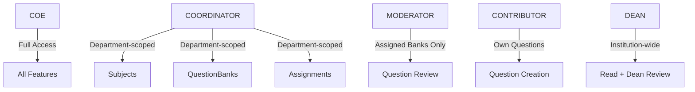

---

## 3. Domain Model & Entity Relationships

### Core Entity Map

```
AcademicUnit
  │
  ├── Programme (degree program)
  │     ├── CurriculumScheme (e.g., "2025 Scheme")
  │     │     └── CurriculumSubject (maps Subject to semester + unit)
  │     └── Batch (student cohort, e.g., "BE Computer 2025-29")
  │           └── BatchSemester (one semester instance per batch)
  │
Department (HR entity — faculty affiliation)
  │
  ├── User (person with login)
  │     ├── Notification
  │     └── AuditLog
  │
  └── Subject (academic subject like "Operating Systems")
        ├── SubjectVersion (versioned syllabus)
        │     └── QuestionLibraryItem (questions)
        ├── ExamCycleLink (links subject to exam cycles)
        └── QuestionBank (per subject + exam cycle)
              ├── QuestionSlot (position for a question)
              │     └── QuestionLibraryItem (assigned question)
              ├── PaperPattern (defines structure)
              ├── AiReport
              ├── GeneratedPaper (Paper A, B, C)
              ├── DeanReview
              ├── ApprovalDecision
              └── ExportArtifact

ExamCycle
  ├── BatchSemester (the semester this exam is for)
  └── SubjectExamCycleLink (subjects included)
```

### Key Business Rules (Invariants)

1. **One bank per (subject, exam cycle)** — `@@unique([subjectId, examCycleId])` on QuestionBank
2. **One slot position per bank** — `@@unique([questionBankId, moduleNumber, marks, slotNumber])` on QuestionSlot
3. **LOCKED banks reject all mutations** — guarded by `ensureQuestionBankMutable()`
4. **ApprovalDecision is write-once** — `@@unique([questionBankId])` ensures single decision
5. **Phase transitions are strictly defined** — DRAFTING→MODERATION→APPROVAL↔MODERATION→COMPLETE
6. **Bank must be in MODERATION phase to moderate** — enforced in `ModeratorService.moderate()`
7. **Dean review requires locked bank with completed papers** — enforced in `DeanReviewService`
8. **Export requires dean review** — enforced in `ExportService`
9. **Papers can only be generated in APPROVAL or COMPLETE phase** — enforced in `PaperGenerationService`

### Phase State Machine

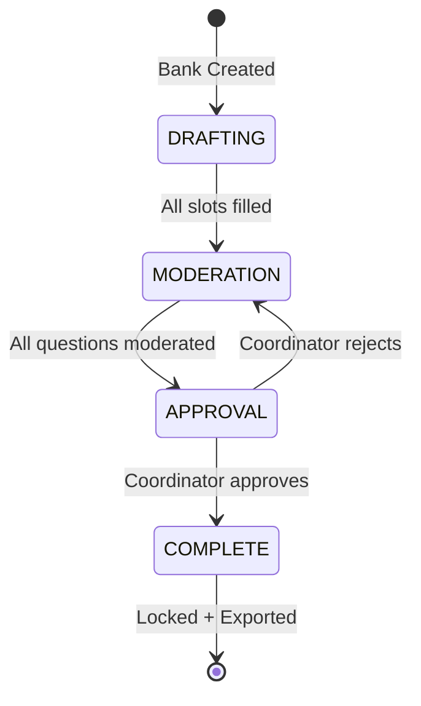

### Record Status

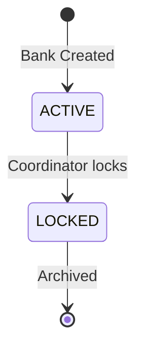

---

## 4. Authentication & Authorization

### Dual Authentication System

EMQPGS uses TWO authentication systems that coexist:

1. **Auth.js v5 (NextAuth)** — Used for the session-based `auth()` helper and sign-in pages
2. **Custom JWT** — Used for API route authentication via access/refresh token cookies

### Login Flow

```
User
  │
  ├── Enters email + password on /login
  │
  ├── POST /api/auth/login
  │     │
  │     ├── UserService.verifyCredentials()
  │     │     ├── Look up user by email (with password hash)
  │     │     ├── Check user is not DISABLED
  │     │     ├── bcrypt.compare(password, passwordHash)
  │     │     └── Return user or throw "Invalid credentials"
  │     │
  │     ├── signAccessToken({ sub, email, role, name, departmentId })
  │     │     └── JWT signed with HS256, 15min TTL (configurable)
  │     │
  │     ├── signRefreshToken({ sub, email, role, name, departmentId })
  │     │     └── JWT signed with HS256, 7-day TTL (configurable)
  │     │
  │     ├── Set HTTP-only cookies:
  │     │     ├── emqpgs_access_token (15min)
  │     │     └── emqpgs_refresh_token (7 days)
  │     │
  │     ├── Update lastLoginAt on User
  │     └── Redirect to /dashboard
  │
  └── Response: { success: true, data: { user } }
```

### Token Refresh Flow

When the access token expires, the client calls `POST /api/auth/refresh`:

1. Read refresh token from cookie
2. `verifyRefreshToken(refreshToken)` — checks signature, blacklist, idle timeout (30 min)
3. Issue new access + refresh tokens
4. Blacklist old refresh token
5. Set new cookies

### Logout Flow

1. `POST /api/auth/logout`
2. Blacklist current access token JTI
3. Blacklist current refresh token JTI
4. Clear cookies
5. Redirect to /login

### Password Reset Flow

1. User clicks "Forgot password" on login page
2. Goes to `/forgot-password` page
3. Enters email
4. `POST /api/auth/forgot-password` generates reset token, emails user
5. User clicks link in email → `/reset-password?token=...`
6. `POST /api/auth/reset-password` validates token, hashes new password, saves

### CSRF Protection

- Every mutating request (POST, PUT, PATCH, DELETE) must include `x-csrf-token` header
- CSRF token is stored in `emqpgs_csrf_token` cookie (httpOnly: false, sameSite: strict)
- Token is HMAC-signed with server secret + timestamp (24-hour validity)
- Client reads cookie, sends as header
- Server verifies signature + age + origin

### Rate Limiting

- In-memory rate limit store (resets on server restart)
- Keyed by `sha256(method + path + IP)`
- Default: 120 requests per 60-second window (configurable)
- Returns 429 when exceeded

---

## 5. Role-Based Access Control

### Role Definitions

| Role | Code | Description |
|------|------|-------------|
| COE | `COE` | Controller of Examination — system administrator |
| Coordinator | `COORDINATOR` | Department-level academic workflow manager |
| Moderator | `MODERATOR` | Quality reviewer for questions |
| Contributor | `CONTRIBUTOR` | Question writer |
| Dean | `DEAN` | Final paper reviewer |

### Permission Matrix

Each role has an associated set of permissions defined in `src/lib/constants.ts` under `rbacMatrix`.

| Permission | COE | COORD | MOD | CONTRIB | DEAN |
|------------|:---:|:-----:|:---:|:-------:|:----:|
| users:create | ✓ | | | | |
| users:update | ✓ | | | | |
| users:disable | ✓ | | | | |
| departments:manage | ✓ | | | | |
| exam-cycles:manage | ✓ | | | | |
| subjects:read | ✓ | ✓ | | | ✓ |
| question-banks:read | ✓ | ✓ | ✓ | | ✓ |
| question-banks:manage | | ✓ | | | |
| question-banks:review | | | ✓ | | |
| question-banks:contribute | | | | ✓ | |
| audit:read | ✓ | | | | |
| reports:read | ✓ | ✓ | ✓ | | ✓ |
| papers:read | ✓ | ✓ | ✓ | | ✓ |
| exports:manage | ✓ | | | | |
| dean-selections:read | ✓ | | | | |
| dean-selections:manage | | | | | ✓ |
| assignments:manage | | ✓ | | | |
| notifications:read | | ✓ | ✓ | ✓ | ✓ |
| monitoring:read | ✓ | | | | |

### Department Scoping

- **COE**: Has access to ALL departments
- **Coordinator**: Scoped to departments they are assigned to via `CoordinatorDepartmentAssignment`
- **Moderator**: Scoped to question banks they are assigned to via `ModeratorBankAssignment`
- **Contributor**: Scoped to their department (via `User.departmentId`) and their own questions
- **Dean**: Institution-wide access (no department restriction)

### User Statuses

| Status | Meaning |
|--------|---------|
| ACTIVE | User can log in and work |
| DISABLED | User blocked from logging in; all credentials checks reject |

---

## 6. Academic Setup — Foundation Modules

### 6.1 Academic Units

**Purpose:** Represent curriculum-owning bodies (departments or ES&H) that define what subjects are taught.

**Types:**
- `ES_H` — Engineering Sciences & Humanities (first-year common courses)
- `DEPARTMENT` — Regular academic department

**Fields:**
| Field | Description |
|-------|-------------|
| name | Full name (e.g., "Computer Engineering") |
| code | Unique code (e.g., "COMP") |
| type | ES_H or DEPARTMENT |
| hodName | Head of department name |
| isActive | Whether the unit is active |

**Used by:** Programmes (homeAcademicUnit + firstYearAcademicUnit), CurriculumSubjects, BatchSemesters

### 6.2 Departments

**Purpose:** HR/administrative entities representing faculty departments. Distinct from AcademicUnits (a department may own multiple academic units in some institutions).

**Fields:**
| Field | Description |
|-------|-------------|
| name | Full name (e.g., "Computer Engineering") |
| code | Unique code |
| hodName | Head of department name |
| isActive | Whether the department is active |

**Used by:** Users (via departmentId), Subjects (via departmentId), CoordinatorDepartmentAssignments

### 6.3 Programmes

**Purpose:** Degree programs that students graduate from.

**Fields:**
| Field | Description |
|-------|-------------|
| name | Full name (e.g., "BE Computer Engineering") |
| code | Unique code (e.g., "BECOMP") |
| degreeType | BE, BTECH, MTECH, PHD, DIPLOMA |
| durationYears | Program duration in years |
| durationSemesters | Total semesters (typically 8) |
| homeAcademicUnit | The academic unit that owns this programme |
| firstYearAcademicUnit | The unit for first-year teaching (often ES&H) |
| isActive | Whether programme is active |

**Business Rules:**
- Cannot create a programme under an inactive academic unit
- Cannot delete a programme that has curriculum schemes or batches

### 6.4 Curriculum Schemes

**Purpose:** Named curriculum plans (e.g., "2025 Scheme") that define subject-semester mappings for a programme.

**Fields:**
| Field | Description |
|-------|-------------|
| programmeId | Parent programme |
| name | Scheme name (e.g., "2025 Scheme") |
| year | Academic year of the scheme |
| isActive | Whether this scheme is active |

**Business Rules:**
- `@@unique([programmeId, year])` — only one scheme per programme per year
- Activating a scheme auto-deactivates all other schemes for the same programme
- Cannot delete a scheme that has curriculum subjects or batches

### 6.5 Curriculum Subjects

**Purpose:** The authoritative mapping of a Subject to a specific semester and academic unit within a curriculum scheme. This is a pure curriculum entity (not operational).

**Fields:**
| Field | Description |
|-------|-------------|
| curriculumSchemeId | Parent scheme |
| subjectId | The subject being taught |
| semesterNumber | 1-8 (which semester) |
| academicUnitId | Which unit offers this subject |
| groupAssignment | ALL, GROUP_1, or GROUP_2 |

**Uniqueness:** `@@unique([curriculumSchemeId, subjectId, semesterNumber, groupAssignment])`

**Business Rules:**
- A subject can appear multiple times across different semesters
- Teaching groups allow "Physics Group 1" vs "Physics Group 2" for first-year subjects

### 6.6 Academic Years

**Purpose:** Define academic year boundaries for reporting and scheduling.

**Fields:**
| Field | Description |
|-------|-------------|
| code | Display code (e.g., "2026-2027") |
| startDate | When the year starts |
| endDate | When the year ends |
| status | ACTIVE or CLOSED |

### 6.7 Batches

**Purpose:** A cohort of students admitted together. No student table exists — batches are cohort descriptors.

**Fields:**
| Field | Description |
|-------|-------------|
| name | Display name (e.g., "BE Computer 2025-29") |
| code | Unique code (e.g., "BECOMP2025") |
| programmeId | Parent programme |
| curriculumSchemeId | Assigned curriculum scheme |
| admissionYear | Year of admission |
| graduationYear | Expected graduation year |
| status | ACTIVE or GRADUATED |
| hasTeachingGroups | Whether first year uses teaching groups |
| currentBatchSemesterId | Pointer to current active semester |

**Business Rules:**
- Creating a batch auto-creates all semesters (1 through durationSemesters)
- If hasTeachingGroups is true, creates Group 1 and Group 2 teaching groups
- Requires pre-existing academic years for all semesters
- Cannot use inactive curriculum scheme

### 6.8 Batch Semesters

**Purpose:** A per-batch instance of a semester (batch's semester 5, not a global one). Each batch owns independent dates.

**Fields:**
| Field | Description |
|-------|-------------|
| batchId | Parent batch |
| semesterNumber | 1-8 |
| academicYearId | Which academic year |
| academicUnitId | ES&H for sem 1-2, home unit for sem 3-8 |
| startDate | Actual start date (set by COE) |
| endDate | Actual end date (set by COE) |
| status | UPCOMING, ACTIVE, or COMPLETED |

**Business Rules:**
- `@@unique([batchId, semesterNumber])`
- Semesters cannot overlap in dates
- Activating a semester updates batch.currentBatchSemesterId
- Completing a semester auto-advances to next semester (or null if final)

### 6.9 Teaching Groups

**Purpose:** Records which teaching groups exist for a batch in first year. Maximum 2 groups per batch.

**Fields:**
| Field | Description |
|-------|-------------|
| batchId | Parent batch |
| groupNumber | 1 or 2 |
| name | Display name (e.g., "Group 1") |
| description | Optional description |
| isActive | Whether group is active |

### 6.10 Coordinator Department Assignments

**Purpose:** Maps coordinators to the departments they manage.

**Fields:**
| Field | Description |
|-------|-------------|
| coordinatorId | User (role must be COORDINATOR) |
| departmentId | Department |

**Uniqueness:** `@@unique([coordinatorId, departmentId])` — a coordinator can be assigned to multiple departments, but only once per department.

### 6.11 Subjects

**Purpose:** An academic subject (e.g., "Operating Systems", "Data Structures").

**Fields:**
| Field | Description |
|-------|-------------|
| subjectCode | Unique within department (e.g., "OS101") |
| subjectName | Full name |
| credits | Credit load |
| status | ACTIVE or INACTIVE |
| questionBankDueDate | Default due date for question banks |
| departmentId | Owning department |

**Uniqueness:** `@@unique([subjectCode, departmentId])`

### 6.12 Subject Versions

**Purpose:** Versioned syllabi for subjects. When the syllabus changes, a new version is created.

**Fields:**
| Field | Description |
|-------|-------------|
| subjectId | Parent subject |
| versionNumber | Sequential (1, 2, 3...) |
| title | Version title |
| syllabusDescription | Optional syllabus text |
| effectiveFromAcademicYearId | When this version takes effect |
| status | ACTIVE or ARCHIVED |

**Uniqueness:** `@@unique([subjectId, versionNumber])`

---

## 7. Exam Cycles

### Purpose

An Exam Cycle represents an examination event (e.g., "ENDSEM exams for Semester 5, Academic Year 2026-2027"). It groups subjects together for a specific batch semester and exam type.

### Who Creates It

**COE** — only the COE has `exam-cycles:manage` permission.

### Fields

| Field | Description |
|-------|-------------|
| examType | ISE_1, ISE_2, ENDSEM, SUPPLEMENTARY, or KT |
| status | DRAFT, ACTIVE, or CLOSED |
| version | Optimistic lock version (starts at 0) |
| startDate | Exam start date (optional) |
| endDate | Exam end date (optional) |
| batchSemesterId | Which batch + semester |
| timetableDocumentRef | Reference to uploaded timetable file |
| timetableIssueDate | Date timetable was issued |
| timetableTitle | Title of the timetable |
| timetableRows | JSON array of timetable entries |
| timetableSignature | Signature hash for verification |

### Creation Flow

```
COE dashboard → "Create Exam Cycle" button
  │
  ├── Step 1: Select Batch
  ├── Step 2: Select Semester
  ├── Step 3: Select Exam Type (ISE_1, ISE_2, ENDSEM, etc.)
  │
  ├── System loads CurriculumSubjects for:
  │       curriculumSchemeId (from batch)
  │       semesterNumber (from selection)
  │       academicUnitId (from batch semester's unit)
  │
  ├── Shows list of subjects to be included
  │       (can override with subjectOverrides)
  │
  ├── COE enters:
  │       Timetable title, issue date, rows, signature
  │
  ├── Transaction:
  │       1. Create ExamCycle record
  │       2. Create SubjectExamCycleLink for each subject
  │          (unique constraint prevents duplicate links)
  │
  └── System redirects to exam cycle detail page
```

### Uniqueness

`@@unique([batchSemesterId, examType])` — only one exam cycle of a given type per batch semester.

### State Transitions

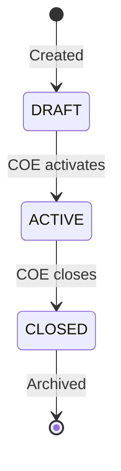

### Subject Exam Cycle Links

A join table connecting subjects to exam cycles. A subject can be linked to multiple exam cycles (e.g., ENDSEM and KT) but only once per cycle.

---

## 8. Question Banks

### Purpose

A Question Bank is the central container for all questions related to one subject in one exam cycle. It has two independent state axes:

1. **Phase** (workflow progress): DRAFTING → MODERATION → APPROVAL → COMPLETE
2. **Record Status** (editability): ACTIVE → LOCKED

### Who Works With It

| Role | What They Can Do |
|------|------------------|
| Coordinator | Create/initialize, advance phase, assign moderators, lock |
| Contributor | Create and assign questions to slots |
| Moderator | Review assigned questions |
| Dean | View, submit review (for COMPLETE banks) |
| COE | Export (for LOCKED banks) |

### Fields

| Field | Description |
|-------|-------------|
| subjectId | The subject |
| examCycleId | The exam cycle |
| phase | DRAFTING, MODERATION, APPROVAL, or COMPLETE |
| recordStatus | ACTIVE, LOCKED, or ARCHIVED |
| version | Optimistic lock counter |
| createdById | Who created it |
| lockedAt | When it was locked |
| lockedReason | Why it was locked |

### Uniqueness

`@@unique([subjectId, examCycleId])` — one bank per subject per exam cycle.

### Paper Pattern

Each bank has exactly ONE PaperPattern defining its structure:

| Field | Description |
|-------|-------------|
| examType | Exam type (determines default pattern) |
| totalModules | 3 for ISE, 6 for ENDSEM/SUPPLEMENTARY/KT |
| marksPattern | [2, 5, 10] — the available mark values |
| slotsPerModule | 7 (slots per (module, marks) combination) |
| totalSlots | 63 (ISE) or 126 (ENDSEM) |

**Default Patterns:**
- **ISE_1 / ISE_2**: 3 modules × 3 marks × 7 slots = 63 slots
- **ENDSEM / SUPPLEMENTARY / KT**: 6 modules × 3 marks × 7 slots = 126 slots

### Phase Transition Rules

| Current Phase | Can Go To | Requirements |
|---------------|-----------|--------------|
| DRAFTING | MODERATION | All slots filled (ReadinessEngine check) |
| MODERATION | APPROVAL | All questions have moderation decisions + AI report completed |
| APPROVAL | MODERATION | Coordinator rejects |
| APPROVAL | COMPLETE | Coordinator approves |
| COMPLETE | (none) | Final state |

### Readiness Engine

Before any phase transition, the `ReadinessEngine` checks:

**DRAFTING → MODERATION:**
- All slots must have questions assigned (no empty slots)

**MODERATION → APPROVAL:**
- At least one question assigned
- All questions have at least one moderation event
- AI report completed
- Warnings for: < 3 COs represented, < 3 RBT levels represented

**APPROVAL → COMPLETE:**
- No engine check (coordinator decision gates this)

---

## 9. Questions & Question Library

### 9.1 Question Library Items

**Purpose:** A standalone, reusable question that belongs to a SubjectVersion. A question can be used in multiple banks simultaneously.

**Fields:**
| Field | Description |
|-------|-------------|
| subjectVersionId | Which subject version this question is for |
| moduleNumber | 1-6 (which module/syllabus unit) |
| marks | 2, 5, or 10 |
| questionText | The question content (min 15 chars) |
| coMapping | Course Outcome (CO1-CO6) |
| rbtLevel | Bloom's Taxonomy Level (L1-L6) |
| difficultyLevel | EASY, MEDIUM, or HARD |
| teachingIndex | Optional teaching reference |
| status | DRAFT, PENDING, APPROVED, REJECTED, REVISION_REQUESTED, REVISION_SUBMITTED |
| createdById | Who created the question |
| ownerId | Current owner (can be transferred) |
| moderatorRemark | Latest moderator note |
| submittedAt | When submitted for moderation |
| reviewedAt | When last reviewed |

### 9.2 Question Status Machine

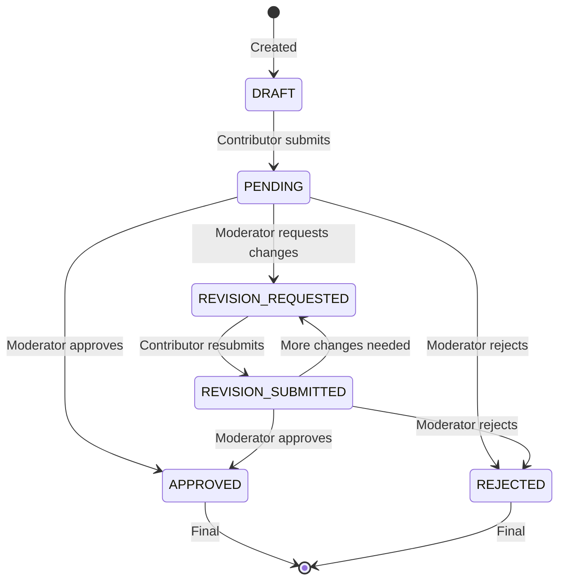

### 9.3 Question Lifecycle

```
Contributor creates question (status: DRAFT)
  │
  ├── Contributor submits question (status: PENDING)
  │     │
  │     ├── Moderator approves (status: APPROVED)
  │     │
  │     ├── Moderator rejects (status: REJECTED)
  │     │     └── Contributor can edit and resubmit
  │     │
  │     └── Moderator requests revision (status: REVISION_REQUESTED)
  │           │
  │           └── Contributor resubmits (status: REVISION_SUBMITTED)
  │                 │
  │                 └── Moderator reviews again
  │
  └── Contributor edits draft (status stays DRAFT)
```

### 9.4 Ownership Transfer

- Only coordinators can transfer question ownership
- Target must be an ACTIVE contributor
- Reason is optional
- Creates QuestionOwnershipHistory record

### 9.5 Revision History

Every content change creates a QuestionRevision record storing:
- Snapshot of question text, module, marks, CO, RBT, difficulty, teaching index
- Who changed it
- Change reason

### 9.6 Usage History

When a question is used in paper generation, a QuestionUsageHistory record is created tracking:
- Which generated paper it was used in
- Which exam cycle
- Source type (GENERATED_PAPER, MANUAL, EXPORT)

---

## 10. Question Slots

### Purpose

A QuestionSlot is the linkage between a QuestionBank and a QuestionLibraryItem. Each slot is defined by its position: `(moduleNumber, marks, slotNumber)`.

### Slot Structure

For each module (1-6 or 1-3), for each mark value (2, 5, 10), there are 7 slots. So:

- ISE (3 modules): 3 × 3 × 7 = 63 slots
- ENDSEM (6 modules): 6 × 3 × 7 = 126 slots

### Fields

| Field | Description |
|-------|-------------|
| questionBankId | Parent bank |
| moduleNumber | Which module |
| marks | 2, 5, or 10 |
| slotNumber | 1-7 (unique within module + marks) |
| assignedQuestionId | The question in this slot (nullable) |
| reservedById | User who reserved the slot (optional) |
| reservedAt | When reserved |
| isLocked | Prevents modification |

### Business Rules

- `@@unique([questionBankId, moduleNumber, marks, slotNumber])` — unique position
- A question can only be in ONE slot per bank (app-layer enforcement)
- Slots in LOCKED banks cannot be modified
- Cannot assign the same question to multiple slots in the same bank

### Slot Assignment Flow

```
Contributor or Coordinator
  │
  ├── Creates a new question via createForBank()
  │     └── System auto-assigns to first empty matching slot
  │         (same moduleNumber + marks, ordered by slotNumber)
  │
  └── Manually assigns existing question to slot
        └── Validates:
              ├── Slot exists
              ├── Bank is not LOCKED
              ├── Slot is not locked
              ├── Question exists
              └── Question not already in another slot in this bank
```

---

## 11. Moderation Workflow

### Purpose

Moderators review questions submitted by contributors for quality, correctness, and adherence to standards.

### Who Can Moderate

- Users with role `MODERATOR`
- Must be assigned to the question bank via `ModeratorBankAssignment`
- Can only moderate when bank is in `MODERATION` phase

### Actions

| Action | Resulting Status | Requires Note? |
|--------|-----------------|----------------|
| Approve | APPROVED | No |
| Reject | REJECTED | Yes (reason required) |
| Request Revision | REVISION_REQUESTED | Yes (instructions required) |

### Moderation Flow

```
Coordinator assigns moderator to bank
  │
  ├── Bank advances to MODERATION phase
  │
  ├── Moderator sees all questions requiring review
  │     (PENDING or REVISION_SUBMITTED status)
  │
  ├── Moderator clicks into a question
  │     ├── Reads question text
  │     ├── Views metadata (module, marks, CO, RBT, difficulty)
  │     ├── Checks revision history
  │     └── Takes action:
  │           ├── Approve → question moves to APPROVED
  │           ├── Reject → question moves to REJECTED
  │           │     └── Contributor notified with reason
  │           └── Request revision → question moves to REVISION_REQUESTED
  │                 └── Contributor notified with instructions
  │
  ├── All questions moderated?
  │     └── Coordinator can advance to APPROVAL phase
  │
  └── Optimistic locking: if another moderator acted first,
      the update fails with conflict error
```

### Notification Triggers

- **Question approved**: `NotificationType.SUCCESS` to contributor
- **Question rejected**: `NotificationType.ACTION_REQUIRED` to contributor
- **Revision requested**: `NotificationType.ACTION_REQUIRED` to contributor

### Conflict Prevention

Uses Prisma's `P2025` error code handling:
```typescript
await prisma.questionLibraryItem.update({
  where: { id: questionId, status: originalStatus }, // optimistic lock
  data: { status, reviewedAt: new Date(), moderatorRemark: note ?? null },
}).catch((err) => {
  if (err.code === "P2025") throw new ConflictError("Modified by another moderator");
  throw err;
});
```

---

## 12. AI Analysis

### Purpose

The AI Analysis module generates a report on the question bank's coverage, quality, and balance. It combines deterministic metrics (always computed) with optional AI-generated insights from Ollama.

### Who Triggers It

**Coordinator** — from the question bank workspace or as part of the approval workflow.

### Analysis Components

#### Deterministic Analysis (always runs)

1. **Module Coverage**: For each module (1-6 or 1-3), how many approved questions exist (target: 21 per module)
2. **Course Outcome Distribution**: Count of questions per CO (CO1-CO6)
3. **RBT Level Distribution**: Count per Bloom's level (L1-L6)
4. **Difficulty Distribution**: Count per difficulty level (EASY, MEDIUM, HARD)
5. **Missing Areas**: Modules with no questions, COs not covered, RBT levels not represented
6. **Quality Findings**: Imbalance detection (e.g., too many EASY vs HARD questions)
7. **Bloom's Balance Assessment**: L1-L3 vs L4-L6 ratio

#### AI Analysis (optional, Ollama)

If Ollama is available, it receives the deterministic report and returns:
- `executiveSummary`: Natural language summary
- `missingAreas`: List of gaps
- `qualityFindings`: Quality observations
- `bloomsBalance`: Bloom's taxonomy assessment

If Ollama is unavailable, the system still completes with the deterministic report only.

### Report Structure

```json
{
  "moduleCoverage": [
    { "label": "1", "total": 21, "approved": 15, "missing": 6 }
  ],
  "coDistribution": [
    { "key": "CO1", "count": 8, "percentage": 27 }
  ],
  "rbtDistribution": [ ... ],
  "difficultyDistribution": [ ... ],
  "duplicates": [],
  "missingAreas": ["Module 6 has no approved questions."],
  "qualityFindings": [],
  "bloomsBalance": "Balanced Bloom's taxonomy distribution.",
  "inventory": {
    "approvedQuestions": 36,
    "remainingWarning": false,
    "remainingCritical": false,
    "exhausted": false
  },
  "executiveSummary": "AI analysis unavailable. Deterministic report only.",
  "chartData": { ... }
}
```

---

## 13. Coordinator Approval Decision

### Purpose

After AI analysis is complete and the coordinator has reviewed the report, they make a final decision:

| Decision | Action |
|----------|--------|
| APPROVED | Bank advances to COMPLETE phase |
| REJECTED | Bank returns to MODERATION phase |

### Flow

```
Coordinator reviews AI report
  │
  ├── "Approve" → Creates ApprovalDecision(APPROVED)
  │     └── Bank phase → COMPLETE
  │     └── Papers can now be generated
  │
  └── "Reject" → Creates ApprovalDecision(REJECTED)
        └── Bank phase → MODERATION (loopback)
        └── Coordinator can provide remark explaining why
        └── Questions go back to moderation
```

### Business Rules

- Only one ApprovalDecision per bank (`@@unique([questionBankId])`)
- Decision only possible when bank is in APPROVAL phase
- Decision creates an immutable audit record

---

## 14. Paper Generation

### Purpose

Automatically generates 3 paper variants (Paper A, Paper B, Paper C) from the approved question inventory using an algorithm that selects questions to maximize coverage and minimize duplication.

### Who Triggers It

**Coordinator** — after approval decision (bank in COMPLETE phase) or from the bank workspace.

### Algorithm

```
For each variant (PAPER_A, PAPER_B, PAPER_C):
  For each module (1-6 or 1-3):
    For each marks value (2, 5, 10):
      Find approved question matching (module, marks)
      That is NOT already used in this variant
      That is NOT used in any previously generated paper
      Rank candidates: MEDIUM difficulty = highest priority
      Select best candidate
  Generate coverage score, difficulty score, quality score
  Calculate duplicate risk
  Build recommendation text
```

### Per-Variant Output

| Metric | How Calculated |
|--------|---------------|
| **Coverage Score** | (Unique modules covered / 6) × 100 |
| **Difficulty Score** | Spread across EASY/MEDIUM/HARD; larger spread = lower score |
| **Quality Score** | Average question text length + teaching index coverage bonus |
| **Duplicate Risk** | Pairwise Jaccard similarity; threshold 84% |
| **Recommendation** | "Recommended for dean review" if ≥2 difficulty levels |

### Paper Persistence

Each variant is stored as:
- `GeneratedPaper` record in database (with all scores)
- `GeneratedPaperItem` records for each question (used for usage tracking)
- PDF file in MinIO bucket `generated-papers`
- `PaperSnapshot` for temporal history

### Usage Tracking

Every question used in a paper gets a `QuestionUsageHistory` record with `sourceType: "GENERATED_PAPER"`.

---

## 15. Dean Review

### Purpose

The Dean reviews the 3 generated paper variants and selects which variant goes to which exam slot:

| Slot | Description |
|------|-------------|
| Regular Paper | Main exam |
| Supplementary Paper | Makeup/second chance exam |
| KT Paper | Carry-over / back paper exam |

### Who Does It

**Dean** — institution-wide role with no department restrictions.

### Prerequisites

- Bank must be LOCKED (`recordStatus === LOCKED`)
- Generated papers must exist (all 3 COMPLETED)

### Review Flow

```
Dean dashboard → "Review papers" link
  │
  ├── Sees all 3 paper variants with scores:
  │     ├── Coverage Score
  │     ├── Difficulty Score
  │     ├── Quality Score
  │     ├── Duplicate Risk
  │     └── AI Recommendation
  │
  ├── Dean selects for each slot:
  │     ├── Regular Paper: [PAPER_A | PAPER_B | PAPER_C]
  │     ├── Supplementary: [PAPER_A | PAPER_B | PAPER_C]
  │     └── KT Paper: [PAPER_A | PAPER_B | PAPER_C]
  │
  ├── Validates:
  │     ├── All 3 slots assigned to different papers
  │     └── All selected papers exist in the bank
  │
  ├── Creates DeanReview record (immutable)
  │
  ├── Notifications sent:
  │     ├── COE: "Dean review complete — ready for export"
  │     └── Coordinator: "Dean review complete"
  │
  └── Production page now shows dean selections
```

### Business Rules

- Only ONE dean review per bank (`@@unique([questionBankId])` on DeanReview)
- All 3 selected papers must be different
- Review is immutable after creation (no edit)

---

## 16. Locking & Snapshots

### Locking

**Who locks:** Coordinator (via `lockQuestionBank`)

**When:** After dean review, before export

**Effect:**
- `recordStatus` changed to `LOCKED`
- All mutations blocked by `ensureQuestionBankMutable()`
- `lockedAt` timestamp recorded
- `QuestionBankSnapshot` created (LOCKED type)
- Shows in COE production console as ready for export

**Requirements:**
- Exam cycle must be ACTIVE
- Exam cycle must have an end date

### Snapshots

Three snapshot types preserve state at critical points:

| Type | When Created |
|------|-------------|
| LOCKED | When bank is locked |
| APPROVED | When coordinator approves |
| EXPORTED | When papers are exported |

Each snapshot stores:
- All slot assignments (JSON)
- Current phase and record status
- Version number
- Metadata

### Unlocking

The API route `POST /api/question-banks/[id]/unlock` allows reverting a LOCKED bank back to ACTIVE. This would be used if the COE or coordinator needs to make changes after locking.

---

## 17. Exports

### Purpose

Generate final printable examination packets containing all 3 papers (Regular, Supplementary, KT) in the desired format.

### Who Does It

**COE** — only COE has `exports:manage` permission.

### Prerequisites

- Dean review must exist (dean has selected variants)
- Bank must be locked (optional but recommended)

### Export Formats

| Format | Content | Use Case |
|--------|---------|----------|
| PDF | Single PDF with all 3 papers | Print-ready |
| DOCX | Single DOCX with all 3 papers | Editable |
| ZIP | PDF + DOCX + manifest.json | Archive |

### Export Flow

```
COE opens Production Console
  │
  ├── Sees all banks with dean reviews
  │
  ├── Clicks "Export" for a bank
  │
  ├── Enter export details:
  │     ├── Format (PDF / DOCX / ZIP)
  │     ├── Exam Date
  │     ├── Duration
  │     ├── Maximum Marks
  │     ├── Instructions (list of strings)
  │     └── Institution Name (default from env)
  │
  ├── System:
  │     1. Creates ExportArtifact (status: PENDING)
  │     2. Retrieves dean-selected papers
  │     3. Builds paper documents with:
  │           - Header: Institution name, subject, exam type
  │           - Instructions
  │           - Questions with numbering
  │     4. Renders to chosen format (PDF via pdf-lib, DOCX via docx npm)
  │     5. Uploads to MinIO bucket "exports"
  │     6. Updates ExportArtifact (status: COMPLETED) with file reference
  │     7. Sets expiry date (default: 30 days)
  │
  └── Download link available
```

### Document Structure

Each paper in the export includes:
- Header: Institution name
- Title: "Regular Exam Paper" / "Supplementary Paper" / "KT Paper"
- Subject: Name and code
- Info line: Exam type, date, duration, total marks
- Instructions (bullet list)
- Questions with metadata tags: `[M{module} • {marks}M • {CO} • {RBT}]`

### Download Link

- Presigned URL from MinIO (Signed URL)
- Configurable expiry (default: 900 seconds)
- Only accessible by COE

### Export Artifact Lifecycle

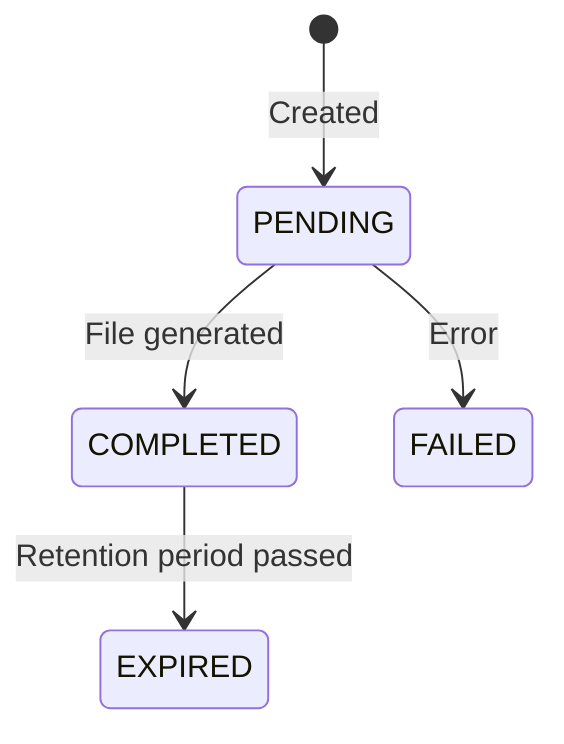

---

## 18. Notifications

### Purpose

In-app notifications (with optional email) alert users to events requiring their attention.

### Types

| Type | Meaning | Example |
|------|---------|---------|
| INFO | General information | "AI analysis ready" |
| SUCCESS | Positive outcome | "Question approved" |
| WARNING | Needs attention | "Review pending" |
| ACTION_REQUIRED | Urgent action needed | "Papers ready for review" |

### Triggers

| Event | Recipient | Type |
|-------|-----------|------|
| Question approved | Contributor | SUCCESS |
| Question rejected | Contributor | ACTION_REQUIRED |
| Revision requested | Contributor | ACTION_REQUIRED |
| AI analysis ready | Coordinator | INFO |
| Paper generation complete | Coordinator | SUCCESS |
| Dean review complete | COE, Coordinator | ACTION_REQUIRED, SUCCESS |
| Dean review reminder | Dean | WARNING |
| Papers ready for review | Dean | ACTION_REQUIRED |

### Email Notifications

- `EmailService` wraps either SMTP provider or Console provider (fallback)
- Console provider logs to console (for development)
- SMTP requires `SMTP_HOST`, `SMTP_USER`, `SMTP_PASS` env vars
- `createAndEmail()` creates in-app notification AND attempts email
- Email failures are logged but do not block the workflow

### In-App Notification Retrieval

- `GET /api/notifications` - list user's notifications
- Client-side polling or server-side rendering
- Unread count tracked in dashboard

### Mark as Read

- `markAsRead()` - mark specific notification IDs
- `markAllAsRead()` - mark all as read
- `markByActionUrlAsRead()` - triggered when user visits the action URL

---

## 19. Audit Logging

### Purpose

Tamper-evident, chain-linked audit trail for all significant actions.

### Architecture

```
Each audit log entry:
  ├── Entry data: actorId, action, entityType, entityId, metadata, ipAddress, userAgent
  ├── previousHash: SHA-256 hash of the PREVIOUS entry (chain link)
  └── integrityHash: SHA-256 hash of THIS entry (includes previousHash)
```

### Verification

The chain allows verifying that no entries have been tampered with:
- Recompute hash of each entry
- Verify it matches the stored integrityHash
- Verify each entry's previousHash matches the previous entry's integrityHash

### Retry on Conflict

Uses `Serializable` transaction isolation level with up to 3 retries to handle concurrent entries.

### Logged Actions

| Action | Entity Type |
|--------|-------------|
| QUESTION_BANK_APPROVED | QUESTION_BANK |
| QUESTION_BANK_REJECTED | QUESTION_BANK |
| DEAN_SELECTION_SUBMITTED | DEAN_REVIEW |
| AI_REPORT_GENERATED | AI_REPORT |
| QUESTION_PAPERS_GENERATED | GENERATED_PAPER |
| (plus all CRUD operations via API handler) |

### Viewing Audit Logs

The COE can view audit logs at `/dashboard/coe/audit`. This shows the last 25 log entries with actor information.

---

## 20. System Backup & Monitoring

### System Backup

- Triggered via `POST /api/backups`
- Runs `mysqldump` against the database
- Uploads SQL dump to MinIO bucket `system-backups`
- Status tracked: PENDING → COMPLETED / FAILED
- Auto-expires after configurable retention days

### Expired Artifact Cleanup

`cleanupExpiredArtifacts()`:
- Finds expired exports and backups
- Deletes files from MinIO
- Updates records to EXPIRED status
- Can be run as cron job

### Monitoring Dashboard

Available at `/dashboard/coe/monitoring` for COE:

| Section | What It Shows |
|---------|--------------|
| Health | Database connectivity + latency, MinIO bucket health |
| Metrics | User count, bank count, AI report count, export count, backup count, file bucket counts |
| Workflows | In-progress AI reports, paper generations, exports, backups |

---

## 21. Production Console (COE)

### Purpose

Central hub for COE to monitor and manage the final stages of the workflow — reviewing papers, dean selections, and exporting.

### Access

COE only (navigable from `/dashboard/coe/production`).

### Page Layout

```
Production Console
  │
  ├── Table: "Generated Papers and Dean Selections"
  │     ├── Subject (code + name)
  │     ├── AI Report (status badge)
  │     ├── Papers (badges for A/B/C)
  │     └── Dean Selection (Regular/Supplementary/KT) or "Pending"
  │
  └── Export Console
        ├── For each bank with dean review:
        │     ├── Format selector (PDF / DOCX / ZIP)
        │     ├── Exam Date input
        │     ├── Duration input
        │     ├── Maximum Marks input
        │     ├── Instructions editor
        │     ├── Export button
        │     └── Download link (after export)
        └── Recent exports list
```

---

## 22. Complete Screen-by-Screen Guide

### 22.1 Login Page (`/login`)

**Purpose:** Authenticate into the system.

**Who can access:** Everyone (unauthenticated).

**Elements:**
- Left panel: Branding with system name, description, role list
- Right panel: Sign-in form

**Form fields:**
| Field | Type | Required |
|-------|------|----------|
| Email | email | Yes |
| Password | password | Yes |

**Links:** "Forgot password?" → `/forgot-password`

**What happens on submit:**
1. `POST /api/auth/login` with email + password
2. Server validates via `verifyCredentials()`
3. On success: sets JWT cookies, redirects to `/dashboard`
4. On failure: shows error message "Invalid email or password"

### 22.2 Dashboard Index (`/dashboard`)

**Purpose:** Role-based landing page that redirects users to their appropriate workspace.

**Who can access:** Any authenticated user.

**Elements:**
- Access denied banner (if user tried to access wrong role's workspace)
- Single card linking to user's role-appropriate dashboard

**Redirection logic:**
| User Role | Link |
|-----------|------|
| COE | `/dashboard/coe` |
| COORDINATOR | `/dashboard/coordinator` |
| CONTRIBUTOR | `/dashboard/contributor` |
| MODERATOR | `/dashboard/moderator` |
| DEAN | `/dashboard/dean` |

### 22.3 COE Dashboard (`/dashboard/coe`)

**Purpose:** System administration hub.

**Who can access:** COE.

**Elements:**
- **Stat Cards**: Users count, Departments count, Active Cycles count, Question Banks count
- **Pending Tasks**: List of suggested actions
- **Notifications**: Recent notification list

**Navigation sidebar links:**
- Academic Setup
- Academic Units
- Departments
- Programmes
- Curriculum Schemes
- Curriculum Subjects
- Batches
- Batch Semesters
- Teaching Groups
- Users
- Coordinator Assignments
- Academic Years
- Exam Cycles
- Production
- Audit
- Monitoring

### 22.4 COE — Academic Setup Page

**Purpose:** Quick-access overview of all academic setup entities.

**Elements:**
- Cards for each entity type (Departments, Programmes, Curriculum Schemes, Batches)
- Links to manage each

### 22.5 COE — Departments Page

**Purpose:** CRUD management of departments.

**Elements:**
- Table with columns: Name, Code, HOD Name, Status, Actions
- Create Department button
- Inline actions: edit, delete

**Create/Edit Dialog:**
| Field | Type | Required |
|-------|------|----------|
| Name | text | Yes |
| Code | text | Yes |
| HOD Name | text | Yes |

### 22.6 COE — Users Page

**Purpose:** Manage all system users (create, edit, disable).

**Elements:**
- Table: Name, Email, Role, Department, Status, Last Login, Actions
- Create User button
- Edit/Disable actions per user

**Create/Edit Form:**
| Field | Type | Required |
|-------|------|----------|
| Name | text | Yes |
| Email | email | Yes |
| Role | select (COE/COORDINATOR/MODERATOR/CONTRIBUTOR/DEAN) | Yes |
| Department | select (optional for COE/DEAN) | No |
| Password | password | Yes (on create), No (on edit) |
| Status | select (ACTIVE/DISABLED) | No |

### 22.7 COE — Exam Cycles Page

**Purpose:** List, create, and manage exam cycles.

**Elements:**
- Table: Exam Type, Batch/Semester, Status, Timetable, Actions
- Create Exam Cycle button

**Create Exam Cycle Wizard:**
- Step 1: Select Batch (from dropdown)
- Step 2: Select Semester (from batch's semesters)
- Step 3: Select Exam Type (ISE_1, ISE_2, ENDSEM, SUPPLEMENTARY, KT)
- System loads curriculum subjects automatically
- Step 4: Enter timetable details (title, issue date, rows, signature)
- Submit creates ExamCycle + SubjectExamCycleLinks

### 22.8 COE — Production Page (`/dashboard/coe/production`)

See Section 21 above.

### 22.9 COE — Audit Page (`/dashboard/coe/audit`)

**Purpose:** View tamper-evident audit log.

**Elements:**
- Table: Timestamp, Actor, Action, Entity Type, Entity ID
- Shows last 25 audit entries

### 22.10 COE — Monitoring Page (`/dashboard/coe/monitoring`)

**Purpose:** System health and observability.

**Elements:**
- Health status (Database, MinIO)
- Metrics (users, banks, reports, exports, backups)
- Workflow pipeline status

### 22.11 COE — Academic Units Page

**Purpose:** Manage academic units.

**Elements:**
- Table: Name, Code, Type, HOD, Status
- Create button
- Edit/Deactivate actions

### 22.12 COE — Programmes Page

**Purpose:** Manage degree programmes.

**Elements:**
- Table: Name, Code, Degree Type, Duration, Home Unit
- Create button
- Edit/Delete actions

**Create Form:**
| Field | Type | Required |
|-------|------|----------|
| Name | text | Yes |
| Code | text | Yes |
| Degree Type | select | Yes |
| Duration Years | number | Yes |
| Duration Semesters | number | Yes |
| Home Academic Unit | select | Yes |
| First Year Academic Unit | select | No |

### 22.13 COE — Curriculum Schemes Page

**Purpose:** Manage curriculum schemes for programmes.

**Elements:**
- Table: Programme, Name, Year, Status
- Create button
- Activate/Delete actions

**Create Form:**
| Field | Type | Required |
|-------|------|----------|
| Programme | select | Yes |
| Name | text | Yes |
| Year | number | Yes |
| Is Active | checkbox | No |

### 22.14 COE — Curriculum Subjects Page

**Purpose:** Map subjects to semesters and academic units within a curriculum scheme.

**Elements:**
- Filter by scheme, semester
- Table: Subject, Semester, Academic Unit, Group
- Create button

### 22.15 COE — Batches Page

**Purpose:** Manage student cohorts.

**Elements:**
- Table: Name, Code, Programme, Scheme, Years, Status
- Create button
- Detail/semester/teaching-groups navigation

**Create Form:**
| Field | Type | Required |
|-------|------|----------|
| Name | text | Yes |
| Code | text | Yes |
| Programme | select | Yes |
| Curriculum Scheme | select | Yes |
| Admission Year | number | Yes |
| Graduation Year | number | Yes |
| Has Teaching Groups | checkbox | No |

**Batch Detail Page Elements:**
- Batch info summary
- Quick links to semesters and teaching groups

**Batch Semesters Page:**
- Table: Semester, Academic Year, Unit, Start/End Date, Status
- Activate/Update actions

**Teaching Groups Page:**
- List of groups (if applicable)
- Group name and description

### 22.16 COE — Coordinator Assignments Page

**Purpose:** Assign coordinators to departments.

**Elements:**
- Table: Coordinator, Department, Assigned At
- Assign button

**Assign Form:**
| Field | Type | Required |
|-------|------|----------|
| Coordinator | select (users with role COORDINATOR) | Yes |
| Department | select | Yes |

### 22.17 COE — Academic Years Page

**Purpose:** Manage academic years.

**Elements:**
- Table: Code, Start/End Date, Status
- Create button

**Create Form:**
| Field | Type | Required |
|-------|------|----------|
| Code | text | Yes |
| Start Date | date | Yes |
| End Date | date | Yes |
| Status | select | No |

### 22.18 Coordinator Dashboard (`/dashboard/coordinator`)

**Purpose:** Central hub for department coordinators.

**Who can access:** COORDINATOR.

**Elements:**
- **Stat Cards**: Active Banks, Drafting, Moderation, Approval, Complete counts
- **Overdue Banks**: Cards for banks stalled >7 days
- **Active Exam Cycles**: Links to exam workspace
- **Needs Attention**: Cards for stalled, missing moderator, ready-to-advance items
- **Phase Distribution**: Grid showing counts per phase
- **Active Banks Table**: Subject, Exam Type, Phase, Fill %, Approved %, Days in Phase, Status, Next Action
- **Recent Contribution Activity**: Recent question submissions
- **Notification Inbox**: Recent notifications with unread count

**Navigation sidebar links:**
- Dashboard
- Subjects
- Question Banks
- Questions
- Coverage
- Assignments

### 22.19 Coordinator — Subjects Page

**Purpose:** View and manage subjects for assigned departments.

**Actions:**
- Create Subject
- Edit Subject
- Deactivate Subject
- Link to Exam Cycle
- View Versions

**Create Subject Form:**
| Field | Type | Required |
|-------|------|----------|
| Subject Code | text | Yes |
| Subject Name | text | Yes |
| Department | select | Yes |
| Semester Number | number (1-8) | Yes |
| Credit Load | number | Yes |

**Subject Detail Page Elements:**
- Subject info
- Active version
- Linked exam cycles
- Question banks for this subject

### 22.20 Coordinator — Question Banks Page

**Purpose:** List and manage question banks.

**Elements:**
- Table: Subject, Phase, Status, Created
- Filter by department, exam cycle, status
- Initialize new bank

**Initialize Bank Form:**
| Field | Type | Required |
|-------|------|----------|
| Subject | select | Yes |
| Exam Cycle | select | Yes |

### 22.21 Coordinator — Question Bank Detail Page

**Purpose:** Full workspace for a single question bank.

**Elements:**
- **Bank Header**: Subject name, exam cycle, phase, status badges
- **Workflow Timeline**: Visual phase indicator
- **Slot Grid**: Organized by module, marks, slot number
  - Empty slot → "Empty" placeholder
  - Filled slot → question text preview, status badge, creator name
- **Slot Coverage Dashboard**: Summary of filled/empty by module
- **Actions Panel** (context-dependent):
  - DRAFTING: Assign Contributor, Advance to Moderation
  - MODERATION: View moderator assignments, Advance to Approval
  - APPROVAL: Generate AI Report, View AI Report, Approve/Reject
  - COMPLETE: Generate Papers, View Papers, Lock
- **AI Reports**: Latest report card
- **Generated Papers**: Paper A/B/C cards with previews
- **Dean Review Status**: If applicable
- **Next Step Guidance**: Contextual help text

### 22.22 Coordinator — Questions Page

**Purpose:** View all questions across assigned departments.

**Elements:**
- Filters: Subject, Module, Marks, Status, Contributor
- Table: Question, Module, Marks, Status, Contributor, Submitted Date
- Click to view detail

### 22.23 Coordinator — Question Detail Page

**Purpose:** Full question with history and actions.

**Elements:**
- Question text and metadata
- Status history
- Revision history
- Ownership transfer button
- Moderation events

### 22.24 Coordinator — Coverage Page

**Purpose:** Visual coverage analysis for a subject version.

**Elements:**
- Module Coverage: Bar/table per module with adequate/partial/missing status
- CO Coverage: Which outcomes are covered/missing
- RBT Coverage: Which Bloom's levels are covered/missing
- Difficulty Coverage: EASY/MEDIUM/HARD distribution

### 22.25 Coordinator — Assignments Page

**Purpose:** Manage moderator assignments.

**Elements:**
- List of banks needing moderators
- Assign Moderator form

**Assign Moderator Form:**
| Field | Type | Required |
|-------|------|----------|
| Question Bank | select | Yes |
| Moderator | select (users with role MODERATOR) | Yes |

### 22.26 Coordinator — Exam Workspace Page

**Purpose:** Focused view of a single exam cycle across subjects.

**Elements:**
- Cycle info header
- List of subjects with:
  - Bank phase
  - Fill percentage
  - Moderation status
  - Approval status
- Quick actions per subject

### 22.27 Contributor Dashboard (`/dashboard/contributor`)

**Purpose:** Question creation hub.

**Who can access:** CONTRIBUTOR.

**Elements:**
- **My Banks**: List of active banks in the contributor's department
  - Per bank: fill percentage, module-marks summary grid
  - "Biggest gap" identification
  - "Create Question" quick-link button for biggest gap
- **My Statistics**: Submitted, Approved, Pending, Revision Requested, Rejected, Draft counts
- **Recent Feedback**: Moderator notes on recent questions
- **Action buttons:** View My Questions, Create New Question

### 22.28 Contributor — My Subjects Page

**Purpose:** Browse subjects available for contribution.

**Elements:**
- List of subjects with bank info
- Link to submit question

### 22.29 Contributor — Questions Page

**Purpose:** View personal question library.

**Elements:**
- Table: Subject, Module, Marks, Status, Submitted Date
- Filters available
- Click to view/edit

### 22.30 Contributor — Submit Question Page

**Purpose:** Create a new question and assign to a bank.

**Form:**
| Field | Type | Required |
|-------|------|----------|
| Bank | select (or pre-filled from context) | Yes |
| Module Number | number (1-6) | Yes |
| Marks | select (2/5/10) | Yes |
| Question Text | textarea (min 15 chars) | Yes |
| CO Mapping | select (CO1-CO6) | Yes |
| RBT Level | select (L1-L6) | Yes |
| Difficulty Level | select (Easy/Medium/Hard) | No |
| Teaching Index | text (max 50 chars) | No |

### 22.31 Contributor — Question Edit Page

**Purpose:** Edit an existing question.

**Same fields as create.** Content changes create a revision record.

### 22.32 Moderator Dashboard (`/dashboard/moderator`)

**Purpose:** Question moderation hub.

**Who can access:** MODERATOR.

**Elements:**
- **Summary Counts**: Pending, Approved, Rejected, Revision Requested, Awaiting Resubmission
- **Awaiting Revision Resubmission**: List of questions needing re-review
- **Recent Moderation Activity**: Recent actions log
- **Quick-Access Bank List**: Banks with pending/revision-submitted counts
- **Notification Inbox**: With mark-as-read functionality

### 22.33 Moderator — Questions Page

**Purpose:** View all questions needing moderation.

**Filters:** Bank ID

**Elements:**
- Table of questions with status
- Click to review

### 22.34 Moderator — Question Detail Page

**Purpose:** Review a single question.

**Elements:**
- Question text and metadata
- Subject info
- Action buttons:
  - Approve
  - Reject (requires reason)
  - Request Revision (requires instructions)

### 22.35 Moderator — Approved Questions Page

**Purpose:** View all approved questions.

### 22.36 Moderator — Rejected Questions Page

**Purpose:** View all rejected questions.

### 22.37 Dean Dashboard (`/dashboard/dean`)

**Purpose:** Final paper review hub.

**Who can access:** DEAN.

**Elements:**
- **Pending Reviews**: Cards showing banks needing dean selection
  - Subject, exam info, generation timestamp
  - "Review papers" link
- **Completed Reviews**: Past reviews with selections shown
  - Regular/Supplementary/KT summary
- **Notification Inbox**

### 22.38 Dean — Review Page (`/dashboard/dean/review`)

**Purpose:** Review generated papers and select variants.

**Elements:**
- **Paper A / Paper B / Paper C** sections:
  - Coverage Score
  - Difficulty Score
  - Quality Score
  - Duplicate Risk percentage
  - AI Recommendation
  - List of questions with module, marks, CO, RBT metadata
- **Selection Form:**
  - Regular Paper: dropdown (A/B/C)
  - Supplementary Paper: dropdown (A/B/C)
  - KT Paper: dropdown (A/B/C)
- **Submit button**
- **Validation:** All three must be different

### 22.39 Dean — Readiness Overview Page

**Purpose:** Overview of all banks ready for dean review.

### 22.40 Dean — Reports Page

**Purpose:** View dean-facing reports.

### 22.41 Forgot Password Page (`/forgot-password`)

**Purpose:** Request password reset email.

**Form:** Email field → Submit

### 22.42 Reset Password Page (`/reset-password`)

**Purpose:** Set new password using reset token.

**Form:** New password + confirm → Submit

---

## 23. Form Reference

### Create Academic Year

| Field | Type | Required | Validation | Saved To | Example |
|-------|------|----------|------------|----------|---------|
| Code | text | Yes | Unique | AcademicYear.code | "2026-2027" |
| Start Date | date | Yes | Must be before end date | AcademicYear.startDate | "2026-06-01" |
| End Date | date | Yes | Must be after start date | AcademicYear.endDate | "2027-05-31" |
| Status | select | No | ACTIVE/CLOSED | AcademicYear.status | ACTIVE |

### Create Department

| Field | Type | Required | Validation | Saved To | Example |
|-------|------|----------|------------|----------|---------|
| Name | text | Yes | Non-empty | Department.name | "Computer Engineering" |
| Code | text | Yes | Unique | Department.code | "COMP" |
| HOD Name | text | Yes | Non-empty | Department.hodName | "Dr. Suresh Patil" |

### Create Programme

| Field | Type | Required | Validation | Saved To | Example |
|-------|------|----------|------------|----------|---------|
| Name | text | Yes | Non-empty | Programme.name | "BE Computer Engineering" |
| Code | text | Yes | Unique | Programme.code | "BECOMP" |
| Degree Type | select | Yes | BE/BTECH/MTECH/PHD/DIPLOMA | Programme.degreeType | BE |
| Duration Years | number | Yes | Positive int | Programme.durationYears | 4 |
| Duration Semesters | number | Yes | Positive int | Programme.durationSemesters | 8 |
| Home Academic Unit | select (AcademicUnit) | Yes | Must be active | Programme.homeAcademicUnitId | — |
| First Year Academic Unit | select (AcademicUnit) | No | Must be active | Programme.firstYearAcademicUnitId | — |

### Create Curriculum Scheme

| Field | Type | Required | Validation | Saved To | Example |
|-------|------|----------|------------|----------|---------|
| Programme | select (Programme) | Yes | — | CurriculumScheme.programmeId | — |
| Name | text | Yes | Non-empty | CurriculumScheme.name | "2025 Scheme" |
| Year | number | Yes | Unique per programme | CurriculumScheme.year | 2025 |
| Is Active | checkbox | No | — | CurriculumScheme.isActive | true |

### Create Batch

| Field | Type | Required | Validation | Saved To | Example |
|-------|------|----------|------------|----------|---------|
| Name | text | Yes | Non-empty | Batch.name | "BE Computer 2025-29" |
| Code | text | Yes | Unique | Batch.code | "BECOMP2025" |
| Programme | select | Yes | Must be active | Batch.programmeId | — |
| Curriculum Scheme | select | Yes | Must be active | Batch.curriculumSchemeId | — |
| Admission Year | number | Yes | < graduation year | Batch.admissionYear | 2025 |
| Graduation Year | number | Yes | > admission year | Batch.graduationYear | 2029 |
| Has Teaching Groups | checkbox | No | — | Batch.hasTeachingGroups | false |

### Create User

| Field | Type | Required | Validation | Saved To | Example |
|-------|------|----------|------------|----------|---------|
| Name | text | Yes | Min 2 chars, no HTML | User.name | "Dr. Mahesh Kulkarni" |
| Email | email | Yes | Valid email, unique | User.email | "coe@emqpgs.local" |
| Role | select | Yes | COE/COORDINATOR/MODERATOR/CONTRIBUTOR/DEAN | User.role | COE |
| Department | select | No | Must exist | User.departmentId | — |
| Password | password | Yes (create) / No (edit) | Min 8 chars | User.passwordHash (bcrypt) | — |

### Create Exam Cycle

| Field | Type | Required | Validation | Saved To | Example |
|-------|------|----------|------------|----------|---------|
| Batch | select | Yes | Must have semesters | ExamCycle.batchSemesterId (via batch semester) | — |
| Semester | select | Yes | 1-8 | ExamCycle.batchSemesterId | 5 |
| Exam Type | select | Yes | Unique per batch+semester | ExamCycle.examType | ENDSEM |
| Timetable Title | text | Yes | Non-empty | ExamCycle.timetableTitle | "End Sem Examination Nov 2026" |
| Timetable Issue Date | date | Yes | Valid date | ExamCycle.timetableIssueDate | "2026-11-01" |
| Timetable Document Ref | text | Yes | Non-empty | ExamCycle.timetableDocumentRef | "REF/2026/ENDSEM" |
| Timetable Rows | JSON array | Yes | Min 1 row, each with date/time/paper | ExamCycle.timetableRows | [...] |
| Timetable Signature | text | Yes | Non-empty | ExamCycle.timetableSignature | "signature-hash" |

### Create Question

| Field | Type | Required | Validation | Saved To | Example |
|-------|------|----------|------------|----------|---------|
| Subject Version | select | Yes | Must exist | QuestionLibraryItem.subjectVersionId | — |
| Module Number | number | Yes | 1-6 | QuestionLibraryItem.moduleNumber | 3 |
| Marks | select | Yes | 2, 5, or 10 | QuestionLibraryItem.marks | 5 |
| Question Text | textarea | Yes | Min 15 chars | QuestionLibraryItem.questionText | "Explain the concept of virtual memory..." |
| CO Mapping | select | Yes | CO1-CO6 | QuestionLibraryItem.coMapping | CO2 |
| RBT Level | select | Yes | L1-L6 | QuestionLibraryItem.rbtLevel | L3 |
| Difficulty Level | select | No | EASY/MEDIUM/HARD | QuestionLibraryItem.difficultyLevel | MEDIUM |
| Teaching Index | text | No | Max 50 chars | QuestionLibraryItem.teachingIndex | "3.2" |

### Coordinator Decision

| Field | Type | Required | Validation | Saved To |
|-------|------|----------|------------|----------|
| Decision | radio | Yes | APPROVED or REJECTED | ApprovalDecision.decision |
| Remark | textarea | No | — | ApprovalDecision.remark |

### Export

| Field | Type | Required | Validation | Saved To |
|-------|------|----------|------------|----------|
| Format | select | Yes | PDF/DOCX/ZIP | ExportArtifact.format |
| Exam Date | date | Yes | Valid date | ExportArtifact.metadata.examDate |
| Duration | text | Yes | — | ExportArtifact.metadata.duration |
| Maximum Marks | number | Yes | Positive int | ExportArtifact.metadata.maximumMarks |
| Instructions | textarea list | Yes | Min 1 | ExportArtifact.metadata.instructions |
| Institution Name | text | No | Default from env | ExportArtifact.metadata.institutionName |

### Dean Review

| Field | Type | Required | Validation | Saved To |
|-------|------|----------|------------|----------|
| Regular Paper | select | Yes | Must be A/B/C | DeanReview.regularPaper |
| Supplementary Paper | select | Yes | Must differ from regular | DeanReview.supplementaryPaper |
| KT Paper | select | Yes | Must differ from both above | DeanReview.ktPaper |

### Batch Semester

| Field | Type | Required | Validation |
|-------|------|----------|------------|
| Start Date | date | No | Must be before end date |
| End Date | date | No | Must be after start date, no overlap with other semesters |

### Create Moderator Assignment

| Field | Type | Required | Validation |
|-------|------|----------|------------|
| Question Bank | select | Yes | Must exist |
| Moderator | select (MODERATOR role) | Yes | Not already assigned |

### Ownership Transfer

| Field | Type | Required | Validation |
|-------|------|----------|------------|
| Target User | select (CONTRIBUTOR role) | Yes | Must be active |
| Reason | text | No | — |

---

## 24. End-to-End Simulations

### Simulation 1: Complete College Setup

**Scenario:** A brand-new engineering college is setting up EMQPGS for the first time.

**Persona:** Dr. Mahesh Kulkarni, COE

```
Step 1: COE logs in
  → Navigates to /login
  → Enters coe@emqpgs.local / Password@123
  → Clicks "Sign in"
  → Redirected to /dashboard
  → Clicks "COE Dashboard"

Step 2: Create Academic Units
  → Navigates to Academic Units
  → Clicks "Create Academic Unit"
  → Fills: Name="Engineering Sciences & Humanities", Code="ESH", Type="ES_H", HOD="Dr. Sharma"
  → Clicks "Create"
  → Database: AcademicUnit created with id=unit_esh
  → Creates another: Name="Computer Engineering", Code="COMP", Type="DEPARTMENT", HOD="Dr. Patil"
  → Database: AcademicUnit created with id=unit_comp

Step 3: Create Department
  → Navigates to Departments
  → Clicks "Create Department"
  → Fills: Name="Computer Engineering", Code="COMP", HOD="Dr. Patil"
  → Clicks "Create"
  → Database: Department created with id=dept_comp

Step 4: Create Programme
  → Navigates to Programmes
  → Clicks "Create Programme"
  → Fills: Name="BE Computer Engineering", Code="BECOMP"
  → Degree Type="BE", Duration 4 years / 8 semesters
  → Home Unit="Computer Engineering (COMP)"
  → First Year Unit="Engineering Sciences & Humanities (ESH)"
  → Clicks "Create"
  → Database: Programme created with id=prog_comp

Step 5: Create Curriculum Scheme
  → Navigates to Curriculum Schemes
  → Clicks "Create Curriculum Scheme"
  → Programme="BE Computer Engineering"
  → Name="2025 Scheme", Year=2025, Active=yes
  → Clicks "Create"
  → Database: CurriculumScheme created with id=scheme_2025

Step 6: Create Academic Years
  → Navigates to Academic Years
  → Clicks "Create Academic Year"
  → Code="2025-2026", Start=2025-06-01, End=2026-05-31
  → Creates also: 2026-2027, 2027-2028, 2028-2029
  → Database: AcademicYear records created

Step 7: Create Subjects (as Coordinator)
  → Logout, login as coordinator.coordinator@institution.edu
  → Navigate to Subjects → Create Subject
  → Subject Code="OS101", Name="Operating Systems"
  → Department="Computer Engineering"
  → Semester=5, Credits=4
  → Clicks "Create"
  → Database: Subject created with id=subj_os101
  → Database: SubjectVersion created (v1)
  → Repeat for: "DBMS101" (Database Systems), "CN101" (Computer Networks)

Step 8: Create Curriculum Subjects
  → Navigate to Curriculum Subjects
  → For each subject, link to scheme_2025, semester 5, COMP unit

Step 9: Create Batch
  → Navigate to Batches
  → Clicks "Create Batch"
  → Name="BE Computer 2025-29", Code="BECOMP2025"
  → Programme="BE Computer Engineering"
  → Scheme="2025 Scheme"
  → Admission=2025, Graduation=2029
  → Clicks "Create"
  → Database: Batch created
  → Database: 8 BatchSemester records auto-created
  → System is now ready for exam cycles.
```

### Simulation 2: Complete Exam Cycle Lifecycle

**Scenario:** Creating an ENDSEM exam for Semester 5 of BE Computer 2025-29.

**Actors:** COE, Coordinator, Contributors (3), Moderator, Dean

```
PART A: COE Creates Exam Cycle

1. COE logs in, navigates to Exam Cycles
2. Clicks "Create Exam Cycle"
3. Selects: Batch="BE Computer 2025-29"
4. Selects: Semester=5 (shows batch's semester 5)
5. Selects: Exam Type="ENDSEM"
6. System loads curriculum subjects for semester 5
   → Shows: OS101, DBMS101, CN101
7. COE fills timetable:
   → Title="End Sem Exam Nov 2026"
   → Issue Date=2026-11-01
   → Rows: [{"date":"2026-11-15","time":"10:00","paper":"OS101"}, ...]
   → Signature="verified-signature"
8. Clicks "Create"
9. Transaction:
   → ExamCycle created (status=DRAFT)
   → 3 SubjectExamCycleLinks created
10. COE activates the cycle (status=ACTIVE)
11. Notifications sent to Coordinator

PART B: Coordinator Initializes Banks

1. Coordinator logs in, sees dashboard
2. Clicks "Question Banks"
3. Clicks "Initialize Bank" for OS101
   → Selects: Subject="OS101", Exam Cycle="ENDSEM Sem 5 2026-27"
   → System creates:
     - QuestionBank (phase=DRAFTING, status=ACTIVE)
     - PaperPattern (6 modules, [2,5,10] marks, 7 slots/module = 126 slots)
     - 126 QuestionSlot records
4. Repeat for DBMS101 and CN101
5. For each bank, assigns moderator:
   → Navigates to "Assignments"
   → Selects bank, selects moderator
   → Database: ModeratorBankAssignment created

PART C: Contributors Write Questions

1. Contributor 1 logs in
2. Sees "My Banks" with OS101, DBMS101, CN101
3. Each shows fill percentage (0%) and biggest gaps
4. Clicks "Create Question" (pre-filled module and marks from gap)
5. Fills form:
   → Question Text: "Explain the concept of virtual memory and how it is implemented using paging."
   → Module: 3, Marks: 5, CO: CO2, RBT: L3, Difficulty: MEDIUM
6. Clicks "Create"
   → Database: QuestionLibraryItem created (status=DRAFT)
   → Auto-assigned to first empty slot (Module 3, 5 marks, slot 1)
   → Revision history created (v1)
7. Contributor writes 20 more questions across modules
8. Submits each question (status → PENDING)
9. Contributors 2 and 3 repeat, each filling ~35-40 slots
10. Eventually all 126 slots filled

PART D: Coordinator Advances to Moderation

1. Coordinator checks dashboard
2. OS101: 100% filled, "Ready for Moderation"
3. Clicks into OS101 bank
4. Clicks "Advance to Moderation"
5. ReadinessEngine checks:
   → All 126 slots filled ✓
   → No issues
6. Bank phase → MODERATION
7. Moderator receives notification

PART E: Moderator Reviews Questions

1. Moderator logs in
2. Dashboard shows: "126 pending review"
3. Clicks into questions list
4. Reviews each question:
   → Reads question text
   → Checks metadata (module, marks, CO, RBT)
   → Clicks "Approve" for well-written questions
   → Clicks "Reject" with reason for incorrect questions
   → Clicks "Request Revision" with instructions for borderline
5. For each action:
   → Database: QuestionLibraryItem.status updated
   → ModerationEvent record created
   → Notification sent to contributor
6. Contributor responds to rejections/revisions:
   → Edits question
   → Resubmits (status → REVISION_SUBMITTED)
   → Moderator reviews again
7. Eventually all 126 questions moderated (APPROVED)

PART F: Coordinator Advances to Approval

1. Coordinator checks dashboard
2. OS101: "Ready for Approval"
3. Clicks "Advance to Approval"
4. ReadinessEngine checks:
   → All questions moderated ✓
5. Bank phase → APPROVAL

PART G: AI Analysis

1. Coordinator clicks "Generate AI Report"
2. System runs:
   → Deterministic analysis (module coverage, CO/RBT/difficulty distribution)
   → Optional: calls Ollama for AI insights
3. AI Report created (status=COMPLETED)
4. Report shows:
   → Module 1-6 coverage: adequate/partial/missing
   → CO1-CO6 distribution
   → L1-L6 distribution
   → Missing areas: "Module 4 has only 8 approved questions"
   → Quality findings: "Disproportionately many easy questions"
   → Bloom's balance: "Balanced"

PART H: Coordinator Makes Decision

1. Coordinator reviews AI report
2. If satisfied: Clicks "Approve"
   → ApprovalDecision(APPROVED) created
   → Bank phase → COMPLETE
3. If unsatisfied: Clicks "Reject"
   → ApprovalDecision(REJECTED) created
   → Bank phase → MODERATION (loopback)
   → Questions re-reviewed, revised, re-moderated

PART I: Paper Generation

1. Coordinator clicks "Generate Papers"
2. System runs PaperGenerator for 3 variants:
   → PAPER_A: Selects 1 question per (module, marks) slot
   → PAPER_B: Selects different questions (avoiding duplicates)
   → PAPER_C: Selects different questions (avoiding duplicates)
3. Each paper scored:
   → Coverage Score: 100% (all 6 modules)
   → Difficulty Score: 85.5
   → Quality Score: 92.3
   → Duplicate Risk: 0%
4. Three GeneratedPaper records created
5. PDFs uploaded to MinIO
6. Usage history recorded for each question
7. Coordinator notifies Dean

PART J: Locking

1. Before dean can review, bank must be locked
2. Coordinator clicks "Lock Question Bank"
3. Ensures:
   → Exam cycle is ACTIVE
   → Exam cycle has end date
4. Database:
   → QuestionBank.recordStatus → LOCKED
   → QuestionBankSnapshot created (type=LOCKED)
   → All further mutations blocked

PART K: Dean Review

1. Dean logs in, sees "Papers ready for review"
2. Clicks "Review papers" for OS101
3. Sees Paper A, B, C with all scores
4. Reviews question lists for each
5. Selects:
   → Regular: PAPER_A
   → Supplementary: PAPER_B
   → KT: PAPER_C
6. Clicks "Submit"
7. Validation: all 3 different ✓
8. Database: DeanReview created (immutable)
9. Notifications sent:
   → COE: "Dean review complete"
   → Coordinator: "Dean review complete"

PART L: Export

1. COE navigates to Production Console
2. Sees OS101 with dean review ✓
3. Clicks "Export"
4. Selects: Format=PDF
5. Fills: Exam Date=2026-11-15, Duration=3 hours, Marks=100
6. Instructions: "Answer any 5 questions", "Use black ink"
7. Clicks "Export"
8. System:
   → Builds 3 papers (Regular/Supplementary/KT) with headers
   → Renders to PDF
   → Uploads to MinIO
   → Creates ExportArtifact record
9. Download link appears
10. COE downloads and prints

PART M: Cycle Closure

1. COE closes exam cycle (status → CLOSED)
2. All banks now archived
```

### Simulation 3: Rejected Moderation Loop

**Scenario:** A contributor submits a question; moderator rejects it; contributor fixes; moderator approves.

```
1. Contributor creates question: "What is OS?" (Module 1, 2 marks)
   → status=DRAFT
2. Contributor submits
   → status=PENDING
3. Moderator reviews, sees question is too vague
4. Clicks "Reject", enters reason: "Question is too vague. Please elaborate on the concepts."
   → status=REJECTED
   → ModerationEvent created
   → Notification to contributor
5. Contributor sees notification, clicks through to question
6. Edits: "Explain the role of an operating system in managing hardware resources, including CPU scheduling and memory management."
7. Resubmits
   → status=PENDING (because resubmit from REJECTED not supported — need DRAFT first)
   
   NOTE: The actual code flow requires contributor to edit (stays REJECTED) and then submit
   from DRAFT. If rejected, the question stays REJECTED. Contributor cannot resubmit a REJECTED
   question directly. The coordinator would need to intervene or create a new question.

   ACTUAL BEHAVIOR (from code):
   - submit() checks: status must be DRAFT or REVISION_REQUESTED
   - REJECTED questions cannot be resubmitted
   - This is a deliberate design — rejected questions are final
   - Contributor must create a new question
```

**Correction based on actual code:**

The status machine shows: REJECTED → [*] (terminal). Rejected questions ARE final. Contributors must create new questions. Only REVISION_REQUESTED questions can be resubmitted.

### Simulation 4: Revision Requested Loop

```
1. Contributor creates and submits question (status=PENDING)
2. Moderator sees quality issue but fixable
3. Clicks "Request Revision", enters: "Add a real-world example to illustrate the concept."
   → status=REVISION_REQUESTED
   → Notification to contributor with instructions
4. Contributor edits question, adds example
5. Clicks "Submit" (status → REVISION_SUBMITTED)
6. Moderator reviews updated question
7. If satisfied: Approve (status → APPROVED)
8. If not: Request Revision again (status → REVISION_REQUESTED)
```

### Simulation 5: Coordinator Rejection (Approve → Loopback)

```
1. Coordinator reviews AI report
2. AI report shows: Module 4 coverage is very poor (only 4 questions)
3. Coordinator clicks "Reject", remark: "Module 4 needs more approved questions. Create and moderate more questions."
4. Database:
   → ApprovalDecision(REJECTED) created
   → QuestionBank.phase → MODERATION
5. Coordinators and moderators work on improving Module 4 coverage
6. New questions created, moderated, approved
7. Coordinator advances to APPROVAL again
8. Re-runs AI analysis
9. If satisfied: Approve → COMPLETE
```

### Simulation 6: Dean Rejection

**NOTE:** The system does NOT have a dean rejection mechanism. Dean review is a one-time selection. If the dean is dissatisfied, they would need to coordinate with the coordinator to unlock the bank (if locked) or restart the workflow at a higher level. The DeanReview record is immutable once created.

### Simulation 7: Password Reset

```
1. User clicks "Forgot password?" on login page
2. Enters email on /forgot-password
3. POST /api/auth/forgot-password
   → System generates reset token, hashes it, stores resetTokenHash + resetTokenExpiry
   → System sends email with reset link (or logs to console in dev)
4. User checks email, clicks link → /reset-password?token=xxx
5. POST /api/auth/reset-password
   → Validates token (hash match + not expired)
   → Sets new password (bcrypt hashed)
   → Clears reset token
6. User redirected to login, signs in with new password
```

### Simulation 8: Configuring Teaching Groups

```
1. COE creates batch with hasTeachingGroups=true
2. System auto-creates TeachingGroup records: Group 1, Group 2
3. When creating CurriculumSubject, can set groupAssignment:
   → ALL (both groups study this subject)
   → GROUP_1 (only group 1)
   → GROUP_2 (only group 2)
4. This allows different subjects for different first-year groups
```

---

## 25. Workflow Diagrams

### 25.1 Full End-to-End Sequence

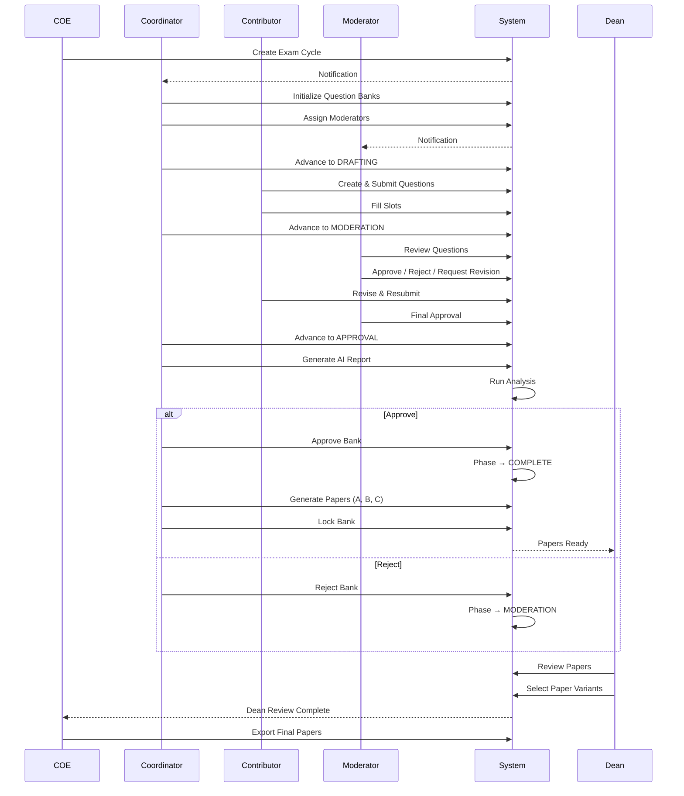

### 25.2 Question Bank Phase State Diagram

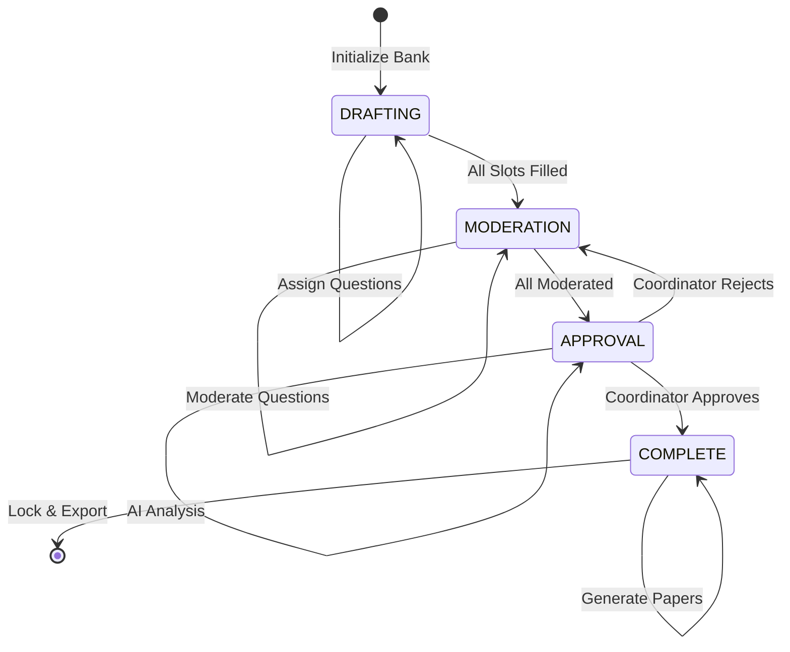

### 25.3 Question Status State Diagram

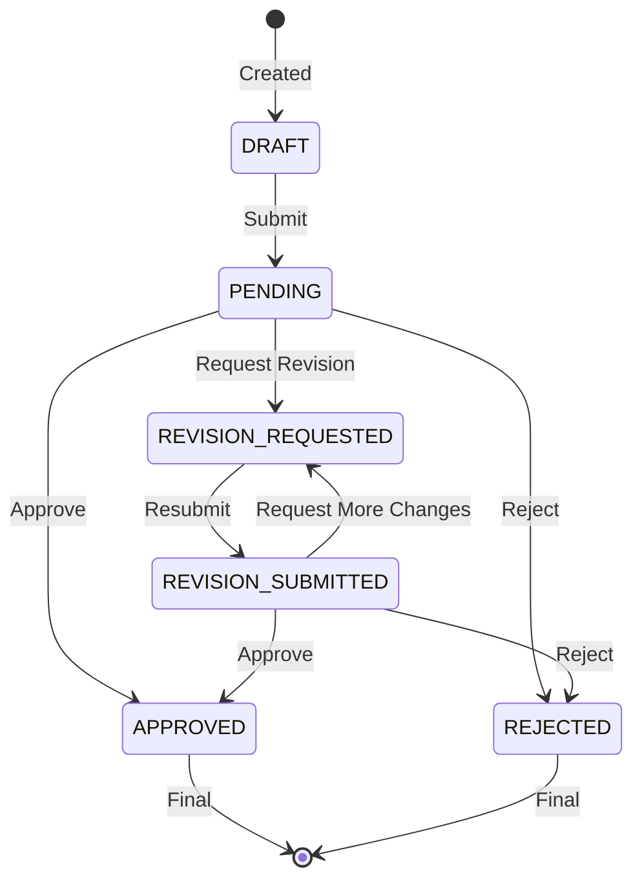

### 25.4 Record Status State Diagram

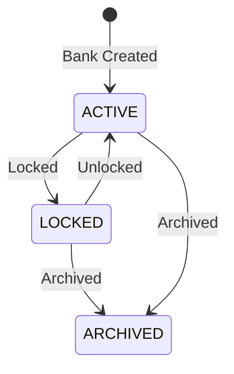

### 25.5 Academic Setup Entity Relationship

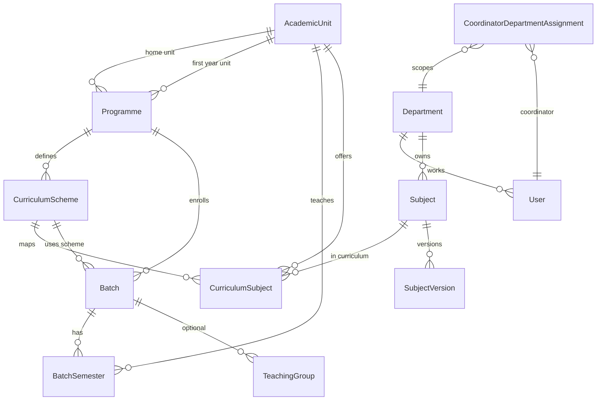

### 25.6 Question Bank Domain Model

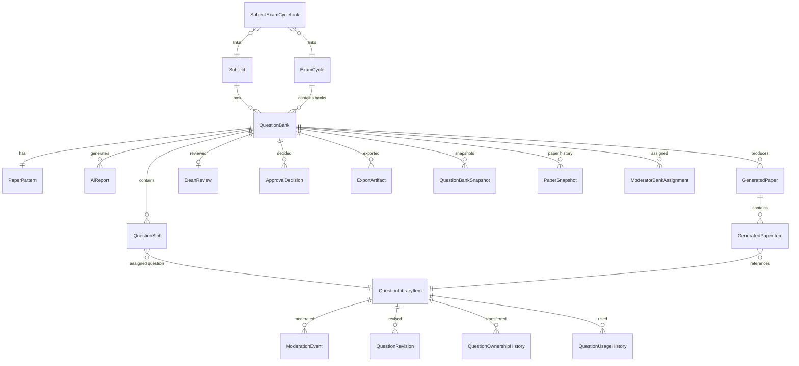

---

## 26. Database Mapping

### 26.1 Key Tables Reference

#### AcademicUnit
| Column | Type | Notes |
|--------|------|-------|
| id | cuid | PK |
| name | String | e.g., "Computer Engineering" |
| code | String | Unique. e.g., "COMP" |
| type | Enum(ES_H, DEPARTMENT) | ES_H for first year |
| hodName | String | Head of department |
| isActive | Boolean | Default true |
| createdAt/updatedAt | DateTime | Auto |

**Relations:** Programme (homeAcademicUnit, firstYearAcademicUnit), CurriculumSubject, BatchSemester

#### Programme
| Column | Type | Notes |
|--------|------|-------|
| id | cuid | PK |
| name | String | e.g., "BE Computer Engineering" |
| code | String | Unique. e.g., "BECOMP" |
| degreeType | Enum(BE, BTECH, MTECH, PHD, DIPLOMA) | |
| durationYears | Int | Default 4 |
| durationSemesters | Int | Default 8 |
| homeAcademicUnitId | cuid | FK → AcademicUnit |
| firstYearAcademicUnitId | cuid? | FK → AcademicUnit (nullable) |
| isActive | Boolean | Default true |

**Relations:** CurriculumScheme, Batch

#### CurriculumScheme
| Column | Type | Notes |
|--------|------|-------|
| id | cuid | PK |
| programmeId | cuid | FK → Programme |
| name | String | e.g., "2025 Scheme" |
| year | Int | |
| isActive | Boolean | Default true |

**Unique:** `[programmeId, year]`

**Relations:** CurriculumSubject, Batch

#### CurriculumSubject
| Column | Type | Notes |
|--------|------|-------|
| id | cuid | PK |
| curriculumSchemeId | cuid | FK → CurriculumScheme |
| subjectId | cuid | FK → Subject |
| semesterNumber | Int | 1-8 |
| academicUnitId | cuid | FK → AcademicUnit |
| groupAssignment | Enum(ALL, GROUP_1, GROUP_2) | |

**Unique:** `[curriculumSchemeId, subjectId, semesterNumber, groupAssignment]`

#### Batch
| Column | Type | Notes |
|--------|------|-------|
| id | cuid | PK |
| name | String | e.g., "BE Computer 2025-29" |
| code | String | Unique |
| programmeId | cuid | FK → Programme |
| curriculumSchemeId | cuid | FK → CurriculumScheme |
| admissionYear | Int | |
| graduationYear | Int | |
| status | Enum(ACTIVE, GRADUATED) | |
| hasTeachingGroups | Boolean | Default false |
| currentBatchSemesterId | cuid? | FK → BatchSemester |

**Relations:** BatchSemester, TeachingGroup

#### BatchSemester
| Column | Type | Notes |
|--------|------|-------|
| id | cuid | PK |
| batchId | cuid | FK → Batch |
| semesterNumber | Int | 1-8 |
| academicYearId | cuid | FK → AcademicYear |
| academicUnitId | cuid | FK → AcademicUnit |
| startDate | DateTime? | Set by COE |
| endDate | DateTime? | Set by COE |
| status | Enum(UPCOMING, ACTIVE, COMPLETED) | |

**Unique:** `[batchId, semesterNumber]`

#### Subject
| Column | Type | Notes |
|--------|------|-------|
| id | cuid | PK |
| subjectCode | String | e.g., "OS101" |
| subjectName | String | e.g., "Operating Systems" |
| credits | Int | |
| status | Enum(ACTIVE, INACTIVE) | |
| questionBankDueDate | DateTime | Default +30 days |
| departmentId | cuid | FK → Department |

**Unique:** `[subjectCode, departmentId]`

#### User
| Column | Type | Notes |
|--------|------|-------|
| id | cuid | PK |
| name | String | |
| email | String | Unique |
| passwordHash | String | bcrypt |
| role | Enum(COE, COORDINATOR, MODERATOR, CONTRIBUTOR, DEAN) | |
| status | Enum(ACTIVE, DISABLED) | |
| lastLoginAt | DateTime? | |
| departmentId | cuid? | FK → Department |
| resetTokenHash | String? | For password reset |
| resetTokenExpiry | DateTime? | For password reset |

#### ExamCycle
| Column | Type | Notes |
|--------|------|-------|
| id | cuid | PK |
| examType | Enum(ISE_1, ISE_2, ENDSEM, SUPPLEMENTARY, KT) | |
| status | Enum(DRAFT, ACTIVE, CLOSED) | |
| version | Int | Optimistic lock |
| startDate | DateTime? | |
| endDate | DateTime? | |
| batchSemesterId | cuid | FK → BatchSemester |
| timetableDocumentRef | String? | |
| timetableIssueDate | DateTime? | |
| timetableTitle | String? | |
| timetableRows | Json? | JSON array |
| timetableSignature | String? | |

**Unique:** `[batchSemesterId, examType]`

#### QuestionBank
| Column | Type | Notes |
|--------|------|-------|
| id | cuid | PK |
| subjectId | cuid | FK → Subject |
| examCycleId | cuid | FK → ExamCycle |
| phase | Enum(DRAFTING, MODERATION, APPROVAL, COMPLETE) | |
| recordStatus | Enum(ACTIVE, LOCKED, ARCHIVED) | |
| version | Int | Optimistic lock |
| createdById | cuid | FK → User |
| lockedAt | DateTime? | |
| lockedReason | String? | |

**Unique:** `[subjectId, examCycleId]`

#### QuestionLibraryItem
| Column | Type | Notes |
|--------|------|-------|
| id | cuid | PK |
| subjectVersionId | cuid | FK → SubjectVersion |
| moduleNumber | Int | 1-6 |
| marks | Int | 2, 5, or 10 |
| questionText | String | Min 15 chars |
| coMapping | Enum(CO1-CO6) | Course Outcome |
| rbtLevel | Enum(L1-L6) | Bloom's Level |
| difficultyLevel | Enum(EASY, MEDIUM, HARD)? | |
| teachingIndex | String? | |
| status | Enum(DRAFT, PENDING, APPROVED, REJECTED, REVISION_REQUESTED, REVISION_SUBMITTED) | |
| createdById | cuid | FK → User |
| ownerId | cuid | FK → User |
| moderatorRemark | String? | |
| submittedAt | DateTime? | |
| reviewedAt | DateTime? | |

#### QuestionSlot
| Column | Type | Notes |
|--------|------|-------|
| id | cuid | PK |
| questionBankId | cuid | FK → QuestionBank |
| moduleNumber | Int | |
| marks | Int | 2, 5, or 10 |
| slotNumber | Int | 1-7 |
| assignedQuestionId | cuid? | FK → QuestionLibraryItem |
| reservedById | cuid? | FK → User |
| reservedAt | DateTime? | |
| isLocked | Boolean | Default false |

**Unique:** `[questionBankId, moduleNumber, marks, slotNumber]`

#### PaperPattern
| Column | Type | Notes |
|--------|------|-------|
| id | cuid | PK |
| questionBankId | cuid | Unique FK → QuestionBank |
| examType | Enum | |
| totalModules | Int | 3 or 6 |
| marksPattern | Json | [2, 5, 10] |
| slotsPerModule | Int | 7 |
| totalSlots | Int | 63 or 126 |

#### ApprovalDecision
| Column | Type | Notes |
|--------|------|-------|
| id | cuid | PK |
| questionBankId | cuid | Unique FK → QuestionBank |
| decision | Enum(APPROVED, REJECTED) | |
| remark | String? | |
| decidedById | cuid | FK → User |
| decidedAt | DateTime | |

#### DeanReview
| Column | Type | Notes |
|--------|------|-------|
| id | cuid | PK |
| questionBankId | cuid | Unique FK → QuestionBank |
| regularPaper | Enum(PAPER_A, PAPER_B, PAPER_C) | |
| supplementaryPaper | Enum(PAPER_A, PAPER_B, PAPER_C) | |
| ktPaper | Enum(PAPER_A, PAPER_B, PAPER_C) | |
| reviewedById | cuid | FK → User |
| notes | String? | |
| status | Enum(PENDING, SUBMITTED, CONFIRMED) | |
| reviewedAt | DateTime | |

#### GeneratedPaper
| Column | Type | Notes |
|--------|------|-------|
| id | cuid | PK |
| questionBankId | cuid | FK → QuestionBank |
| variant | Enum(PAPER_A, PAPER_B, PAPER_C) | |
| status | Enum(PENDING, PROCESSING, COMPLETED, FAILED) | |
| generatedById | cuid? | |
| generatedAt | DateTime? | |
| coverageScore | Float? | |
| difficultyScore | Float? | |
| qualityScore | Float? | |
| duplicateRisk | Float? | |
| recommendation | String? | |
| paperJson | Json? | |
| paperFileAssetId | cuid? | FK → FileAsset |

**Unique:** `[questionBankId, variant]`

#### Notification
| Column | Type | Notes |
|--------|------|-------|
| id | cuid | PK |
| recipientId | cuid | FK → User |
| title | String | |
| message | String | |
| type | Enum(INFO, SUCCESS, WARNING, ACTION_REQUIRED) | |
| isRead | Boolean | Default false |
| actionUrl | String? | Click-through link |
| createdAt/updatedAt | DateTime | |

#### AuditLog
| Column | Type | Notes |
|--------|------|-------|
| id | cuid | PK |
| actorId | cuid? | FK → User |
| action | String | e.g., "QUESTION_BANK_APPROVED" |
| entityType | String | e.g., "QUESTION_BANK" |
| entityId | String? | |
| metadata | Json? | |
| ipAddress | String? | |
| userAgent | String? | |
| previousHash | String? | Chain link |
| integrityHash | String | SHA-256 |
| createdAt | DateTime | |

---

## 27. Role Guide

### 27.1 COE (Controller of Examination)

**Real-world person:** Senior administrator / examination controller.

**Responsibilities:**
- System-wide setup and governance
- User management (create, update, disable)
- Academic structure setup (departments, programmes, batches, academic years)
- Exam cycle creation and activation
- Production oversight (reviewing dean selections, exporting final papers)
- Audit log review
- System monitoring and health checks

**Accessible Pages:**
| Page | URL |
|------|-----|
| Dashboard | `/dashboard/coe` |
| Academic Setup | `/dashboard/coe/academic-setup` |
| Academic Units | `/dashboard/coe/academic-units` |
| Departments | `/dashboard/coe/departments` |
| Programmes | `/dashboard/coe/programmes` |
| Curriculum Schemes | `/dashboard/coe/curriculum-schemes` |
| Curriculum Subjects | `/dashboard/coe/curriculum-subjects` |
| Batches | `/dashboard/coe/batches` |
| Batch Semesters | `/dashboard/coe/batch-semesters` |
| Teaching Groups | `/dashboard/coe/teaching-groups` |
| Users | `/dashboard/coe/users` |
| Coordinator Assignments | `/dashboard/coe/coordinator-assignments` |
| Academic Years | `/dashboard/coe/academic-years` |
| Exam Cycles | `/dashboard/coe/exam-cycles` |
| Production Console | `/dashboard/coe/production` |
| Audit Logs | `/dashboard/coe/audit` |
| Monitoring | `/dashboard/coe/monitoring` |

**Allowed Actions:**
- Create/update/delete any academic entity
- Create/update/disable users (any role)
- Create/activate/close exam cycles
- View all question banks and papers
- Export final papers
- View audit logs and monitoring

**Forbidden Actions:**
- Cannot contribute questions (no question creation)
- Cannot moderate questions
- Cannot make dean selections

**Typical Daily Workflow:**
1. Check monitoring dashboard for system health
2. Review audit logs for suspicious activity
3. Create new users as faculty join
4. Create exam cycles for upcoming examinations
5. Monitor production console for completed dean reviews
6. Export and download finalized papers
7. Activate/close exam cycles as needed

---

### 27.2 Coordinator

**Real-world person:** Department academic coordinator.

**Responsibilities:**
- Subject management (create, edit, deactivate)
- Question bank initialization
- Moderator assignments
- Phase advancement (DRAFTING → MODERATION → APPROVAL → COMPLETE)
- AI report generation and review
- Approval decisions
- Paper generation
- Bank locking

**Accessible Pages:**
| Page | URL |
|------|-----|
| Dashboard | `/dashboard/coordinator` |
| Subjects | `/dashboard/coordinator/subjects` |
| Question Banks | `/dashboard/coordinator/question-banks` |
| Question Bank Detail | `/dashboard/coordinator/question-banks/[id]` |
| Questions | `/dashboard/coordinator/questions` |
| Question Detail | `/dashboard/coordinator/questions/[id]` |
| Coverage | `/dashboard/coordinator/coverage` |
| Assignments | `/dashboard/coordinator/assignments` |
| Exam Workspace | `/dashboard/coordinator/exam-workspace/[id]` |

**Allowed Actions:**
- Manage subjects in assigned departments
- Initialize question banks
- Assign moderators to banks
- Advance bank phases
- Generate AI reports
- Approve or reject banks
- Generate papers
- Lock banks

**Forbidden Actions:**
- Cannot create users
- Cannot create academic structure (departments, programmes, etc.)
- Cannot create exam cycles
- Cannot export papers
- Cannot make dean selections

**Typical Daily Workflow:**
1. Check dashboard for overdue items and items needing attention
2. Advance banks that are ready for next phase
3. Initialize new banks for new exam cycles
4. Assign moderators to banks needing them
5. Review AI reports and make approval decisions
6. Generate papers for approved banks
7. Lock banks after dean review
8. Monitor question contribution progress

---

### 27.3 Contributor

**Real-world person:** Faculty member / teacher.

**Responsibilities:**
- Write and submit questions
- Fill question bank slots
- Respond to moderator feedback (revision requests)
- Track question status

**Accessible Pages:**
| Page | URL |
|------|-----|
| Dashboard | `/dashboard/contributor` |
| My Subjects | `/dashboard/contributor/my-subjects` |
| Questions | `/dashboard/contributor/questions` |
| Question Detail | `/dashboard/contributor/questions/[id]` |
| Question Edit | `/dashboard/contributor/questions/[id]/edit` |
| Submit Question | `/dashboard/contributor/submit-question` |

**Allowed Actions:**
- Create questions in active banks
- Submit questions for moderation
- Edit own draft/revision-requested questions
- View own question history and feedback

**Forbidden Actions:**
- Cannot moderate questions
- Cannot advance bank phases
- Cannot generate AI reports or papers
- Cannot view other contributors' questions
- Cannot manage users or academic structure

**Typical Daily Workflow:**
1. Check dashboard for banks needing questions
2. See biggest gaps (modules with most empty slots)
3. Write and submit questions
4. Check notifications for moderator feedback
5. Revise and resubmit questions as requested
6. Track question approval status

---

### 27.4 Moderator

**Real-world person:** Senior faculty member / quality reviewer.

**Responsibilities:**
- Review pending questions
- Approve, reject, or request revision on questions
- Provide quality feedback
- Monitor revision resubmissions

**Accessible Pages:**
| Page | URL |
|------|-----|
| Dashboard | `/dashboard/moderator` |
| Questions | `/dashboard/moderator/questions` |
| Question Detail | `/dashboard/moderator/questions/[id]` |
| Approved Questions | `/dashboard/moderator/approved` |
| Rejected Questions | `/dashboard/moderator/rejected` |
| Question Banks | `/dashboard/moderator/question-banks/[id]` |

**Allowed Actions:**
- View questions in assigned banks
- Approve well-written questions
- Reject poor questions (with reason)
- Request revisions (with instructions)
- View moderation history

**Forbidden Actions:**
- Cannot edit questions
- Cannot create questions
- Cannot advance bank phases
- Cannot manage users or academic structure
- Cannot view other banks (only assigned ones)

**Typical Daily Workflow:**
1. Check dashboard for pending review count
2. Review questions awaiting moderation
3. Approve quality questions
4. Reject or request revision on problematic questions
5. Monitor revision resubmissions
6. Re-review resubmitted questions

---

### 27.5 Dean

**Real-world person:** Dean of faculty.

**Responsibilities:**
- Review generated paper variants
- Select papers for Regular, Supplementary, and KT slots
- Monitor overall readiness

**Accessible Pages:**
| Page | URL |
|------|-----|
| Dashboard | `/dashboard/dean` |
| Review | `/dashboard/dean/review?bank=[id]` |
| Readiness Overview | `/dashboard/dean/readiness-overview` |
| Reports | `/dashboard/dean/reports` |

**Allowed Actions:**
- View all locked banks with generated papers
- Review paper variants with scores
- Submit dean selection (one-time)

**Forbidden Actions:**
- Cannot edit questions or banks
- Cannot moderate
- Cannot export
- Cannot change selections after submission

**Typical Daily Workflow:**
1. Check dashboard for pending reviews
2. Review paper variants for each ready bank
3. Compare coverage, difficulty, quality scores
4. Select paper assignments for Regular/Supplementary/KT
5. Submit selection

---

## 28. Troubleshooting

### Common Issues and Solutions

#### 1. "Cannot transition from [phase] to [target phase]"

**Cause:** Phase transition is not in the allowed transitions map.

**Valid transitions:**
- DRAFTING → MODERATION
- MODERATION → APPROVAL
- APPROVAL → MODERATION (rejection)
- APPROVAL → COMPLETE (approval)

**Fix:** Ensure the current phase is correct and the target is valid.

#### 2. "Phase advancement blocked: X slots have no question assigned"

**Cause:** Trying to advance from DRAFTING to MODERATION with empty slots.

**Fix:** Fill all empty slots with questions before advancing.

#### 3. "Phase advancement blocked: X questions have no moderation decision"

**Cause:** Trying to advance from MODERATION to APPROVAL with unmoderated questions.

**Fix:** All questions must have at least one moderation event (approved/rejected/revised).

#### 4. "AI report not generated or not completed"

**Cause:** Trying to advance from MODERATION to APPROVAL without AI analysis.

**Fix:** Generate AI report first.

#### 5. "Cannot initialize a bank for an inactive subject"

**Cause:** Subject status is INACTIVE.

**Fix:** Activate the subject first.

#### 6. "Subject must be linked to the exam cycle before initializing a bank"

**Cause:** No SubjectExamCycleLink exists.

**Fix:** Link the subject to the exam cycle first.

#### 7. "An exam cycle already exists for this batch semester and exam type"

**Cause:** Unique constraint violation on `[batchSemesterId, examType]`.

**Fix:** Choose a different exam type or use a different batch semester.

#### 8. "Locked question bank cannot be modified"

**Cause:** Trying to modify a LOCKED bank (assign questions, edit slots, etc.).

**Fix:** Unlock the bank first (coordinator), or work with a different bank.

#### 9. "Questions can only be moderated when the bank is in MODERATION phase"

**Cause:** Trying to moderate questions in DRAFTING or APPROVAL phase.

**Fix:** Ensure bank is in MODERATION phase.

#### 10. "Question is not in an actionable moderation status"

**Cause:** Trying to moderate a question with status other than PENDING or REVISION_SUBMITTED.

**Fix:** Only PENDING and REVISION_SUBMITTED questions can be moderated.

#### 11. "Each exam slot must be assigned to a different paper"

**Cause:** Dean selected the same paper for multiple slots.

**Fix:** Select unique papers for Regular, Supplementary, and KT.

#### 12. "Selected paper does not belong to this question bank"

**Cause:** Dean selected a variant that doesn't exist in this bank.

**Fix:** Only select from available variants (A, B, C shown in the workspace).

#### 13. "A dean selection has already been submitted for this question bank"

**Cause:** Attempting to submit dean review twice.

**Fix:** DeanReview is immutable; contact coordinator if changes are needed.

#### 14. "Dean selections are required before export"

**Cause:** Trying to export a bank without dean review.

**Fix:** Complete dean review first.

#### 15. "No approved inventory available for paper generation"

**Cause:** No questions have APPROVED status.

**Fix:** Ensure questions are moderated and approved.

#### 16. "Insufficient approved inventory for [variant] at Module X, Y-mark slot"

**Cause:** Not enough approved questions to fill all paper slots without duplication.

**Fix:** Create more questions for the affected module and mark combination.

#### 17. "This slot was already assigned by another user"

**Cause:** Race condition — two users tried to assign to the same slot.

**Fix:** Refresh and try again; the slot is now taken.

#### 18. "Coordinator is not assigned to any departments"

**Cause:** Coordinator has no department assignments.

**Fix:** COE must assign coordinator to departments via Coordinator Assignments page.

#### 19. "This coordinator is already assigned to this department"

**Cause:** Unique constraint violation on `[coordinatorId, departmentId]`.

**Fix:** No action needed — assignment already exists.

#### 20. Why is the "Advance" button disabled?

**Check:**
- Are all slots filled? (DRAFTING → MODERATION)
- Has AI report been generated? (MODERATION → APPROVAL)
- Have all questions been moderated?
- Is the bank record status ACTIVE (not LOCKED)?

#### 21. Why can't I see any question banks?

**For Coordinators:** Ensure you are assigned to at least one department.
**For Moderators:** Ensure a coordinator has assigned you to a bank.
**For Contributors:** Ensure you have a department assigned and there are active banks in your department.

#### 22. Why did my paper generation fail?

**Common causes:**
- Not enough approved questions for all slots
- Questions with required (module, marks) combination missing
- Bank not in APPROVAL or COMPLETE phase

#### 23. Email notifications not working?

**Check:**
- SMTP configuration in `.env` (SMTP_HOST, SMTP_USER, SMTP_PASS)
- If no SMTP configured, emails fall back to console logging
- Email failures do not block workflow — only in-app notifications are guaranteed

---

## 29. Glossary

### A

**Academic Unit** — A curriculum-owning body (department or ES&H) that defines subjects and programmes. Distinct from Department (which is an HR entity).

**Academic Year** — A time period (e.g., "2026-2027") used for reporting and scheduling.

**Approval Decision** — A write-once record created when a coordinator decides to approve (→ COMPLETE) or reject (→ MODERATION) a question bank after AI analysis.

**Audit Log** — A tamper-evident, chain-linked log of all significant actions in the system. Each entry links to the previous via SHA-256 hashes.

### B

**Batch** — A student cohort (e.g., "BE Computer 2025-29"). No individual student records exist — only cohort descriptors.

**Batch Semester** — A per-batch instance of a semester with independent start/end dates.

**Bloom's Taxonomy Level (RBT Level)** — A classification of cognitive difficulty:
- L1: Remember
- L2: Understand
- L3: Apply
- L4: Analyze
- L5: Evaluate
- L6: Create

### C

**COE (Controller of Examination)** — System administrator role with full governance access.

**Contributor** — Faculty member who writes and submits questions.

**Coordinator** — Department academic manager who oversees question banks, workflows, and assignments.

**Course Outcome (CO)** — A measurable learning outcome (CO1-CO6) that questions are mapped to.

**Curriculum Scheme** — A named curriculum plan (e.g., "2025 Scheme") defining subject-semester mappings.

**Curriculum Subject** — The authoritative mapping of a subject to a specific semester and academic unit within a curriculum scheme.

### D

**Dean** — Senior faculty role responsible for final paper review and variant selection.

**Department** — HR/admistrative entity representing a faculty department.

### E

**Exam Cycle** — An examination event (e.g., "ENDSEM Semester 5, 2026-2027") grouping subjects for a batch semester.

**Exam Type** — Category of examination:
- ISE_1: In-Semester Exam 1
- ISE_2: In-Semester Exam 2
- ENDSEM: End Semester Exam
- SUPPLEMENTARY: Supplementary/makeup exam
- KT: Carry-over/back paper exam

**Export Artifact** — A generated file (PDF/DOCX/ZIP) containing finalized examination papers.

### F

**File Asset** — A file stored in MinIO with metadata tracked in the database.

### G

**Generated Paper** — An automatically produced paper variant (PAPER_A/B/C) with scored metrics.

**Group Assignment** — Teaching group designation (ALL, GROUP_1, GROUP_2) for curriculum subjects.

### L

**Locked (Record Status)** — A state where no mutations are allowed on a question bank. Required before dean review.

### M

**Moderator** — Senior faculty role responsible for reviewing question quality.

**Moderator Bank Assignment** — Links a moderator to a specific question bank.

**Moderation Event** — A record of a moderator action (approve/reject/request revision) on a question.

### N

**Notification** — In-app alert with optional email delivery, categorized as INFO, SUCCESS, WARNING, or ACTION_REQUIRED.

### P

**Paper Pattern** — Defines the structure of a question bank (number of modules, mark values, slots per module).

**Paper Variant** — One of PAPER_A, PAPER_B, or PAPER_C — automatically generated from approved questions.

**Phase** — Workflow stage of a question bank: DRAFTING → MODERATION → APPROVAL → COMPLETE.

**Programme** — A degree program students enroll in (e.g., "BE Computer Engineering").

### Q

**Question Bank** — The central container for all questions for one subject in one exam cycle. Has a phase and a record status.

**Question Library Item** — A standalone, reusable question belonging to a SubjectVersion.

**Question Slot** — A position within a question bank defined by (moduleNumber, marks, slotNumber). Links a bank to a question.

**Question Status** — The lifecycle state of a question: DRAFT, PENDING, APPROVED, REJECTED, REVISION_REQUESTED, REVISION_SUBMITTED.

### R

**RBT Level** — See Bloom's Taxonomy Level.

**Readiness Engine** — A service that checks whether a question bank meets requirements to advance to the next phase.

**Record Status** — Editability state: ACTIVE (modifiable), LOCKED (immutable), ARCHIVED (deleted).

### S

**Snapshot** — A point-in-time capture of a question bank's state (slot assignments, phase, status).

**Subject** — An academic subject (e.g., "Operating Systems").

**Subject Version** — A versioned syllabus for a subject, with an effective academic year.

**Subject Exam Cycle Link** — A join table connecting subjects to exam cycles.

### T

**Teaching Group** — A first-year student grouping (Group 1 or Group 2) for differentiated curriculum.

### U

**User** — A person with login credentials, assigned a role and optional department.

---

*End of Workflow Guide*

---

**Document Version:** 1.0  
**Generated:** June 2026  
**Source:** Full codebase analysis of EMQPGS  
**Accuracy:** Verified against source code. Any behavior not described here should be verified by reading the source code.
