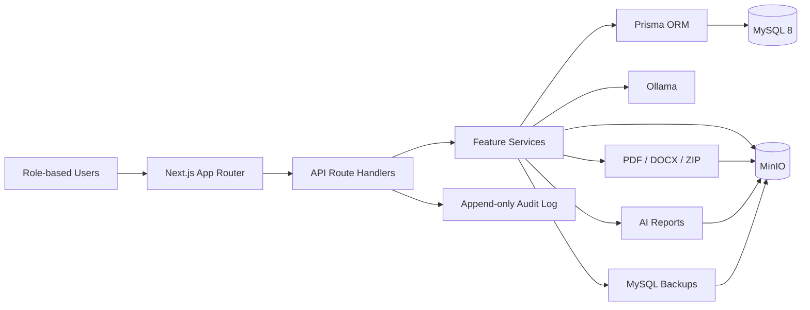

# Architecture Diagram

```mermaid
flowchart LR
  Users[Role-based Users] --> Next[Next.js App Router]
  Next --> API[API Route Handlers]
  API --> Services[Feature Services]
  Services --> Prisma[Prisma ORM]
  Prisma --> MySQL[(MySQL 8)]
  Services --> MinIO[(MinIO)]
  Services --> Ollama[Ollama]
  API --> Audit[Append-only Audit Log]
  Services --> Exports[PDF / DOCX / ZIP]
  Exports --> MinIO
  Services --> Reports[AI Reports]
  Reports --> MinIO
  Services --> Backups[MySQL Backups]
  Backups --> MinIO
```
