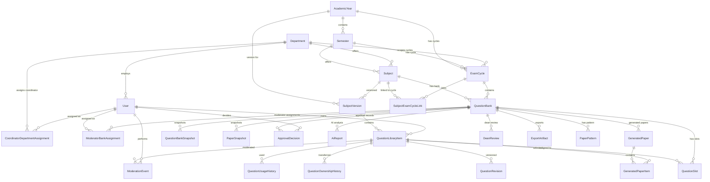
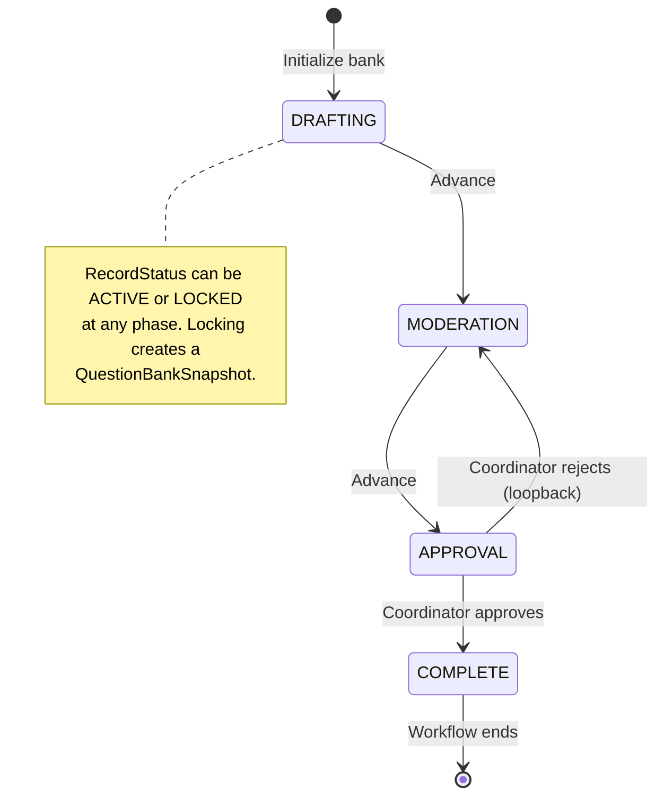
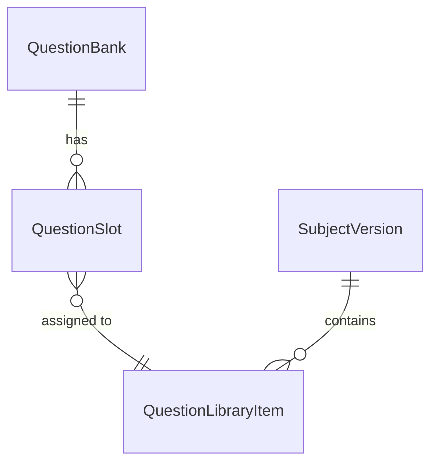
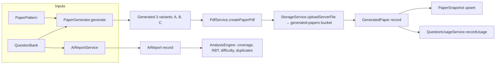
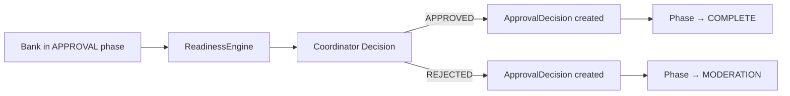
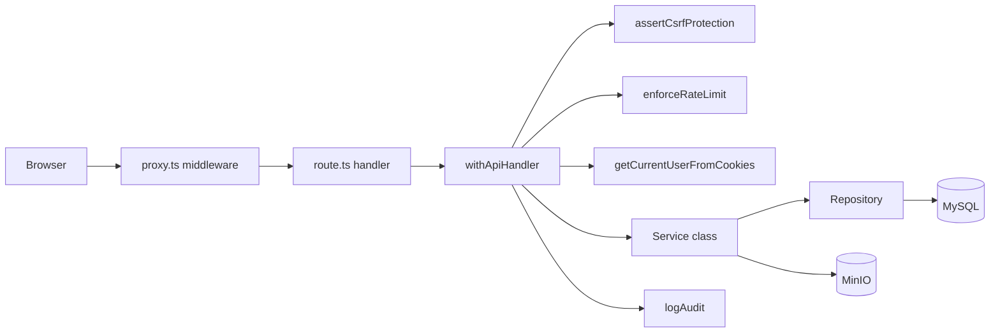

# Architecture

> **Last updated:** 2026-06-15
> **Architecture baseline:** QuestionBankPhase + RecordStatus, QuestionSlot linkage, ReadinessEngine, snapshot immutability

---

## 1. Domain model



---

## 2. Question bank state model

Two orthogonal state axes: **phase** (what the bank is doing) and **record status** (operational immutability).



The transition table in `src/modules/question-banks/transitions.ts`:

```
DRAFTING  → [MODERATION]
MODERATION → [APPROVAL]
APPROVAL   → [COMPLETE, MODERATION]
COMPLETE   → []
```

All transition requests go through `QuestionBankService.advancePhase()` which validates against this table and uses optimistic locking.

### RecordStatus

| Status | Meaning |
|---|---|
| `ACTIVE` | Bank is mutable. Slots can be assigned/unassigned. Phases can be advanced. |
| `LOCKED` | Bank is frozen. All modifications rejected by `ensureQuestionBankMutable()`. Unlock via `unlock` API (reversible). |
| `ARCHIVED` | Hidden from active workflows. For long-term retention. |

`ensureQuestionBankMutable()` in `src/modules/question-banks/mutable-guard.ts` throws HTTP 409 on any mutation attempt if `recordStatus === LOCKED`.

---

## 3. Question linking via QuestionSlot

`QuestionSlot` is the **sole** mechanism linking `QuestionLibraryItem` to `QuestionBank`. No join table exists.



Slot uniqueness: `@@unique([questionBankId, moduleNumber, marks, slotNumber])`. Each slot represents exactly one position in the bank's grid. A question can occupy only one slot per bank (application-enforced in `QuestionSlotService.assignToSlot()`), but can be in slots of multiple banks simultaneously.

Slots are created when `QuestionBankWorkflowService.initializeQuestionBank()` runs, based on the `PaperPattern` for the exam type.

---

## 4. ReadinessEngine

`src/modules/readiness/engine.ts` | `ReadinessEngine.isReady(questionBankId, targetPhase)`

Evaluates if a bank is ready to enter a target phase. Returns `ReadinessAssessment { ready, issues, warnings }`.

| Target Phase | Checks |
|---|---|
| `MODERATION` | All slots filled (no empty slots) |
| `APPROVAL` | ≥1 filled slot, all filled slots have moderation decisions, AI report completed. Coverage warnings for CO/RBT spread. |
| `COMPLETE` | No checks (gated by coordinator decision) |

**Readiness does NOT auto-advance phases.** The coordinator must explicitly call `advancePhase()`.

---

## 5. Paper generation architecture



Generation flow:
1. `PaperGenerationService.generatePapers()` called by coordinator
2. Validates bank is in `APPROVAL` or `COMPLETE` phase
3. `PaperGenerator.generate()` selects questions from filled slots, respecting CO/RBT/difficulty distribution
4. PDF created via `PdfService`, uploaded to MinIO `generated-papers` bucket
5. `GeneratedPaper` record created/upserted per variant
6. `PaperSnapshot` upserted for each variant (immutable record)
7. Usage history recorded for each selected question
8. Coordinators notified

### PaperSnapshots

Created via `prisma.paperSnapshot.upsert()` in `PaperGenerationService`. Unique per `(questionBankId, variant)`. Stores paper JSON, coverage/difficulty/quality scores. Immutable after creation — subsequent generation runs overwrite the same key (upsert), but the previous values are still in the `GeneratedPaper` table.

### QuestionBankSnapshots

Created when `QuestionBankWorkflowService.lockQuestionBank()` runs. Captures the full slot array at lock time. Type: `SnapshotType.LOCKED`. Includes phase, status, and version. Serves as the authoritative record of what was in the bank when it was frozen.

---

## 6. Approval architecture



`ApprovalDecision` is created in the same transaction as the phase update (`prisma.$transaction` in `ReportService.coordinatorDecision()`):

```typescript
const [approvalDecision] = await prisma.$transaction([
  prisma.approvalDecision.create({ data: { questionBankId, decision, remark, decidedById } }),
  prisma.questionBank.update({ where: { id: questionBankId }, data: { phase: targetPhase } }),
]);
```

The decision is immutable — no update or delete path exists.

---

## 7. Request flow



1. `proxy.ts` middleware runs first — route-level role gating
2. `withApiHandler` wraps the handler — CSRF check, rate limit, auth, RBAC
3. Handler calls a service method
4. Service owns business logic and calls repository
5. Repository owns raw Prisma queries
6. `withApiHandler` automatically logs audit entry if `audit:` option provided

---

## 8. Infrastructure

| Component | Tech | Purpose |
|---|---|---|
| App server | Next.js 16 | SSR, API routes, middleware |
| Database | MySQL 8 | Primary data store |
| ORM | Prisma (local engine) | Type-safe queries + migrations |
| Object storage | MinIO | File assets (papers, exports, backups) |
| Auth | Auth.js v5 + custom JWT | Credentials provider, custom cookie management |
| AI | Ollama (optional) | Natural-language summary overlay |
| PDF | Custom PdfService | Server-side paper PDF generation |
| Email | Nodemailer + SMTP | Notifications |

### MinIO buckets

| Bucket | Access |
|---|---|
| `question-bank-attachments` | Question file uploads |
| `generated-papers` | Generated paper PDFs |
| `exports` | Export artifacts |
| `audit-files` | Audit log dumps |
| `system-backups` | Database backups |

### Audit model

- Append-only `AuditLog` table
- SHA-256 integrity hash chain (each record's `integrityHash` = hash of previous record's hash + current record fields)
- No request body auto-capture
- Accessed via `GET /api/audit-logs` (COE only)

---

## 9. Service dependency graph

```
QuestionLibraryService
├── QuestionLibraryRepository

QuestionBankService
├── QuestionBankRepository
└── Transition table (function)

QuestionSlotService
├── QuestionSlotRepository
└── Mutable guard (function)

QuestionBankWorkflowService (coordinator/)
├── DepartmentAccessUtils
└── Direct Prisma calls

ReportService
├── AiReportService
├── PaperGenerationService
│   ├── PaperGenerator
│   ├── PdfService
│   ├── StorageService
│   └── QuestionUsageService
└── Direct Prisma calls

ReadinessEngine → Direct Prisma calls

QuestionBankMetricsService → Direct Prisma calls
```

---

## 10. Invariants

1. **ExamCycle is department-scoped** — `@@unique([semesterId, examType, departmentId])` allows each department to have its own cycle per (semester, examType). Cross-department cycles are prevented.
2. **One bank per (subject, exam cycle)** — `@@unique([subjectId, examCycleId])`
3. **One slot position per bank** — `@@unique([questionBankId, moduleNumber, marks, slotNumber])`
4. **No duplicate questions per bank** — application-enforced, not schema-level
5. **ApprovalDecision is write-once** — created in transaction, no update path
6. **QuestionBankSnapshot is immutable** — created on lock, never modified
7. **Phase transitions are validated** — via `isValidPhaseTransition()` in `transitions.ts`
8. **LOCKED banks reject mutations** — via `ensureQuestionBankMutable()` guard
9. **ReadinessEngine is advisory only** — does not block or auto-advance
10. **Question status lifecycle** — DRAFT→PENDING→APPROVED|REJECTED|REVISION_REQUESTED→REVISION_SUBMITTED
11. **QuestionLibraryItem is SubjectVersion-scoped** — cannot exist outside a subject version

---

## 11. Cross-References

| Topic | Document |
|---|---|
| Single-page system overview | `docs/architecture/current-system.md` |
| Database schema | `docs/database.md` |
| API reference | `docs/api.md` |
| Workflow guide | `docs/workflow.md` |
| Operations manual | `docs/operations-manual.md` |
| RBAC matrix | `docs/rbac-matrix.md` |
| Onboarding | `docs/onboarding.md` |
| Architectural decisions | `docs/adr/ADR-001` through `005` |
