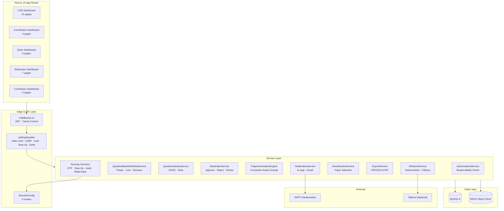
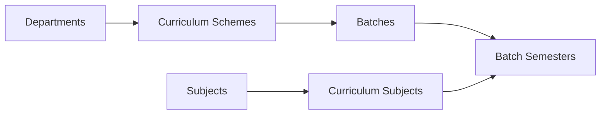
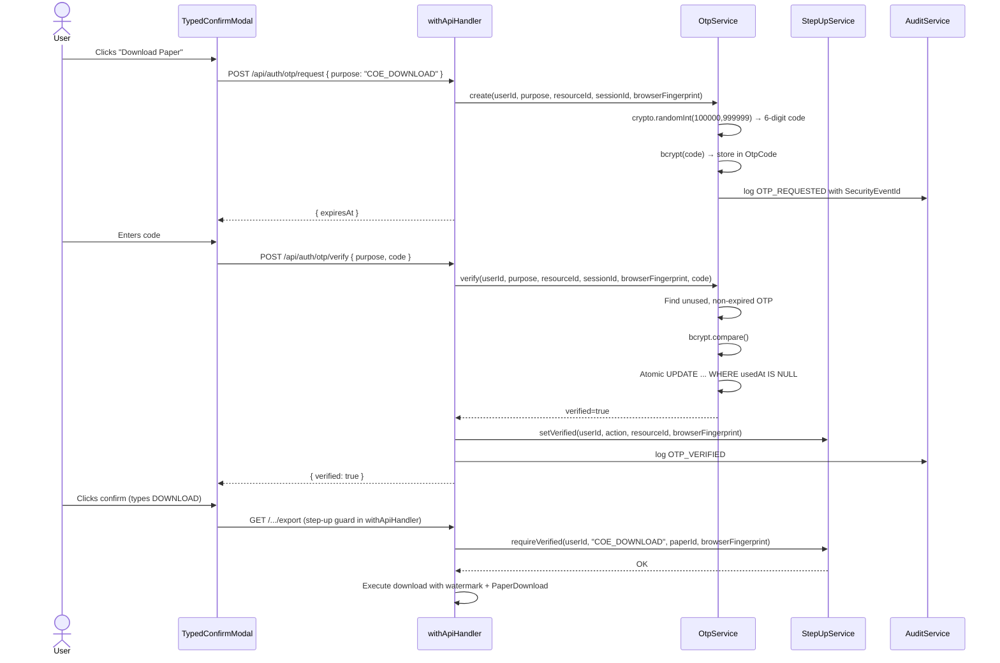
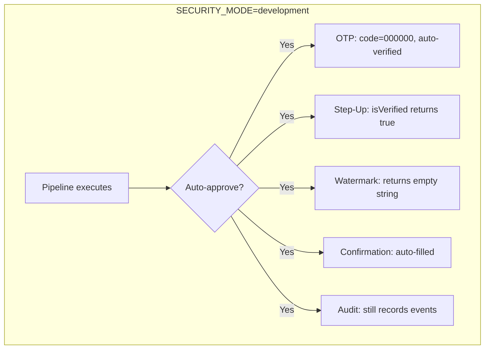
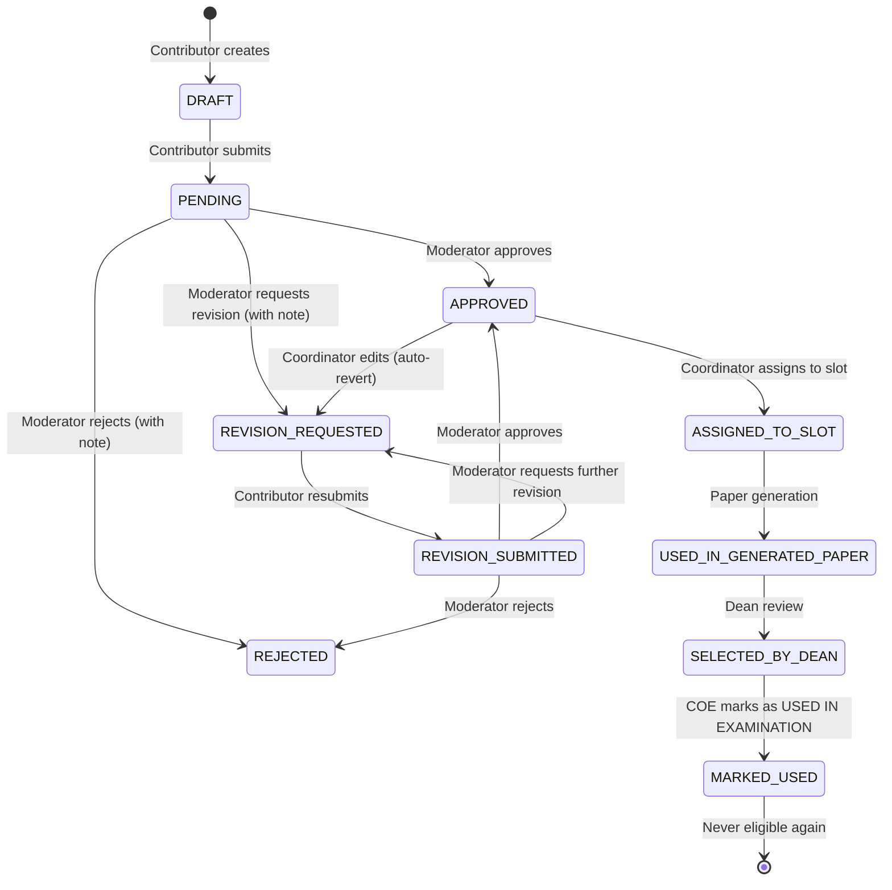
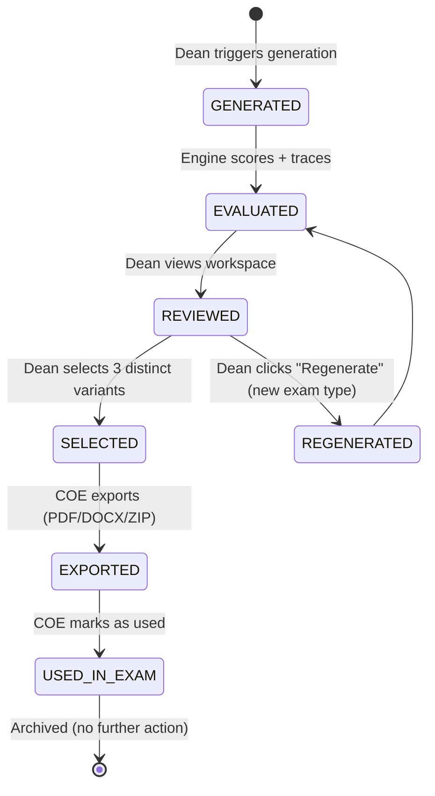

# EMQPGS — System Workflows

> Definitive reference for how the entire system operates.  
> **Verified against implementation** — every section cross-checked with source code.

---

## 1. System Overview

### What EMQPGS Is

EMQPGS (Examination Management & Question Paper Generation System) is a full-stack web application for managing the complete lifecycle of academic examination question papers. It covers:

- **Academic structure**: Departments, curriculum schemes, batches, semesters, subjects
- **Question bank management**: 126-slot templates per (batch-semester, subject) with 4-phase lifecycle
- **Question contribution**: Contributor → Moderator workflow with versioned submissions
- **AI analysis**: Optional Ollama integration overlaying deterministic analysis
- **Automated paper generation**: Constraint-aware greedy engine producing 3 balanced variants (A, B, C)
- **Dean review**: Side-by-side paper comparison with variant selection
- **COE export & publication**: PDF/DOCX/ZIP packet generation with forensic watermarking
- **Security**: Step-up authentication (OTP), browser/DOCX watermarks, hash-chained audit, download tracking

**Stack**: Next.js 16 (App Router) · TypeScript 5 (strict) · Prisma 6 · MySQL 8 · MinIO · Nodemailer · Ollama (optional) · docx/pdf-lib · Vitest

### Examination Paper Lifecycle

```
COE creates academic structure (departments, schemes, batches, semesters)
  ↓
COE creates users + assigns responsibilities
  ↓
User activates workspace → sees role-specific dashboard
  ↓
BatchSemester activated → QuestionBanks auto-created (126 slots each)
  ↓
Coordinator assigns Moderators + Contributors to each bank
  ↓
Contributors create questions → submit for moderation
  ↓
Moderators approve/reject/request revision
  ↓
Coordinator advances bank through phases (DRAFTING → MODERATION → APPROVAL)
  ↓
AI analysis runs → deterministic report + optional Ollama overlay
  ↓
Dean triggers paper generation → 3 variants (A, B, C) with evaluation scores
  ↓
Dean reviews papers → selects Regular, Supplementary, KT variants
  ↓
COE exports packets (PDF/DOCX/ZIP)
  ↓
COE downloads → forensic watermark + download tracking
  ↓
COE marks paper USED IN EXAMINATION → questions never eligible again
```

### Core Architectural Principles

1. **Responsibility-based authorization**: Users are identity only. Access is determined by dynamic `ResponsibilityAssignment` records with temporal scoping. A single user can hold multiple responsibilities simultaneously.

2. **Annual question banks**: One bank per (batch-semester, subject) reused across all exam types (ISE-1, ISE-2, ENDSEM). The 126-slot template (6 modules × 3 marks × 7 slots) is a repository — questions are not consumed by paper generation.

3. **Questions are reusable until used in an actual exam**: `QuestionUsageHistory` is created ONLY by the COE "Mark As Used In Examination" action. Paper generation never mutates usage history.

4. **Deterministic + AI hybrid analysis**: Always runs deterministic analysis first. AI (Ollama) is an optional overlay that enhances executive summaries and qualitative findings. The system functions fully without AI.

5. **Explainable paper generation**: Every slot decision, candidate evaluation, and rejection reason is recorded in a `GenerationTrace`. The dean can inspect exactly why each question was selected or rejected.

6. **Security is a layered subsystem**: SecurityConfig, OtpService, StepUpService, AuditService, WatermarkService — all decoupled from business services. Business services never inspect environment variables directly.

### Major Subsystems

| Subsystem | Location | Purpose |
|-----------|----------|---------|
| Auth & Authorization | `src/lib/auth/` | JWT authentication, responsibility resolution, workspace activation |
| API Gateway | `src/lib/api-handler.ts` | Centralized rate limiting, CSRF, auth, step-up, audit, cache-control |
| Question Banks | `src/modules/coordinator/` | Bank lifecycle, slot management, phase advancement, locking |
| Question Library | `src/modules/question-library/` | Question CRUD, status transitions, assignment to slots |
| Moderation | `src/modules/moderation/` | Question review, approval, rejection, revision requests |
| Paper Generation | `src/modules/paper-generation-engine/` | Constraint engine, candidate builder, evaluation engine, search strategy |
| AI Analysis | `src/modules/reports/` | Deterministic analysis + optional Ollama overlay |
| Production | `src/modules/production/` | Dean review, exports, document generation |
| COE Operations | `src/modules/coe/` | Academic structure, users, exam cycles, dashboards |
| Notifications | `src/modules/notifications/` | In-app notifications + email via Nodemailer |
| Security | `src/lib/auth/` (security-config, otp-service, step-up-service, audit-service, watermark-service) | Step-up auth, OTP, watermarks, audit chain |
| Audit | `src/lib/audit.ts` + `src/lib/auth/audit-service.ts` | SHA-256 hash-chained immutable audit log |
| Storage | `src/lib/storage/` | MinIO object storage for PDFs, DOCXs, reports, backups |



---

## 2. Complete Workflow

### Phase 0: Academic Structure Setup (COE)



**Actor**: COE (ResponsibilityType: COE, Scope: INSTITUTION)

**Steps**:
1. **Create Department** → `POST /api/departments` — name, code, hodName
2. **Create CurriculumScheme** → `POST /api/curriculum-schemes` — name, year, durationSemesters, departmentId
3. **Create AcademicYear** → `POST /api/academic-years` — code, startDate, endDate
4. **Create Batch** → `POST /api/batches` — name, code, departmentId, curriculumSchemeId, admissionYear, graduationYear
5. **Create Subjects** → `POST /api/subjects` — subjectCode, subjectName, credits, departmentId
6. **Map CurriculumSubjects** → `POST /api/curriculum-subjects` — map subjects to semesters in the scheme
7. **Create Users** → `POST /api/users` — name, email, password (hashed with bcrypt cost 12)
8. **Assign Responsibilities** → `POST /api/users/{id}/responsibilities` — COORDINATOR at DEPARTMENT scope, MODERATOR/CONTRIBUTOR at QUESTION_BANK scope

**Security checks**: Each endpoint requires COE responsibility. All CRUD operations are audited via `withApiHandler` RouteOptions.

---

### Phase 1: Batch Semester Activation (Auto-Initialize)

**Actor**: COE

**Trigger**: `POST /api/batch-semesters/{id}?action=activate`

**What happens** (in `AutoInitializeService.activate()`):
1. Validates batch semester exists, status = UPCOMING
2. Changes status to ACTIVE
3. **Creates QuestionBanks**: One per (batch-semester, subject) — each with 126 slots in DRAFTING phase, ACTIVE record status
4. **Creates ExamCycles**: ISE-1, ISE-2, ENDSEM per batch-semester
5. **Links Subjects**: Each subject linked to exam cycles via SubjectExamCycleLink
6. **Notifies**: All COORDINATORs in the department — "New semester activated"
7. **Sets current semester** on the batch record

**Database changes**:
- `BatchSemester.status` → ACTIVE
- `QuestionBank` rows created (N subjects × 1)
- `QuestionSlot` rows created (N banks × 126 slots)
- `ExamCycle` rows created (3 per batch-semester)
- `SubjectExamCycleLink` rows created
- `Notification` rows created for coordinators

---

### Phase 2: Bank Preparation (Coordinator)

**Actor**: Coordinator

**Steps**:
1. **Review bank** at `/dashboard/coordinator/question-banks/{id}` — see the 126-slot grid
2. **Assign Moderators** → `POST /api/question-banks/{id}/assignments/moderator` — creates ResponsibilityAssignment(MODERATOR, QUESTION_BANK)
3. **Assign Contributors** → `POST /api/question-banks/{id}/assignments/contributor` — creates ResponsibilityAssignment(CONTRIBUTOR, QUESTION_BANK)
4. **Monitor progress** via dashboard — fill percentage, stalled detection, pending questions

**Notifications emitted**: `"New moderation assignment"` (to moderator), `"New question bank assignment"` (to contributor)

---

### Phase 3: Question Contribution (Contributor)

**Actor**: Contributor

**Workflow**:
1. **Select slot** in the visual grid (module × marks position)
2. **Create question**: `POST /api/question-library` with: subjectVersionId, moduleNumber, marks, questionText, coMapping, rbtLevel, difficultyLevel, teachingIndex
3. **Status**: Initially DRAFT
4. **Submit for moderation**: `POST /api/question-library/{id}/submit` → status becomes PENDING
5. **Edit** (DRAFT or REVISION_REQUESTED only): `PATCH /api/question-library/{id}`
6. **View feedback**: Moderator remarks displayed on question detail

**Question status machine**:
```
DRAFT ──submit──→ PENDING ──approve──→ APPROVED
                       │──reject──→ REJECTED
                       │──revision_request──→ REVISION_REQUESTED
                                                  │
                    DRAFT ──edit── (resubmit) ───→ REVISION_SUBMITTED
                                                     │──approve──→ APPROVED
                                                     │──reject──→ REJECTED
                                                     │──another revision──→ REVISION_REQUESTED
```

**Editing rules**: DRAFT and REVISION_REQUESTED are editable. PENDING, APPROVED, REJECTED, REVISION_SUBMITTED block edits. If a COORDINATOR edits an APPROVED question, it auto-reverts to REVISION_REQUESTED.

**Slot assignment**: A question can be assigned to ONE slot per bank via `PATCH /api/question-banks/{id}/slots/{slotId}` with body `{ questionId }`. The same question can appear in slots across DIFFERENT banks.

**Audit events**: QUESTION_CREATED, QUESTION_SUBMITTED, QUESTION_EDITED

---

### Phase 4: Moderation (Moderator)

**Actor**: Moderator (ResponsibilityAssignment with MODERATOR at QUESTION_BANK scope)

**Moderator sees**: Entire assigned bank's questions (all modules, all marks). Read-only except moderation actions.

**Actions**:
- **Approve** → `POST /api/moderation/questions/{id}/approve` — status → APPROVED, records ModerationEvent
- **Reject** → `POST /api/moderation/questions/{id}/reject` with `note` — status → REJECTED, records ModerationEvent
- **Request Revision** → `POST /api/moderation/questions/{id}/request-revision` with `note` — status → REVISION_REQUESTED

**Business rules**:
- Only PENDING and REVISION_SUBMITTED questions can be moderated
- Moderator must be a different user than the question creator (self-moderation blocked)
- Multiple moderation events can exist per question (revision cycle)
- Each action creates an in-app notification to the question creator

**Audit events**: QUESTION_APPROVED, QUESTION_REJECTED, QUESTION_REVISION_REQUESTED

---

### Phase 5: Coordinator Review & Phase Advancement

**Actor**: Coordinator

**Readiness check**: `GET /api/question-banks/{id}/readiness` — checks:
- For MODERATION: ≥1 filled slot
- For APPROVAL: ≥1 filled slot, all filled slots moderated, AI report completed
- For COMPLETE: No checks (gated by coordinator decision)

**Phase transitions**:
```
DRAFTING → MODERATION: Coordinator advance
MODERATION → APPROVAL: Coordinator advance (all questions moderated + AI report done)
APPROVAL → COMPLETE: Coordinator approve decision
APPROVAL → MODERATION: Coordinator reject (loopback)
```

**Blocked**: DRAFTING→APPROVAL, DRAFTING→COMPLETE, MODERATION→COMPLETE, MODERATION→DRAFTING, APPROVAL→DRAFTING, COMPLETE→anything.

**Locking**: `POST /api/question-banks/{id}/lock` — sets recordStatus = LOCKED, creates QuestionBankSnapshot. All mutations blocked by `ensureQuestionBankMutable()` guard. Required before dean review.

**Coordinator decision** (once bank is in APPROVAL phase):
- `APPROVED` → phase → COMPLETE, ApprovalDecision recorded
- `REJECTED` → phase → MODERATION (loopback)

**Audit events**: PHASE_ADVANCED, QUESTION_BANK_LOCKED, QUESTION_BANK_APPROVED, QUESTION_BANK_REJECTED

---

### Phase 6: AI Analysis

**Actor**: Coordinator (triggers via `POST /api/question-banks/{id}/reports`)

**Flow**:
1. Validates ≥3 filled slots
2. `AnalysisEngine.buildDeterministicReport()` — always runs. Computes module coverage, CO/RBT/difficulty distributions, pairwise Jaccard duplicate detection (threshold 0.7), quality findings, bloom balance.
3. `OllamaService.analyze()` — sends prompt with full metrics, 120s timeout
   - **IF available**: JSON parsed, validated against AiOverlay Zod schema. Overlays executive summary, missing areas, quality findings, bloom balance.
   - **IF unavailable** (network error, timeout, parse fail): Falls back to deterministic values. ExecutiveSummary = `"AI analysis unavailable. Showing deterministic analysis only."`
4. AiReport persisted as COMPLETED (regardless of AI availability)
5. COORDINATORs notified

**The prompt**: ~350 words identifying Ollama as an "academic quality auditor." Supplies subject context + full metrics. Instructs return of JSON `{ executiveSummary, missingAreas, qualityFindings, bloomsBalance }` using ONLY supplied data. Max 200-250 words.

---

### Phase 7: Paper Generation (Dean)

**Actor**: Dean (NOT Coordinator — the old workflow docs incorrectly attribute this)

**Trigger**: Dean selects exam type and clicks "Generate Papers" at `/dashboard/dean/review?bank={id}`

**API**: `POST /api/question-banks/{id}/papers` with body `{ examType: "ISE_1" | "ISE_2" | "ENDSEM" }`

**Validation**: Bank must be in APPROVAL or COMPLETE phase. Requires DEAN responsibility + step-up authentication.

**Generation flow** (inside `PaperGenerationService.generatePapers()`):
1. Module range from `EXAM_MODULE_RANGES[examType]`:
   - ISE-1: [1,2,3], ISE-2: [4,5,6], ENDSEM: [1,2,3,4,5,6]
2. Build approved inventory from bank slots (only APPROVED questions)
3. Load QuestionUsageHistory for freshness scoring
4. For each variant (A, B, C — sequentially):
   a. Exclude questions consumed by earlier variants
   b. Determine marks pattern: ISE uses [2,2,5], ENDSEM uses [2,5,10]
   c. `PaperGenerationEngine.generate()` → ConstraintAwareGreedyStrategy
   d. PDF generated via PdfService → uploaded to MinIO `generated-papers`
   e. Scores calculated: coverageScore, difficultyScore, qualityScore, duplicateRisk
   f. Recommendation: ≥70 → "Recommended for dean review"
   g. Upsert GeneratedPaper with full paperJson (questions, evaluation report, trace, history)
   h. Upsert PaperSnapshot for version tracking
5. Audit: QUESTION_PAPERS_GENERATED
6. Notify: All COORDINATORs in department

**Result**: 3 GeneratedPaper records (PAPER_A, PAPER_B, PAPER_C), each with PDF in MinIO + full trace.

---

### Phase 8: Dean Review

**Actor**: Dean

**Workspace**: `/dashboard/dean/review?bank={id}` — shows all 3 papers side-by-side with:
- Question lists (sorted by module → marks → text)
- Evaluation scores (overall, per-category with deductions)
- AI recommendation
- Duplicate risk flagging
- Generation trace availability

**Selection**: Dean assigns each exam slot to a DIFFERENT paper variant:
- Regular Exam Paper
- Supplementary Exam Paper
- KT (Keep Term) Paper

**Submission**: `POST /api/question-banks/{id}/dean-review` with `{ regularPaper, supplementaryPaper, ktPaper }`

**Validation** (in `DeanReviewService.submitDeanReview()`):
- Requires DEAN responsibility + step-up
- Bank must be LOCKED
- Dean review must NOT already exist (one-time, locked)
- All 3 selections must be DISTINCT
- All 3 selections must be valid variants in the bank

**After submission**:
- `DeanReview` record created (one-time — cannot be changed)
- COE users notified via in-app + email: "Dean review complete - ready for export"
- COORDINATORs notified via in-app: "Dean review is complete"
- Dean notified via in-app: "Your selection confirmed"
- Audit: DEAN_SELECTION_SUBMITTED

---

### Phase 9: COE Publication & Export

**Actor**: COE

**Production page**: `/dashboard/coe/production` — table of all dean-reviewed banks

**Export**: `POST /api/exports` with `{ questionBankId, format: "PDF"|"DOCX"|"ZIP" }`
1. Bank must have a DeanReview
2. Resolves 3 papers from dean's selection (Regular, Supplementary, KT)
3. Generates document via `DocumentService`:
   - **PDF**: A4, institution header, paper labels, instructions, numbered questions with metadata headers
   - **DOCX**: Same content in Word format
   - **ZIP**: Both PDF + DOCX + manifest.json
4. Uploads to MinIO bucket `exports`
5. ExportArtifact tracks status (PENDING → COMPLETED/FAILED)
6. Audit: EXPORT_REQUESTED

**Single-variant download** (security-gated):
- Route: `GET /api/question-banks/{id}/papers/{variant}/export`
- Requires DEAN or COE + step-up authentication
- Applies DOCX watermark (CONFIDENTIAL, downloaded by, email, timestamp, document UUID, download UUID)
- Records forensic PaperDownload entry with unique download ID
- Audit: PAPER_DOWNLOADED

---

### Phase 10: Mark as Used in Examination

**Actor**: COE

**API**: `POST /api/coe/papers/{id}/mark-used` with body `{ examDate?, examCycleId?, reason? }`

**Flow**:
1. Finds GeneratedPaper (with items + bank/subject)
2. Validates paper.status === COMPLETED
3. `QuestionUsageHistory.createMany()` for EVERY question in the paper:
   - sourceType: `"USED_IN_EXAM"`
   - sourceId: paper.id
   - skipDuplicates: true (safe to re-run)
4. Audit: PAPER_MARKED_USED

**Effect**: Questions in this paper are now marked as used. Future paper generation will skip them via the `enforceUsageHistory` constraint in the ConstraintEngine. This is the ONLY mechanism that creates QuestionUsageHistory — paper generation itself never mutates usage history.

---

## 3. Role-Based Scenarios

### COE — Complete Walkthrough

**First login**:
1. Navigate to `/login` → enter email/password → bcrypt verify
2. JWT issued (access token: 15min, refresh token: 7day) → set as HttpOnly cookies
3. Redirect to `/dashboard` → workspace resolution:
   - Load responsibility assignments
   - If multiple: redirect to workspace selector
   - If single (COE at INSTITUTION): auto-activate, redirect to `/dashboard/coe`
4. Session idle timeout: 30min (checked on refresh)

**COE Dashboard** shows: institutional overview, active cycles, stalled banks, dean bottlenecks, workflow pipeline, department progress, task queue, stats (total banks, fill rate, users, cycles, etc.), recent audit activity.

**Academic setup** (sequential):
1. `/dashboard/coe/departments` → Create departments (name, code, hodName)
2. `/dashboard/coe/curriculum` → Create curriculum schemes
3. `/dashboard/coe/academic-years` → Create academic years
4. `/dashboard/coe/batches` → Create batches (links to department + scheme)
5. `/dashboard/coe/academic-setup` → Progress tracking checklist
6. `/dashboard/coe/exam-cycles` → Manage exam cycles (not typically needed — auto-created)

**User management**:
1. `/dashboard/coe/users` → Create users, assign responsibilities
2. `/dashboard/coe/coordinator-assignments` → Assign coordinators to departments

**Production workflow**:
1. `/dashboard/coe/production` → View all dean-reviewed banks
2. Click "Export" → choose format → generates PDF/DOCX/ZIP → stored in MinIO
3. `/dashboard/coe/papers` → List all papers → Download or "Mark as Used"

**Security monitoring**:
1. `/dashboard/coe/security` → View security mode, failed OTPs, downloads, audit chain status, anomaly alerts
2. Toggle security mode (with typed confirmation)
3. Activate lockdown controls (with 2-person approval if configured)

### Coordinator — Complete Walkthrough

1. Login → workspace auto-activates to COORDINATOR dashboard
2. Dashboard shows: phase distribution, priority-ordered attention items, workflow pipeline, recent activity, stats
3. Click into a bank → full workspace with 126-slot grid
4. Assign moderators + contributors
5. Monitor fill progress → advance to MODERATION when ready
6. Trigger AI analysis → wait for completion
7. Advance to APPROVAL → review readiness check
8. When ready: approve (COMPLETE) or reject (→ MODERATION loopback)
9. Lock bank → snapshot created

### Contributor — Complete Walkthrough

1. Login → workspace auto-activates to contributor bank
2. Dashboard shows: progress bar (my slots filled), stats, recent feedback, primary actions
3. "Submit Question" → form with module/marks from slot grid
4. Fill: questionText, coMapping, rbtLevel, difficultyLevel, teachingIndex
5. Save as DRAFT → submit for moderation
6. View feedback → if revision requested, edit and resubmit
7. Track status on "My Questions" page

### Moderator — Complete Walkthrough

1. Login → workspace shows assigned bank
2. Dashboard: pending queue sorted by waiting days, awaiting revision resubmission, recent activity
3. Review question → approve/reject/revision with note
4. Each action sends notification to contributor
5. Slot grid shows visual state of all slots (approved/pending/empty)

### Dean — Complete Walkthrough

1. Login → workspace activates as DEAN
2. Dashboard: pending reviews sorted by oldest, overdue alerts, completed review history
3. Click bank → review workspace:
   - See 3 papers with scores, evaluation reports, AI summaries
   - Expand paper content to see actual questions
   - View insights → generation trace, candidate history, slot decisions
4. Select exam type (ISE-1/ISE-2/ENDSEM) → generate papers
5. Assign Regular, Supplementary, KT to distinct papers → submit
6. Selection locked permanently
7. Next bank navigation

---

## 4. Paper Generation Engine

### Architecture

```
PaperGenerationEngine (orchestrator)
  │
  ├── CandidateBuilder     ← "Which questions can fill this slot?"
  ├── ConstraintEngine      ← "What must never happen?" (pre-flight + post-check)
  ├── EvaluationEngine      ← "How good is this paper?" (6 criteria, 0-100)
  └── SearchStrategy        ← Pluggable algorithm (only one implemented)
        └── ConstraintAwareGreedyStrategy
```

### Inventory & Slot Structure

**Bank slots**: 126 slots per bank — 6 modules × 3 marks × 7 slot positions.

| Module | 2-mark slots | 5-mark slots | 10-mark slots | Total |
|--------|-------------|-------------|--------------|-------|
| 1-6 (each) | 7 | 7 | 7 | 21 |
| **Total** | **42** | **42** | **42** | **126** |

Each slot has exactly ONE approved question assigned (by the coordinator). A paper selects ONE question from each (module, marks) position.

**ISE papers**: 9 slots — 3 modules × [2, 2, 5] marks pattern → 6 × 2-mark questions + 3 × 5-mark questions
**ENDSEM papers**: 18 slots — 6 modules × [2, 5, 10] marks pattern → 6 × 2-mark + 6 × 5-mark + 6 × 10-mark

### Constraint Engine

**Pre-flight** (`validateBankState`):
- Module range: every slot's module matches exam type
- Marks pattern: every slot's marks is valid
- Slot count: matches expected (modules × marksPattern.length)
- Inventory: at least one approved question exists for each (module, marks) position
- **If pre-flight fails, generation is aborted immediately**

**Post-flight** (`validateAssignment` — runs on complete paper):
- Module range ✓
- Marks match (question.marks === slot.marks) ✓
- Module match (question.moduleNumber === slot.moduleNumber) ✓
- Question status === APPROVED ✓
- No duplicate question IDs ✓
- No duplicate teachingIndex (concept groups) ✓
- No questions in QuestionUsageHistory (freshness) ✓

### Evaluation Engine — 6 Criteria

| Criterion | Weight | What It Measures |
|-----------|--------|-----------------|
| Difficulty Balance | 30% | Overall avg vs target (2.0=MEDIUM), per-module variance, progression |
| Bloom Balance | 20% | Distribution match to target, per-module variety, L4-L6 progression |
| Concept Diversity | 20% | Unique teachingIndex ratio, per-module duplicates |
| Freshness | 15% | Ratio of questions NOT in usage history |
| Module Balance | 10% | Difficulty variance across modules |
| Estimated Solve Time | 5% | Estimated time vs target duration |

### Greedy Strategy

**Algorithm** (deterministic — same inputs = same output every time):
1. Slots processed in fixed order (module asc, marks asc)
2. For each slot: try EVERY eligible candidate → evaluate partial paper → pick highest-scoring
3. Record every candidate's score and rejection reasons in `SlotDecision`
4. Never backtracks — each slot decision is locally optimal
5. Final validation pass on complete paper

**GenerationTrace**: Contains `GenerationStats` (strategy name, profile, timing, candidates considered/rejected/evaluated, constraint failures by type) and `SlotDecision[]` (per slot: all candidates, scores, selected question, rejection reasons).

### Why This Architecture?

- **Pluggable strategy**: New algorithms (genetic, simulated annealing, beam search) implement `SearchStrategy` interface without changing engine, builder, evaluator, or constraints
- **Evaluation is pure**: Same input → same score. Deterministic, testable, no randomness
- **CandidateBuilder knows nothing about quality**: Pure filter, not optimizer — clear separation of concerns
- **ConstraintEngine is final arbiter**: No score compensates for a broken constraint
- **Profiles are data, not code**: New evaluation configurations require no code changes

---

## 5. AI Workflow

### Deterministic Analysis (always runs)

`AnalysisEngine.buildDeterministicReport()` computes from APPROVED questions:

- **Module coverage**: Approved count per module vs target
- **CO distribution**: Count per CourseOutcome (CO1-CO6)
- **RBT distribution**: Count per Bloom level (L1-L6)
- **Difficulty distribution**: Count per difficulty (EASY/MEDIUM/HARD)
- **Duplicates**: Pairwise Jaccard similarity on question text tokens (threshold 0.7)
- **Missing areas**: Modules/COs/RBT levels/difficulties with zero questions
- **Quality findings**: Disproportionately many easy or hard questions
- **Bloom balance**: Lower-order (L1-L3) vs higher-order (L4-L6) ratio

### Ollama Integration (optional)

**Provider**: `OLLAMA_BASE_URL` (default: http://localhost:11434), `OLLAMA_MODEL` (default: llama3.1)

**Prompt**: ~350 words. Informs the model it's an academic quality auditor. Supplies full deterministic metrics as JSON. Instructs strict JSON return with 200-250 word summary. 120s timeout. 8192 context window.

**When available**: JSON is parsed and validated against `AiOverlay` Zod schema (strict: no extra fields). If valid, AI's narrative replaces `executiveSummary`, `missingAreas`, `qualityFindings`, `bloomsBalance`. Chart data stays deterministic.

**When unavailable** (network error, timeout, non-200, empty response, JSON parse error, Zod validation error):
- `parseAiOverlay()` returns null — never throws
- ExecutiveSummary = `"AI analysis unavailable. Showing deterministic analysis only."`
- All other fields fall back to deterministic values
- Report persisted as COMPLETED (not FAILED)

### Where AI is NOT used

Paper generation, slot assignment, question moderation, and dean review are intentionally deterministic. AI is purely advisory — used only for the qualitative analysis overlay.

---

## 6. Security Workflow

### Authentication

```
Login form → POST /api/auth/login
  → bcrypt.compare(password, hash)
  → SignJWT { sub, email, name, homeDepartmentId } with jti
  → Set HttpOnly cookies: emqpgs_access_token (15min) + emqpgs_refresh_token (7day)
  → Load ResponsibilityAssignments
  → If 1: auto-activate workspace → redirect to /dashboard/{type}
  → If 2+: redirect to /workspace-select
```

**Token refresh**: `POST /api/auth/refresh` — checks idle timeout (30min), issues new access token. No refresh rotation currently.

### Workspace Resolution

```
GET /dashboard
  → Read emqpgs_active_ws cookie
  → Validate: assignment exists, not soft-deleted, activeFrom ≤ now ≤ activeTo
  → Load workspace context (bank scope + responsibility)
  → Render AppShell with role-specific navigation
```

**Workspace switching**: `POST /api/auth/workspace { assignmentId }` — sets new cookie, redirects. No JWT re-issue needed.

### Authorization Model

```mermaid
flowchart LR
    User[User (Identity)] --> RA[ResponsibilityAssignment[]]
    RA --> WS[ActiveWorkspace]
    WS --> AUTHZ[AuthorizationService]
    AUTHZ -->|has()| ROUTE[Route Handler]
```

**AuthorizationService** methods:
- `has(responsibility, scopeType?, scopeId?)` — exact match
- `hasAny(types[])` — OR
- `hasAll(types[])` — AND
- `requireDean()`, `requireCoe()`, `requireCoordinator()`, etc. — convenience

**withApiHandler** centralizes: Rate limit → CSRF → JWT verify → Responsibility loading → Authorization → Step-Up check → Handler → Audit → Cache-Control headers.

### Step-Up Authentication



**OTP design**:
- 6 digits via `crypto.randomInt(100000, 999999)`
- bcrypt hashed (not SHA-256 — user requirement for brute-force resistance)
- Bound to: user + purpose + resource (paper/bank) + session (JTI) + browser fingerprint
- Single-use via atomic `UPDATE OtpCode SET usedAt=NOW() WHERE id=X AND usedAt IS NULL`
- Rate limited: 5 attempts per code, then auto-invalidated
- Expiry: configurable via `OTP_EXPIRY_SECONDS` (default 300 = 5 min)
- Fallback: password re-entry if email send fails

### Browser Watermark

CSS-only diagonal overlay on all protected pages (via `WatermarkOverlay` in `app/(protected)/layout.tsx`):
- Semi-transparent text (opacity 0.06) at -30 degrees
- Content: "EMQPGS — CONFIDENTIAL · username · email · role · sessionId · timestamp"
- Dynamic: fresh timestamp every render
- Not rendered in development mode
- `pointer-events: none` so it doesn't block interaction

### DOCX Watermark

Every exported paper includes (via `WatermarkService.getDocxWatermarkLines()`):
- "CONFIDENTIAL"
- Downloaded By: [name]
- Email: [email]
- Role: [role]
- Timestamp: [ISO timestamp]
- Document ID: [paper UUID]
- Download ID: [unique UUIDv4 — forensic tracing]

### Development Mode



Pipeline still executes — only verification step bypassed. No duplicate code paths. No special developer APIs.

### Production Mode

Full enforcement: OTP required, step-up checked, watermarks rendered, typed confirmations required, no-cache headers set, all actions audited.

### Lockdown Mode (Reserved)

- Downloads disabled
- Paper reveal disabled
- All active OTPs revoked on activation
- Fresh authentication required
- Emergency audit events created

### Two-Person Emergency Approval (Architecture)

`EmergencyApprovalService` + `EmergencyApproval` Prisma model:
- User A requests emergency action → PENDING status
- User B (different COE) approves → APPROVED status
- Only then can the action execute
- Expiry: configurable TTL
- Statuses: PENDING | APPROVED | REJECTED | EXPIRED

---

## 7. Workspace Architecture

### Why Responsibility-Based?

The previous role-based system had fixed roles (one user, one role). Real universities need:
- A single person who is Coordinator for Computer Engineering AND Moderator for a specific question bank
- Temporal scoping (active semesters, batch-specific assignments)
- Department-level scope for coordinators vs bank-level scope for moderators/contributors

### How It Works

```
User (identity only — JWT payload has { sub, email, name })
  ↓
ResponsibilityAssignment[]
  ├── COE, INSTITUTION scope (system-wide)
  ├── DEAN, INSTITUTION scope
  ├── COORDINATOR, DEPARTMENT scope (e.g., departmentId = "comp-dept")
  ├── MODERATOR, QUESTION_BANK scope (e.g., bankId = "os-bank")
  └── CONTRIBUTOR, QUESTION_BANK scope
  ↓
ActiveWorkspace (one at a time, stored as HttpOnly cookie)
  ├── Resolved from emqpgs_active_ws cookie
  └── Validated: ownership, active dates, not soft-deleted
  ↓
AuthorizationService
  ├── has(responsibility, scopeType?, scopeId?) → boolean
  ├── requireAny([...]) → throws ForbiddenError if none match
  └── getScopeIds(responsibility) → scope IDs for filtering
```

### Workspace Resolution Flow

```
GET /dashboard
  → Try read emqpgs_active_ws cookie
    → If valid: redirect to /dashboard/{type}
    → If invalid or missing:
      → Load user's responsibilities
      → 0 → /no-access
      → 1 → auto-activate (set cookie) → redirect
      → 2+ → /workspace-select → user picks → POST /api/auth/workspace
```

### Authorization Boundaries

- **COE**: All departments, all banks, all users. INSTITUTION scope.
- **DEAN**: Institution-wide paper access. DEPARTMENT-scoped if configured.
- **COORDINATOR**: Department-scoped. Sees only banks in their assigned departments via `DepartmentAccessUtils.getAssignedDepartmentIds()`.
- **MODERATOR**: Single bank scope. Sees entire bank (all modules, all marks) — moderation requires full visibility for duplicate detection and coverage checking.
- **CONTRIBUTOR**: Single bank scope. Sees only their own questions + slot grid.

---

## 8. Question Lifecycle



### State Transitions

| From | To | Trigger | Actor |
|------|----|---------|-------|
| DRAFT | PENDING | submit | Contributor |
| PENDING | APPROVED | approve | Moderator |
| PENDING | REJECTED | reject | Moderator |
| PENDING | REVISION_REQUESTED | requestRevision | Moderator |
| REVISION_REQUESTED | REVISION_SUBMITTED | submit (re-edit) | Contributor |
| REVISION_SUBMITTED | APPROVED | approve | Moderator |
| REVISION_SUBMITTED | REJECTED | reject | Moderator |
| REVISION_SUBMITTED | REVISION_REQUESTED | requestRevision | Moderator |
| APPROVED | REVISION_REQUESTED | update | Coordinator (auto-revert) |

### Editing Rules

| Status | Editable By | Notes |
|--------|-------------|-------|
| DRAFT | Contributor | Free editing |
| PENDING | Nobody | Locked |
| APPROVED | Coordinator only | Auto-reverts to REVISION_REQUESTED |
| REJECTED | Nobody | Must create new question |
| REVISION_REQUESTED | Contributor | Edit + resubmit |
| REVISION_SUBMITTED | Nobody | Locked until moderated |

### Slot Assignment

- Questions are assigned to ONE slot per bank via `PATCH /api/question-banks/{id}/slots/{slotId}`
- A question can appear in slots across DIFFERENT banks
- The slot key is `(questionBankId, moduleNumber, marks, slotNumber)`
- Slots ensure enough questions exist for paper generation to draw from

### Usage Tracking

`QuestionUsageHistory` is created ONLY when COE marks a paper as USED IN EXAMINATION:
```prisma
model QuestionUsageHistory {
  id          String   @id @default(cuid())
  questionId  String
  sourceType  String   // "USED_IN_EXAM"
  sourceId    String   // GeneratedPaper ID
  examCycleId String?
  usedAt      DateTime @default(now())
}
```

Once a question is in usage history, it is NEVER eligible for future paper generation. The ConstraintEngine's `QUESTION_ALREADY_USED` rule filters it out.

---

## 9. Paper Lifecycle



### State Details

**GENERATED**: 3 variant records (PAPER_A, PAPER_B, PAPER_C) created. Each has paperJson with full question list, evaluation report, generation trace, previous generations history. PDF stored in MinIO. Scores: coverageScore, difficultyScore, qualityScore, duplicateRisk, recommendation.

**REGENERATED**: Previous paperJson appended to `previousGenerations[]` array. New paper generation run with fresh inventory (excludes questions used by previous variants).

**REVIEWED**: Dean sees side-by-side comparison. Can inspect evaluation reports, candidate history, slot decisions, rejection reasons.

**SELECTED**: `DeanReview` record created with 3 variant assignments. One-time lock — cannot be changed. Notifies COE.

**EXPORTED**: Combined packet created by ExportService. Validates DeanReview exists, resolves 3 papers, renders as PDF/DOCX/ZIP.

**USED_IN_EXAM**: QuestionUsageHistory created for every question. Questions become ineligible for future generations.

---

## 10. Notifications

### Complete Notification Catalog

| Trigger | Type | Action | Recipients | Delivery |
|---------|------|--------|------------|----------|
| Moderator assigned to bank | INFO | "New moderation assignment" | Moderator | In-app |
| Contributor assigned to bank | INFO | "New question bank assignment" | Contributor | In-app |
| Question approved | SUCCESS | Question approved | Contributor | In-app |
| Question rejected | WARNING | Question rejected (with note) | Contributor | In-app |
| Revision requested | ACTION_REQUIRED | Revision requested (with note) | Contributor | In-app |
| AI analysis complete | SUCCESS | "AI analysis ready" | Coordinator | In-app |
| Papers generated | SUCCESS | "Paper generation complete" | Coordinator | In-app |
| Dean review submitted | ACTION_REQUIRED | "Dean review complete - ready for export" | COE | In-app + Email |
| Dean review submitted | SUCCESS | "Dean review is complete" | Coordinator | In-app |
| Dean review submitted | SUCCESS | "Your selection confirmed" | Dean | In-app |
| Batch semester activated | SUCCESS | "New semester activated" | Coordinator | In-app |
| Papers ready for review | INFO | "Papers ready for review" | Dean | In-app (upsert) |
| Pending review reminder | INFO | "Pending review reminder" | Dean | In-app (upsert) |

### Notification Model

```prisma
model Notification {
  id          String           @id @default(cuid())
  recipientId String
  title       String
  message     String
  type        NotificationType @default(INFO) // INFO | SUCCESS | WARNING | ACTION_REQUIRED
  isRead      Boolean          @default(false)
  actionUrl   String?
  createdAt   DateTime         @default(now())
  updatedAt   DateTime         @updatedAt
}
```

### API

- `GET /api/notifications` — returns 25 latest for current user
- `PATCH /api/notifications` — mark as read (by ID array or `markAll: true`)

### Email

Sent ONLY for dean review completion (OtpService also uses email for OTP delivery). Uses Nodemailer via two providers:
- **SMTP provider** (production): Real email via configured SMTP
- **Console provider** (development): Logs to console — no email sent

Production mode REQUIRES SMTP configuration — throws AppError if unconfigured.

---

## 11. Audit Trail

### Audited Actions

**System events** (via RouteOptions.audit in withApiHandler):
| Action | When |
|--------|------|
| LOGIN | User logs in |
| DEPARTMENT_CREATED/UPDATED/DELETED | Department CRUD |
| ACADEMIC_YEAR_CREATED/UPDATED | Academic year CRUD |
| BATCH_CREATED/UPDATED/DELETED | Batch CRUD |
| BATCH_SEMESTER_UPDATED | Semester activation |
| CURRICULUM_SCHEME_CREATED/UPDATED/DELETED | Scheme CRUD |
| CURRICULUM_SUBJECT_CREATED/UPDATED/DELETED | Curriculum mapping |
| SUBJECT_CREATED/UPDATED/DEACTIVATED | Subject CRUD |
| SUBJECT_VERSION_CREATED/ARCHIVED | Version management |
| EXAM_CYCLE_CREATED/UPDATED | Exam cycle CRUD |
| USER_CREATED/UPDATED/DELETED | User management |
| QUESTION_CREATED/EDITED/SUBMITTED | Question lifecycle |
| QUESTION_ASSIGNED_TO_SLOT/UNASSIGNED_FROM_SLOT | Slot management |
| QUESTION_APPROVED/REJECTED/REVISION_REQUESTED | Moderation actions |
| QUESTION_OWNERSHIP_TRANSFERRED | Ownership change |
| QUESTION_BANK_LOCKED/UNLOCKED | Bank locking |
| PHASE_ADVANCED | Phase transition |
| QUESTION_BANK_APPROVED/REJECTED | Coordinator decision |
| MODERATOR_ASSIGNED/UNASSIGNED | Moderator management |
| CONTRIBUTOR_ASSIGNED/UNASSIGNED | Contributor management |
| AI_REPORT_GENERATED | AI analysis |
| PAPER_GENERATION_REQUESTED | Paper generation trigger |
| EXPORT_REQUESTED | COE export |
| SYSTEM_BACKUP_REQUESTED | Backup |
| SECURITY_MODE_CHANGED | Config change |
| OTP_REVOKE_ALL | Emergency OTP revoke |
| PAPER_MARKED_USED | Mark as used |

**Security events** (via AuditService):
| Action | When |
|--------|------|
| OTP_REQUESTED | OTP code generated |
| OTP_VERIFIED | OTP accepted |
| OTP_FAILED | OTP rejected (expired/invalid/rate-limited/replayed) |
| PAPER_REVEALED | Paper content revealed |
| PAPER_DOWNLOADED | Paper downloaded (with Download UUID) |
| PAPER_REGENERATED | Paper regenerated |
| PAPER_APPROVED | Dean approves selection |
| QUESTIONS_REVEALED | Question text displayed |
| STEP_UP_SESSION_EXPIRED | Session timed out |
| LOCKDOWN_ACTIVATED/DEACTIVATED | Lockdown toggled |
| EMERGENCY_OVERRIDE | Emergency override used |

### Hash Chain

Each entry stores the SHA-256 hash of the previous entry, forming a tamper-evident linked list. A UNIQUE constraint on `previousHash` prevents undetected chain forks. `AuditService.verifyChain()` walks all entries and detects any break.

### Where Audit Is Used

1. **COE Security Dashboard**: Recent events, OTP failures, download counts
2. **COE Audit Trail page**: Full searchable audit log
3. **COE Main Dashboard**: Recent activity widget
4. **Anomaly Detection**: Analyzes patterns for suspicious behavior
5. **Chain Verification**: COE can verify integrity with a button click

---

## 12. End-to-End Scenarios

### Scenario 1: Normal End Semester Examination

1. **COE** activates batch semester → 126-slot banks auto-created
2. **Coordinator** assigns moderators + contributors, monitors progress
3. **Contributors** create questions → submit for moderation
4. **Moderator** reviews and approves
5. **Coordinator** advances through phases (DRAFTING → MODERATION → APPROVAL)
6. **AI analysis** runs (Ollama available) → report with executive summary
7. **Coordinator** approves → bank → COMPLETE, then locks it
8. **Dean** selects ISE-1 → generates 3 paper variants (A, B, C)
9. **Dean** reviews papers → sees evaluation scores + trace
10. **Dean** submits selection: A=Regular, B=Supp, C=KT
11. **COE** exports PDF/DOCX/ZIP via production dashboard
12. **COE** downloads DOCX with watermark + tracking
13. **COE** marks paper USED IN EXAMINATION → questions never reusable

### Scenario 2: Question Rejected Twice

1. **Contributor** creates question → submits
2. **Moderator** rejects (insufficient rigor) → notification to contributor
3. **Contributor** revises → resubmits
4. **Moderator** rejects again (still insufficient) → notification
5. **Coordinator** sees rejected question in dashboard → may reassign or replace

### Scenario 3: AI Unavailable

1. **Coordinator** triggers AI analysis
2. `OllamaService.analyze()` throws / times out
3. `parseAiOverlay()` returns null (never throws)
4. Report persisted as COMPLETED with deterministic values
5. ExecutiveSummary: "AI analysis unavailable. Showing deterministic analysis only."
6. **Coordinator** sees report with all deterministic metrics intact

### Scenario 4: Dean Regenerates Papers

1. **Dean** generates ENDSEM papers → reviews → not satisfied
2. **Dean** clicks "Change Exam" → selects ISE-1 → regenerates
3. New generation run → previous paperJson saved in `previousGenerations[]`
4. New papers generated (different exam → different module range)
5. New evaluation scores + trace

### Scenario 5: OTP-Protected Download

1. **COE** clicks "Download DOCX" on a paper
2. TypedConfirmModal shows "Type DOWNLOAD to confirm"
3. OTP dialog: request OTP → enters 6-digit code → verified
4. Step-up session established (5min, browser-bound)
5. Download executes → PaperDownload record with unique UUID
6. DOCX watermark embedded with user info + download UUID
7. Audit: PAPER_DOWNLOADED with SecurityEventId

### Scenario 6: Emergency Lockdown

1. **COE** observes suspicious activity on Security Dashboard
2. Click "Activate Lockdown" → typed confirmation "OVERRIDE"
3. With 2-person approval (if configured): second COE must approve
4. Lockdown activated: all OTPs revoked, step-up sessions cleared
5. Downloads disabled, paper reveal disabled
6. SecurityConfig → LOCKDOWN mode
7. Emergency audit event recorded
8. To recover: COE deactivates lockdown → returns to production

---

## 13. Failure Scenarios

| Scenario | Behavior | Recovery |
|----------|----------|----------|
| **AI unavailable** | Falls back to deterministic. Report still COMPLETED. | Check Ollama connection. Re-run analysis later. |
| **Insufficient questions** | ConstraintEngine pre-flight fails → generation aborted with error message listing empty modules. | Coordinator assigns more questions or adjusts slot assignments. |
| **Readiness fails** | ReadinessEngine returns issues. Phase advance blocked (409). | Address listed issues (fill slots, complete moderation, run AI). |
| **Contributor has no workspace** | 0 responsibilities → redirect to /no-access page. | Coordinator assigns them to a bank. |
| **OTP expires** | OtpService.verify() → OTP_EXPIRED (401). User sees "Code expired. Request new one." | User clicks "Resend OTP" on dialog. |
| **Paper generation impossible** (inventory exhausted) | ConstraintAwareGreedyStrategy throws "No eligible candidates" for a slot. | Check inventory, verify approved questions exist for all (module,marks) positions. |
| **Duplicate concepts** | ConstraintEngine.validateAssignment → DUPLICATE_CONCEPT_GROUP violation. | Greedy strategy threw. Rerun with different inventory or remove duplicate teachingIndex. |
| **Unauthorized access** | middleware.ts redirects to /login. Or withApiHandler throws ForbiddenError. | User logs in with correct credentials/responsibilities. |
| **Security lockdown active** | All download/reveal endpoints return 403 FEATURE_DISABLED. | COE deactivates lockdown via Security Dashboard. |
| **OTP replay detected** | Atomic UPDATE WHERE usedAt IS NULL returns count=0 → OTP_REPLAYED (409). | User must request new OTP. |

---

## 14. Architecture Decisions

### Workspace Architecture (replaced static roles)

**Problem**: Traditional role-based systems assign one role per user. Real universities need users to hold multiple hats (e.g., Coordinator in Computer Engineering AND Moderator for an OS bank).

**Solution**: Dynamic `ResponsibilityAssignment` records with temporal scoping. A user is identity-only — JWT contains no role information. Workspace is resolved from an HttpOnly cookie server-side.

**Trade-off**: Requires DB query on every request to resolve responsibilities. Mitigated by the workspace cookie which persists the active assignment.

### Authorization Layer (centralized withApiHandler)

**Problem**: Scattered auth checks lead to inconsistent enforcement.

**Solution**: Single `withApiHandler()` wrapper that enforces rate limiting, CSRF protection, JWT verification, responsibility loading, authorization, step-up check, audit logging, and cache-control headers — in one place.

**Trade-off**: Every API route must use `withApiHandler`. A few legacy routes bypass it (now fixed for critical ones like export).

### Security Subsystem (decoupled from business services)

**Problem**: Security logic mixed with business logic creates maintenance burden and audit gaps.

**Solution**: Dedicated services (OtpService, StepUpService, AuditService, WatermarkService) that business services never import. SecurityConfig is the single source of truth — business services never inspect `process.env`.

**Trade-off**: More files/modules. But security can be upgraded, audited, or replaced without touching business code.

### Paper Generation Engine (constraint-aware greedy)

**Problem**: Random brute-force generation produces unpredictable results with no explainability.

**Solution**: Deterministic greedy strategy that evaluates every candidate per slot and records every decision. Plugable via `SearchStrategy` interface.

**Why not genetic/simulated annealing?**: Greedy is:
- Deterministic (same input → same output)
- Explainable (every decision recorded in `GenerationTrace`)
- Fast (126-question bank is small enough)
- Self-validating (post-flight constraint check)

Future strategies implement the same SearchStrategy interface without changing the engine.

### AI Abstraction (deterministic + optional overlay)

**Problem**: AI availability is unpredictable in university environments.

**Solution**: Always run deterministic analysis first. AI (Ollama) is an optional overlay that only enhances qualitative findings. The system is fully functional without AI. Deterministic chart data is always preserved.

**Trade-off**: AI is advisory-only, never authoritative. But reliability is guaranteed regardless of AI availability.

### Explainability (GenerationTrace)

**Problem**: "Why was this question selected?" — black-box generation erodes trust.

**Solution**: Every slot decision is recorded in `GenerationTrace` with `SlotDecision[]` containing ALL candidates, their scores, evaluation reports, and rejection reasons. The dean can inspect exactly why each question was chosen or rejected.

### DOCX Generation (WordExportService + TcetTemplateBuilder)

**Problem**: Need consistent, branded exam paper documents.

**Solution**: `TcetTemplateBuilder` generates DOCX via the `docx` library with proper section headers, table formatting, and metadata. `WordExportService` adds security watermarks (CONFIDENTIAL, user info, download UUID) at the service layer.

### Question Usage Tracking (QuestionUsageHistory)

**Problem**: Questions must not repeat across exam cycles.

**Solution**: `QuestionUsageHistory` is created ONLY by the COE "Mark As Used In Examination" action. Paper generation NEVER mutates usage history (enforced by design — noted with ponytail comment).

**Trade-off**: Generated papers don't block questions from future generation. A question "used" in a generated-but-unused paper remains eligible. Only actual exam usage marks it as ineligible.

---

## 15. Future Extensions

### Genetic Algorithm Strategy

The `SearchStrategy` interface in `strategies/types.ts` is ready for implementation:
```typescript
interface SearchStrategy {
  search(slots, builder, evaluator, constraints, usageHistory, variant)
    => { solution: PaperSolution; trace: GenerationTrace }
}
```

A `GeneticAlgorithmStrategy` would implement this interface without changing the engine, builder, evaluator, or constraints. Suitable for larger question banks (1000+) where greedy may not explore enough of the solution space.

### Redis StepUpStore

The `StepUpStore` interface in `step-up-store.ts` is ready:
```typescript
interface StepUpStore {
  set(key, entry): Promise<void>;
  get(key): Promise<StepUpEntry | undefined>;
  delete(key): Promise<void>;
  entries(prefix): Promise<Array<{ key, entry }>>;
}
```

A `RedisStepUpStore` would implement this for multi-process deployments (PM2, Docker replicas, Kubernetes). Zero code changes to `StepUpService`.

### Multiple AI Providers

The AI layer is abstracted through `OllamaService`. Adding OpenAI, Anthropic, or local models requires:
1. Implementing the provider interface
2. Adding the provider selection in `AiReportService`
3. No changes to analysis engine, report persistence, or UI

### Additional Paper Strategies

Beyond greedy: RandomSearch, SimulatedAnnealing, BeamSearch. All implement `SearchStrategy`. The engine selects the strategy at construction time — no structural changes needed.

### Multi-Campus Support

The existing `Department` model supports multi-campus. Additional scope levels (CAMPUS, UNIVERSITY) can be added to `ScopeType` enum. `ResponsibilityAssignment` already supports any scope type with string IDs.

### Lockdown Enhancements

The `EmergencyService` has full architecture for lockdown. The `SecurityFeatures` type has all flags (`downloadsEnabled`, `paperRevealEnabled`). UI controls in Security Dashboard. Real-time enforcement via `SecurityConfig`. Enhancement needed: real-time push notification to force logout.

### Analytics

The deterministic analysis engine (`AnalysisEngine`) already computes all metrics. An analytics dashboard would consume the existing `AiQuestionBankReport` data — no engine changes needed. Historical trend data is available in `AiReport` and `GeneratedPaper` records.

---

## Validation Notes

This document has been cross-checked against the implementation. Discrepancies found with existing documentation:

| Old Documentation | Actual Implementation | Correct Version |
|------------------|----------------------|-----------------|
| Coordinator generates papers (workflow.md step 18) | **Dean** generates papers via `POST /api/question-banks/{id}/papers` | Dean triggers generation. Coordinator does NOT generate papers. |
| ISE generates 3 marks per module (workflow.md) | ISE uses marks pattern `[2,2,5]` — 6×2m + 3×5m | 9 slots per ISE paper, no 10-mark questions |
| PaperGenerator class used | `PaperGenerationEngine` with `ConstraintAwareGreedyStrategy` used | `PaperGenerator` is legacy (only in test file) |
| "Role-based" terminology | **Responsibility-based** authorization | Dynamic `ResponsibilityAssignment` records, not static roles |
| No mention of security subsystem | Full OTP, step-up, watermark, audit chain, download tracking | Entire security subsystem (25+ files) added |
