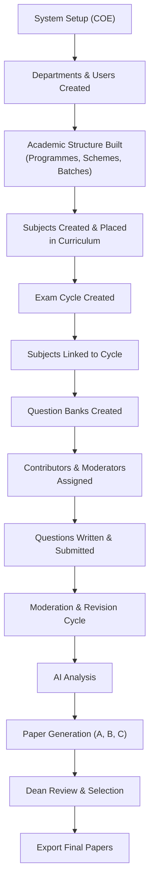
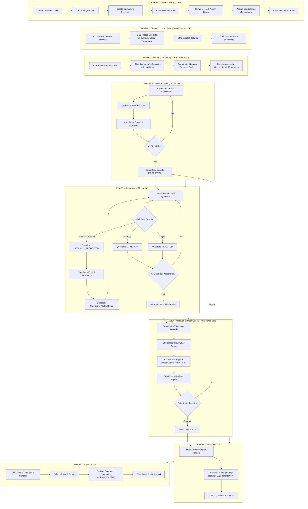
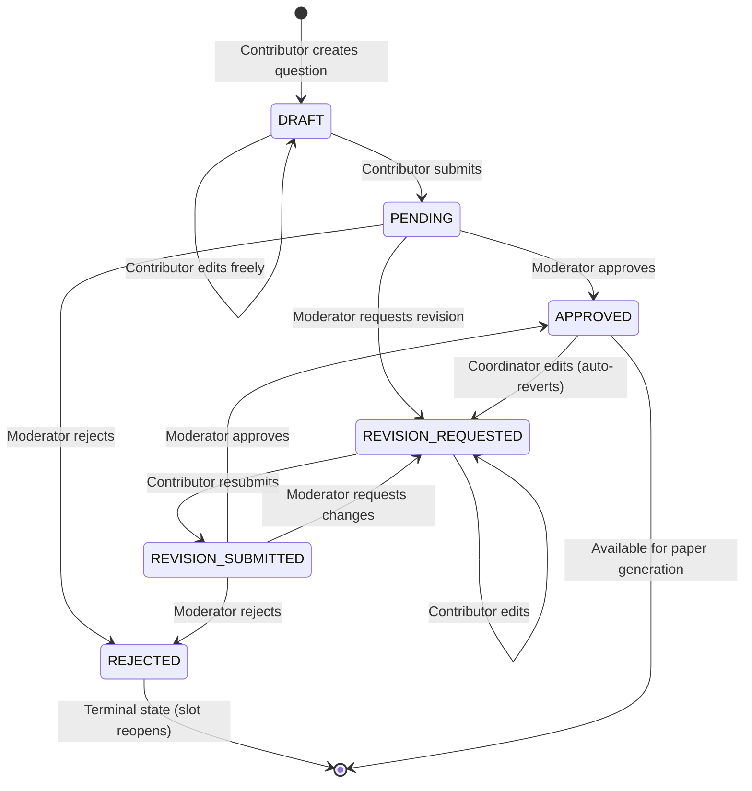
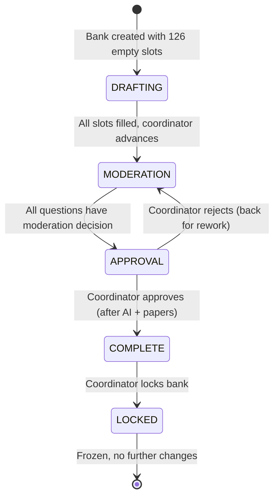
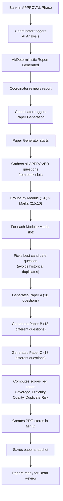
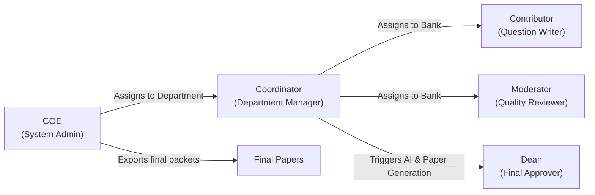
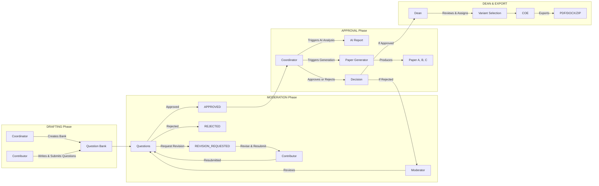
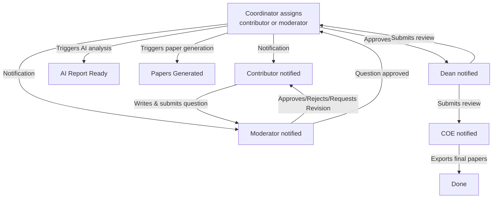

# EMQPGS — End-to-End System Workflow Guide

> **Examination Management & Question Paper Generation System**
>
> This guide explains how EMQPGS works from start to finish. It is written for anyone — faculty members, college administrators, project evaluators, or new developers — who wants to understand the system without reading any code.

---

## Table of Contents

1. [System Overview](#1-system-overview)
2. [Role Overview](#2-role-overview)
3. [Complete End-to-End Workflow](#3-complete-end-to-end-workflow)
4. [Dashboard Guide](#4-dashboard-guide)
5. [Page-by-Page Guide](#5-page-by-page-guide)
6. [Question Lifecycle](#6-question-lifecycle)
7. [Question Bank Lifecycle](#7-question-bank-lifecycle)
8. [Paper Lifecycle](#8-paper-lifecycle)
9. [Role Interaction Diagrams](#9-role-interaction-diagrams)
10. [End-to-End Scenarios](#10-end-to-end-scenarios)
11. [Common Workflow FAQ](#11-common-workflow-faq)
12. [Glossary](#12-glossary)

---

## 1. System Overview

### What EMQPGS Does

EMQPGS is a web-based system that manages the entire process of creating examination question papers at a college or university. It replaces the manual process of collecting questions from faculty, reviewing them, assembling them into papers, getting approvals, and producing the final printable documents.

### High-Level Flow



### Key Principles

- **Five roles** with different responsibilities (see [Role Overview](#2-role-overview))
- **Four-phase question bank lifecycle**: DRAFTING → MODERATION → APPROVAL → COMPLETE
- **126 slots** per question bank (6 modules × 3 mark types × 7 slots per combination)
- **Five exam types**: ISE-1, ISE-2, ENDSEM, Supplementary, KT
- **Three paper variants**: Paper A, Paper B, Paper C (generated automatically)
- **Every action is logged** in an immutable audit trail

---

## 2. Role Overview

### 2.1 COE (Controller of Examination)

**Who they are:** The senior administrator who oversees the entire examination process at the institution level.

**Responsibilities:**
- Set up the academic structure (programmes, batches, semesters)
- Create and manage departments
- Create and manage user accounts
- Create exam cycles
- Monitor progress across all departments
- Export final question papers

**What they can see:**
- Everything in the system — all departments, users, subjects, question banks, papers
- System-wide dashboards showing progress across all departments
- Audit logs of all actions

**What they can do:**
- Create academic units, programmes, curriculum schemes, batches
- Create departments
- Create and manage users (any role)
- Assign coordinators to departments
- Create exam cycles
- Export final examination packets (PDF, DOCX, or ZIP)
- View monitoring dashboards and audit logs

**What happens after their work:**
- After creating the academic structure → coordinators can manage their subjects
- After creating exam cycles → coordinators can link subjects and create question banks
- After exporting → the final papers are ready for printing

### 2.2 Coordinator

**Who they are:** A department-level academic manager (e.g., Head of Department or course coordinator). Each coordinator is assigned to one or more departments.

**Responsibilities:**
- Create and manage subjects for their departments
- Link subjects to exam cycles
- Create question banks
- Assign contributors and moderators to question banks
- Advance question banks through phases
- Trigger AI analysis and paper generation
- Approve or reject generated reports
- Lock completed question banks

**What they can see:**
- Subjects and data belonging to their assigned departments only
- All question banks for their subjects
- All questions submitted for their banks
- AI analysis reports
- Generated papers
- Dean review status

**What they can do:**
- Create, edit, and deactivate subjects
- Create subject versions
- Place subjects in the curriculum
- Link subjects to exam cycles
- Create question banks for subject + exam cycle combinations
- Assign contributors (question writers) and moderators (reviewers) to banks
- Create questions directly (coordinators can also contribute)
- Transfer question ownership between contributors
- Advance banks from DRAFTING to MODERATION
- Advance banks from MODERATION to APPROVAL
- Trigger AI analysis (minimum 3 questions required)
- Trigger paper generation
- Approve or reject reports (approve sends bank to COMPLETE, reject sends back to MODERATION)
- Lock completed banks

**What happens after their work:**
- After creating subjects → they appear in the curriculum
- After assigning contributors → contributors see their assigned banks
- After advancing phases → the next role becomes active
- After approving a report → the bank is ready for dean review

### 2.3 Contributor

**Who they are:** A faculty member who writes questions for a subject's question bank.

**Responsibilities:**
- Write and submit questions for assigned subjects
- Respond to revision requests from moderators

**What they can see:**
- Only the question banks they are assigned to
- Their own questions and their status
- Feedback from moderators

**What they can do:**
- Create new questions (initially in DRAFT status)
- Submit questions for moderation (moves to PENDING)
- Edit questions (only when in DRAFT or REVISION_REQUESTED status)
- Resubmit questions after making revisions

**What happens after their work:**
- After submitting → the question enters the moderation queue
- After making revisions → the question goes back to moderators

### 2.4 Moderator

**Who they are:** A senior faculty member who reviews and approves questions for quality and correctness.

**Responsibilities:**
- Review submitted questions
- Approve, reject, or request revisions for questions

**What they can see:**
- Only the question banks they are assigned to moderate
- Pending questions in those banks
- Question details (text, module, marks, CO mapping, RBT level)
- Previous moderation decisions

**What they can do:**
- Approve a question (moves to APPROVED status)
- Reject a question (with a reason, moves to REJECTED status)
- Request revision (with instructions, moves to REVISION_REQUESTED status)
- See questions awaiting their resubmission

**What happens after their work:**
- After approving → the question becomes available for paper generation
- After rejecting → the slot becomes empty and needs a new question
- After requesting revision → the contributor gets notified to make changes

### 2.5 Dean

**Who they are:** The Dean or final academic authority who reviews and assigns generated papers.

**Responsibilities:**
- Review the three generated paper variants (A, B, C)
- Assign one variant to each exam slot (Regular, Supplementary, KT)

**What they can see:**
- All question banks that have completed paper generation
- Paper scores (quality, coverage, difficulty, duplicate risk)
- AI recommendations
- Side-by-side comparison of all three paper variants

**What they can do:**
- View detailed paper content with all questions
- Assign variants to exam slots (e.g., Paper A → Regular, Paper B → Supplementary, Paper C → KT)
- Each slot must get a DIFFERENT variant (all three must be distinct)

**What happens after their work:**
- After submitting the review → COE and coordinators are notified
- The bank is now ready for export by the COE

### 2.6 Administrator (not a separate role)

There is no separate "Administrator" role. The **COE role** serves as the system administrator with full access to all management functions.

---

## 3. Complete End-to-End Workflow

### 3.1 Overall Workflow Diagram



### 3.2 Step-by-Step Walkthrough

#### Phase 0: System Setup (COE only, done once)

**Step 0.1 — Create Academic Units**
The COE creates academic units (e.g., "Computer Engineering Department", "ES&H"). These represent curriculum ownership — who is responsible for teaching what.

**Step 0.2 — Create Programmes**
The COE creates programmes (e.g., "BE Computer Engineering"). Each programme belongs to a home academic unit.

**Step 0.3 — Create Curriculum Schemes**
The COE creates curriculum schemes (e.g., "2025 Scheme") for each programme. A scheme defines the curriculum plan.

**Step 0.4 — Create Departments**
The COE creates administrative departments (e.g., "AIDS", "Computer Engineering"). Departments represent faculty affiliation (different from academic units which represent curriculum ownership).

**Step 0.5 — Create Users**
The COE creates user accounts for all roles: coordinators, contributors, moderators, and dean. Each user has a name, email, password, and role. Users may optionally belong to a department.

**Step 0.6 — Assign Coordinators to Departments**
The COE assigns each coordinator to one or more departments. This determines what data each coordinator can see and manage.

**Step 0.7 — Create Academic Years**
The COE creates academic years (e.g., "2025-26") with start and end dates.

#### Phase 1: Curriculum & Subjects (Coordinator + COE)

**Step 1.1 — Coordinators Create Subjects**
Coordinators create subjects (e.g., "Data Structures", "Algorithms") for their departments. Each subject has a code, name, and credit load. When created, the system automatically creates version 1 of the subject.

**Step 1.2 — COE Places Subjects in Curriculum**
The COE adds subjects to the curriculum by specifying which semester they are taught in, which academic unit teaches them, and optionally which teaching group.

**Step 1.3 — COE Creates Batches**
The COE creates batches (e.g., "BE Computer 2025-29") linked to a programme and curriculum scheme.

**Step 1.4 — COE Creates Batch Semesters**
The COE creates semester instances for each batch (Semester 1, 2, 3, etc.), linked to academic years. These define when each semester starts and ends.

#### Phase 2: Exam Cycle Setup (COE + Coordinator)

**Step 2.1 — COE Creates Exam Cycle**
The COE creates an exam cycle (e.g., "ISE-1", "ENDSEM") for a specific batch semester. The cycle starts as a DRAFT and can be set to ACTIVE. Each semester can have only one cycle per exam type.

**Step 2.2 — Coordinator Links Subjects to Exam Cycle**
The coordinator links subjects to the active exam cycle. The subject must first be placed in the curriculum for that batch's semester — otherwise the link is blocked.

**Step 2.3 — Coordinator Creates Question Banks**
For each linked subject + exam cycle combination, the coordinator creates a question bank. This is a structured container with 126 slots (6 modules × 3 mark types × 7 slots per combination). The bank starts in DRAFTING phase.

**Step 2.4 — Coordinator Assigns Contributors & Moderators**
The coordinator assigns:
- **Contributors**: Faculty members who will write questions
- **Moderators**: Senior faculty who will review questions

#### Phase 3: Question Drafting (Contributor)

**Step 3.1 — Contributors Write Questions**
Contributors see their assigned banks and create questions. Each question includes:
- Module number (1-6)
- Marks (2, 5, or 10)
- Question text
- Course Outcome (CO) mapping (CO1-CO6)
- RBT Level (L1-L6)
- Difficulty level (Easy, Medium, Hard — optional)
- Teaching Index (optional)

When a contributor creates a question, the system automatically assigns it to the first empty slot matching the module and marks. The question starts as a **DRAFT**.

**Step 3.2 — Contributor Submits Question**
The contributor explicitly submits the question. It moves to **PENDING** status and enters the moderation queue. The moderator receives a notification.

**Step 3.3 — All Slots Filled**
The coordinator monitors slot fill progress. Once all 126 slots have an assigned question, the bank is ready to advance.

#### Phase 4: Moderation (Moderator)

**Step 4.1 — Coordinator Advances to MODERATION**
The coordinator advances the bank from DRAFTING to MODERATION. The system checks that all slots are filled before allowing this.

**Step 4.2 — Moderator Reviews Questions**
Moderators see pending questions and can take one of three actions:

- **Approve**: Question is accepted (status → APPROVED)
- **Reject**: Question is rejected with a reason (status → REJECTED)
- **Request Revision**: Moderator provides instructions for changes (status → REVISION_REQUESTED)

**Step 4.3 — Revision Cycle**
If revision is requested:
1. Contributor receives notification with the moderator's instructions
2. Contributor edits the question and resubmits (status → REVISION_SUBMITTED)
3. Moderator reviews again
4. This cycle can repeat as many times as needed

**Step 4.4 — All Questions Moderated**
Once every question has a moderation decision, the bank is ready to advance to APPROVAL.

#### Phase 5: Approval & Paper Generation (Coordinator)

**Step 5.1 — Coordinator Advances to APPROVAL**
The coordinator advances the bank from MODERATION to APPROVAL. The system checks that all questions have been moderated before allowing this.

**Step 5.2 — Coordinator Triggers AI Analysis**
The coordinator triggers AI analysis (minimum 3 filled slots required). The system generates a report showing:
- Coverage distribution by CO, RBT level, and difficulty
- Slot fill statistics by module and marks
- Optional: AI-powered analysis if Ollama is configured

**Step 5.3 — Coordinator Triggers Paper Generation**
The coordinator triggers paper generation. The system:
1. Collects all APPROVED questions from the bank
2. For each module (1-6) and marks type (2, 5, 10), picks the best question
3. Generates 3 variants (A, B, C) — each with 18 questions (6 modules × 3 marks)
4. Avoids re-using questions across variants or from previous generations
5. Scores each paper for coverage, difficulty balance, quality, and duplicate risk
6. Saves PDFs to storage

**Step 5.4 — Coordinator Decision**
The coordinator reviews the generated papers and can:
- **Approve**: Bank moves to COMPLETE phase. Now ready for dean review.
- **Reject**: Bank goes back to MODERATION phase for rework.

#### Phase 6: Dean Review

**Step 6.1 — Dean Reviews Paper Variants**
The dean enters the review workspace and sees all three paper variants (A, B, C) with their quality scores, coverage scores, difficulty scores, duplicate risk, and AI recommendations.

**Step 6.2 — Assigns Papers to Slots**
The dean assigns each variant to a distinct exam slot:
- **Regular paper**: The main examination
- **Supplementary paper**: For students who missed the regular exam
- **KT paper**: For backlog/compartment exams

Each slot must get a DIFFERENT variant. All three must be distinct.

**Step 6.3 — Notifications Sent**
After submission, the COE and all relevant coordinators are notified. The bank is now ready for export.

#### Phase 7: Export (COE)

**Step 7.1 — COE Opens Production Console**
The COE sees all banks with completed dean reviews ready for export.

**Step 7.2 — Selects Bank & Format**
The COE selects a bank and chooses format:
- **PDF**: All papers combined into one PDF
- **DOCX**: Microsoft Word format
- **ZIP**: Both PDF and DOCX bundled together

**Step 7.3 — Configures Exam Details**
The COE enters:
- Exam date
- Duration (e.g., "3 Hours")
- Maximum marks
- Exam instructions
- Institution name

**Step 7.4 — System Generates & Stores Documents**
The system generates the final documents with all three paper variants as selected by the dean. Files are stored and a download link is created.

**Step 7.5 — Download or Lock Bank**
The COE can download the files or lock the bank permanently.

---

## 4. Dashboard Guide

### 4.1 COE Dashboard

**What the COE sees:**
- **Metric tiles**: Users, departments, active cycles, question banks, total questions, pending review, fill rate, moderation backlog, dean bottlenecks
- **Banks by Phase**: A stacked bar showing distribution across DRAFTING, MODERATION, APPROVAL, COMPLETE
- **Department Progress**: A table showing each department's question bank count broken down by phase
- **Stalled Banks**: Banks not updated in 7+ days (clickable, shows subject name and stall duration)
- **Pending Dean Review**: Banks with generated papers waiting for dean action
- **Recent Activity**: Latest audit log entries with actor and action
- **Quick Navigation**: Links to all COE sections

**What to do first:**
Check stalled banks and dean bottlenecks — these are the most common blockers.

**Typical daily workflow:**
1. Scan metric tiles for overall system health
2. Review stalled banks and follow up with coordinators
3. Check pending dean reviews
4. Navigate to Production to export completed banks

### 4.2 Coordinator Dashboard

**What the coordinator sees:**
- **Phase distribution tiles**: Count of banks in drafting, moderation, approval, complete
- **Total Banks and Needs Attention counts**
- **Bank cards**: Each bank shows fill progress bar, phase badge, approved/pending counts, days in phase, next action
- **Attention sidebar**: Items needing action — stalled banks, missing moderators, banks ready to advance
- **Active Exam Cycles**: Links to exam workspace
- **Recent Contribution Activity**: Latest question submissions
- **Notification Inbox**: Unread notifications

**What to do first:**
Check the attention sidebar. Fix issues in priority order:
1. Assign missing moderators
2. Advance banks ready for next phase
3. Check stalled banks

**Typical daily workflow:**
1. Review attention items
2. Advance banks that are ready (DRAFTING → MODERATION → APPROVAL)
3. Assign contributors/moderators where missing
4. Review AI reports and trigger paper generation
5. Approve or reject reports
6. Lock completed banks

### 4.3 Contributor Dashboard

**What the contributor sees:**
- **Slot demand alert**: Shows how many slots still need questions across all assigned banks
- **Revision requests** (most urgent): Questions needing edits
- **Bank cards**: Each assigned bank with fill progress, phase badge, and "Highest Need" indicator
- **Stats row**: Submitted, approved, pending, revision requested, rejected, draft counts
- **Recent feedback**: Latest moderator comments with question details

**What to do first:**
Check the revision requests section — these are the most time-sensitive.

**Typical daily workflow:**
1. Handle any revision requests first
2. Create new questions for banks with empty slots
3. Submit drafts that are ready for moderation

### 4.4 Moderator Dashboard

**What the moderator sees:**
- **Stat chips**: Pending, approved, rejected, revision requested, awaiting resubmission counts
- **Pending Queue by Bank**: Expandable list of pending questions grouped by bank with module/marks/contributor details
- **Per-Bank Quick Stats**: Table with pending/approved/rejected counts per bank
- **Awaiting Revision Resubmission**: Questions where contributor was asked to revise
- **Recent Activity**: Your own moderation actions with timestamps
- **Notification Inbox**

**What to do first:**
Review pending questions. Then check awaiting resubmission.

**Typical daily workflow:**
1. Review pending questions (approve, reject, or request revision)
2. Check if awaited resubmissions have arrived
3. Review resubmitted questions

### 4.5 Dean Dashboard

**What the dean sees:**
- **Pending Reviews**: Cards for banks needing dean action — shows subject, exam cycle, generation timestamp, quality score, coverage score, AI summary
- **Approval History**: Table of past dean selections with assigned variants and date
- **Completed Reviews**: Past reviews showing which variants were assigned to which slots
- **Notification Inbox**

**What to do first:**
Review pending reviews. These are blocking the entire workflow.

**Typical daily workflow:**
1. Open pending reviews
2. Compare paper variants side by side
3. Assign variants to exam slots (Regular, Supplementary, KT)
4. Submit selections

---

## 5. Page-by-Page Guide

### 5.1 COE Pages

#### Academic Setup (`/dashboard/coe/academic-setup`)
- **Purpose**: Central hub for creating Academic Units, Programmes, and Curriculum Schemes
- **Typical actions**: Create first-time structure, add new programmes

#### Academic Units (`/dashboard/coe/academic-units`)
- **Purpose**: Manage teaching departments (ES&H, Computer Engineering, etc.)
- **Typical actions**: Create, rename, deactivate academic units

#### Programmes (`/dashboard/coe/programmes`)
- **Purpose**: Manage degree programmes (BE, BTECH, etc.)
- **Typical actions**: Create programmes, link to academic units

#### Batches (`/dashboard/coe/batches`)
- **Purpose**: Manage student cohorts
- **Typical actions**: Create batch, view semesters, manage teaching groups

#### Exam Cycles (`/dashboard/coe/exam-cycles`)
- **Purpose**: Create and manage examination cycles
- **Typical actions**: Create cycle (DRAFT → ACTIVE), close cycles

#### Users (`/dashboard/coe/users`)
- **Purpose**: Manage all user accounts
- **Typical actions**: Create users, change roles, disable accounts

#### Departments (`/dashboard/coe/departments`)
- **Purpose**: Manage administrative departments
- **Typical actions**: Create departments, assign HOD names

#### Coordinator Assignments (`/dashboard/coe/coordinator-assignments`)
- **Purpose**: Link coordinators to departments
- **Typical actions**: Assign coordinator to department, remove assignment

#### Production (`/dashboard/coe/production`)
- **Purpose**: Export final question papers
- **Sections**: Generated Papers table, Export Console (form to generate), Recent Exports table
- **Typical workflow**: Select bank from dropdown → choose format → enter exam details → generate → download

#### Monitoring (`/dashboard/coe/monitoring`)
- **Purpose**: System health and observability overview

#### Audit (`/dashboard/coe/audit`)
- **Purpose**: View immutable audit log of all system actions

#### Curriculum (`/dashboard/coe/curriculum`)
- **Purpose**: Place subjects into semester curriculum
- **Sections**: Programme/scheme selector, semester tabs, subject listing table, add-subject form
- **Typical workflow**: Select scheme → select semester → add subjects

### 5.2 Coordinator Pages

#### Dashboard (`/dashboard/coordinator`)
- **Purpose**: Overview of all question banks and attention items
- **Typical actions**: Click bank cards to drill in, click attention items

#### Subjects (`/dashboard/coordinator/subjects`)
- **Purpose**: Create and manage subjects for your departments
- **Shows**: Subject code, name, credits, status, linked cycles, question banks

#### Create Subject (`/dashboard/coordinator/subjects/create`)
- **Inputs**: Subject code, name, credits, department
- **Outputs**: New subject with version 1

#### Question Banks (`/dashboard/coordinator/question-banks`)
- **Purpose**: View all question banks and create new ones
- **Two sections**: Existing banks table (left), Create Bank form (right)
- **Create form**: Select subject + exam cycle → creates bank with 126 slots

#### Question Bank Detail (`/dashboard/coordinator/question-banks/[id]`)
- **Purpose**: Full management workspace for one bank
- **Sections**:
  - Header with subject info, phase badge, record status
  - **Slot Matrix**: 6×3 grid showing fill status per module/marks combination
  - **Slots List**: Expandable per-module view of all 21 slots
  - **Phase Controls**: Advance, moderate, approve buttons
  - **Assignments**: Manage contributors and moderators
  - **AI Reports**: View and trigger AI analysis
  - **Generated Papers**: View and trigger paper generation
  - **Coordinator Decision**: Approve or reject (sends bank to COMPLETE or back to MODERATION)
  - **Lock**: Lock completed bank permanently

#### Assignments (`/dashboard/coordinator/assignments`)
- **Purpose**: Assign moderators and contributors to question banks
- **Sections**: Moderator assignment form, Contributor assignment form
- **Shows**: Current assignments with option to remove

#### Exam Workspace (`/dashboard/coordinator/exam-workspace/[id]`)
- **Purpose**: Overview of all subjects and banks for one exam cycle
- **Sections**:
  - Summary cards: Total subjects, banks initialized, not started, completed
  - Progress bars: Banks initialized, completed, drafting, in moderation
  - Subject list: Each subject with bank status badge and "Open Bank" link
  - Work queue: Colored cards showing bottlenecks

#### Coverage (`/dashboard/coordinator/coverage`)
- **Purpose**: View question coverage distribution (CO, RBT, module, difficulty)

#### Questions (`/dashboard/coordinator/questions`)
- **Purpose**: View all questions across your departments with filters

### 5.3 Contributor Pages

#### Dashboard (`/dashboard/contributor`)
- **Purpose**: Overview of your assigned banks and question stats
- **Typical actions**: Click "Submit Question" on a bank, handle revisions

#### My Subjects (`/dashboard/contributor/my-subjects`)
- **Purpose**: View all assigned question banks
- **Shows**: Subject name, code, exam cycle, phase badge, your question count

#### Submit Question (`/dashboard/contributor/submit-question`)
- **Purpose**: Create a new question
- **Inputs**: Select subject version, module, marks, enter question text, CO, RBT, difficulty
- **Includes**: Slot demand table showing which module/marks combinations need questions
- **Outputs**: New question (DRAFT) auto-assigned to first empty slot

#### My Questions (`/dashboard/contributor/questions`)
- **Purpose**: View all your questions with status
- **Table**: Subject, module, marks, status, linked banks, actions
- **Actions**: Edit (for drafts/revisions), Submit (for drafts)

#### Edit Question (`/dashboard/contributor/questions/[id]/edit`)
- **Purpose**: Edit an existing question
- **Restriction**: Only editable in DRAFT or REVISION_REQUESTED status

### 5.4 Moderator Pages

#### Dashboard (`/dashboard/moderator`)
- **Purpose**: Overview of moderation queue
- **Typical workflow**: Review pending questions by bank

#### Review Queue (`/dashboard/moderator/questions`)
- **Purpose**: List of questions pending moderation
- **Table**: Subject, module, marks, status, contributor, Review button
- **Shows only**: PENDING and REVISION_SUBMITTED questions

#### Question Review (`/dashboard/moderator/questions/[id]`)
- **Purpose**: Review a single question in detail
- **Actions**: Approve, Reject (with reason), Request Revision (with instructions)

#### Approved (`/dashboard/moderator/approved`)
- **Purpose**: View all questions you have approved

#### Rejected (`/dashboard/moderator/rejected`)
- **Purpose**: View all questions you have rejected

### 5.5 Dean Pages

#### Dashboard (`/dashboard/dean`)
- **Purpose**: Overview of pending and completed reviews
- **Typical workflow**: Review pending items → open workspace

#### Review Workspace (`/dashboard/dean/review?bank=[id]`)
- **Purpose**: Compare and assign paper variants
- **Sections**:
  - Three paper tabs (A, B, C) with scores
  - Question-by-question breakdown per paper
  - Assignment dropdowns (Regular, Supplementary, KT)
- **Validation**: All three assignments must be different variants

#### Readiness Overview (`/dashboard/dean/readiness-overview`)
- **Purpose**: Overview of all banks and their readiness status

#### Reports (`/dashboard/dean/reports`)
- **Purpose**: View reports on completed reviews

---

## 6. Question Lifecycle

### 6.1 State Diagram



### 6.2 Complete Question Journey (Real Example)

```
Subject: Data Structures
Question: "Explain the difference between arrays and linked lists."
Module: 3, Marks: 5, CO: CO2, RBT: L2, Difficulty: Medium

STEP 1 — Creator: Contributor Ms. Iyer
     Opens Submit Question page
     Selects Data Structures, Module 3, 5 marks
     Writes the question text, sets CO, RBT, difficulty
     Clicks Save → Question created in DRAFT status
     System auto-assigns it to the first empty slot
     in Module 3/5-marks combination

STEP 2 — Creator: Contributor Ms. Iyer
     Reviews the question, clicks Submit
     → Question moves to PENDING status
     → Moderator Dr. Rao receives notification

STEP 3 — Reviewer: Moderator Dr. Rao
     Opens question in review queue
     Reads the question
     Writes feedback: "Please add a coding example"
     Selects "Request Revision"
     → Question moves to REVISION_REQUESTED
     → Contributor Ms. Iyer receives notification

STEP 4 — Creator: Contributor Ms. Iyer
     Sees revision request on dashboard
     Opens edit page, adds a code example
     Clicks Submit
     → Question moves to REVISION_SUBMITTED
     → Moderator Dr. Rao receives notification

STEP 5 — Reviewer: Moderator Dr. Rao
     Reviews the updated question
     Approves
     → Question moves to APPROVED
     → Now available for paper generation

STEP 6 — Coordinator: Prof. Patel triggers paper generation
     Paper generator may pick this question for 
     one of the variants (assuming it ranks best)
```

---

## 7. Question Bank Lifecycle

### 7.1 Phase State Diagram



### 7.2 Phase Transition Rules

| Transition | Requirement |
|------------|-------------|
| DRAFTING → MODERATION | All 126 slots must have a question assigned |
| MODERATION → APPROVAL | Every filled question must have a moderation event (approved/rejected/revision submitted) |
| APPROVAL → COMPLETE | Coordinator must approve (after AI report and paper generation) |
| APPROVAL → MODERATION | Coordinator can reject, sending bank back |
| COMPLETE → (locked) | Coordinator can lock the bank permanently |

### 7.3 Complete Question Bank Journey (Real Example)

```
Subject: Data Structures
Exam Cycle: ENDSEM, Semester 3
Bank Type: 126 slots (6 modules × 3 marks × 7 slots)

STEP 1 — COE creates "ENDSEM" exam cycle for Semester 3, Batch 2026-30
STEP 2 — Coordinator links "Data Structures" to this cycle
         (checks: subject must be placed in curriculum first)
STEP 3 — Coordinator creates question bank
         → Bank created with PaperPattern (6 modules, [2,5,10] marks, 7 per slot)
         → Phase: DRAFTING, Record Status: ACTIVE
STEP 4 — Coordinator assigns 3 contributors and 2 moderators
         → Contributors and moderators receive notifications
STEP 5 — Contributors submit questions over 2 weeks
         → 120 out of 126 slots filled
STEP 6 — Coordinator monitors progress: 6 empty slots remain
STEP 7 — Contributors fill remaining slots
STEP 8 — Coordinator advances bank to MODERATION
         → System checks: all 126 slots filled? Yes
         → Phase: MODERATION
STEP 9 — Moderators review questions
         → 100 approved, 8 rejected, 18 revision requested
STEP 10 — Contributors revise and resubmit
STEP 11 — Moderators approve revised questions
STEP 12 — Coordinator advances bank to APPROVAL
          → System checks: all questions moderated? Yes
          → Phase: APPROVAL
STEP 13 — Coordinator triggers AI Analysis
          → Report shows: 6/6 COs covered, 4/6 RBT levels, good distribution
STEP 14 — Coordinator triggers Paper Generation
          → System generates Paper A, B, C with 18 questions each
          → PDFs stored in MinIO
STEP 15 — Coordinator reviews papers
          → Approves → Phase: COMPLETE
STEP 16 — Dean reviews papers, assigns variants
STEP 17 — COE exports final packets
STEP 18 — Coordinator locks the bank permanently
```

---

## 8. Paper Lifecycle

### 8.1 Paper Generation Flow



### 8.2 Paper Generation Algorithm

The paper generator works as follows:

1. **Collects** all APPROVED questions from the bank's slots
2. **Rejects** if no approved questions exist
3. **Builds historical exclusion set**: Questions used in any previously generated paper are excluded (prevents repeats)
4. **For each variant (A, B, C)**: Iterates over Module 1→6, Marks 2→5→10
5. **For each slot**: Finds the best approved question that:
   - Matches the module number and marks
   - Has not been consumed by a previous variant in this batch
   - Has not been used in any historical paper generation
   - Ranks questions: MEDIUM difficulty preferred first, then EASY, then HARD
6. **Each variant** gets 18 questions (6 modules × 3 marks)
7. **All 3 variants** use different questions (54 unique questions total)

### 8.3 Scoring System

Each generated paper gets computed scores:

| Score | Range | What it measures |
|-------|-------|------------------|
| **Coverage Score** | 0-100 | What percentage of the 6 syllabus modules are represented |
| **Difficulty Score** | 0-100 | How balanced the EASY/MEDIUM/HARD distribution is |
| **Quality Score** | 0-100 | Question text length + teaching index coverage |
| **Duplicate Risk** | 0-100 | How much text overlap exists between questions in one paper |

The system also provides a recommendation: "Recommended for dean review" if the difficulty mix is reasonable, or "Recommended with caution" if difficulty spread needs improvement.

### 8.4 Complete Paper Journey (Real Example)

```
STEP 1 — Bank "Data Structures" reaches APPROVAL phase
         Has 80 approved questions across all modules

STEP 2 — Coordinator clicks "Generate Papers"
         System runs PaperGenerator.generate() with [PAPER_A, PAPER_B, PAPER_C]

STEP 3 — Paper A generated (18 questions):
         Coverage Score: 100% (all 6 modules covered)
         Difficulty Score: 85% (good mix)
         Quality Score: 92/100
         Duplicate Risk: 5% (very low)

STEP 4 — Paper B generated (18 different questions):
         Coverage Score: 100%
         Difficulty Score: 78%
         Quality Score: 88/100
         Duplicate Risk: 10%

STEP 5 — Paper C generated (18 different questions):
         Coverage Score: 83% (only 5 of 6 modules)
         Difficulty Score: 72%
         Quality Score: 90/100
         Duplicate Risk: 15%

STEP 6 — 3 PDFs stored in MinIO storage bucket "generated-papers"

STEP 7 — Dean opens review workspace
         Sees all 3 papers side by side with scores
         Compares question content across variants

STEP 8 — Dean assigns:
         Regular Exam → Paper A (highest quality, best difficulty mix)
         Supplementary → Paper B
         KT Exam → Paper C

STEP 9 — Dean submits review
         System validates: all 3 assignments are different variants
         Final selections saved to database
         Notifications sent to COE and coordinators

STEP 10 — COE exports as PDF packet for printing
```

---

## 9. Role Interaction Diagrams

### 9.1 Role Hierarchy



### 9.2 Interaction Flow Per Phase



### 9.3 Notification Flow



---

## 10. End-to-End Scenarios

### Scenario 1: A Brand New Semester

**Characters:**
- Dr. Sharma (COE)
- Prof. Patel (Coordinator, Computer Engineering)
- Ms. Iyer (Contributor)
- Dr. Rao (Moderator)
- Dr. Verma (Dean)

**Setting:** It is the start of a new academic year. The system is completely empty.

---

**Day 1 — COE Setup**

Dr. Sharma logs in as COE. The system has nothing — no users, no departments, no subjects.

She navigates to Academic Setup and creates:
1. **Academic Unit**: "Computer Engineering"
2. **Programme**: "BE Computer Engineering" (4 years, 8 semesters)
3. **Curriculum Scheme**: "2026 Scheme" for this programme

Then she goes to Departments and creates "Computer Engineering Department".

She goes to Users and creates accounts for:
- Prof. Patel → Coordinator role
- Ms. Iyer → Contributor role
- Dr. Rao → Moderator role
- Dr. Verma → Dean role

She creates an **Academic Year**: "2026-27"

She assigns Prof. Patel to the Computer Engineering department.

---

**Day 2 — Coordinator Creates Subjects**

Prof. Patel logs in. His dashboard shows his assigned department. He navigates to Subjects and creates:
1. "Data Structures" (code: CS301, 4 credits)
2. "Algorithms" (code: CS302, 4 credits)
3. "Database Systems" (code: CS303, 3 credits)

Each subject is automatically created with Version 1.

---

**Day 3 — COE Builds Curriculum**

Dr. Sharma goes to Curriculum page, selects "2026 Scheme", and adds subjects to Semester 3:
1. Data Structures → Semester 3
2. Algorithms → Semester 3
3. Database Systems → Semester 3

She creates a **Batch**: "BE Computer 2026-30" (admission 2026, graduation 2030)
She creates **Batch Semester**: Semester 3 for this batch, linked to Academic Year "2026-27"

---

**Day 4 — Exam Cycle Setup**

Dr. Sharma creates an **Exam Cycle**: "ISE-1" for Semester 3, then sets it to ACTIVE.

Prof. Patel goes to the Exam Workspace. He links Data Structures, Algorithms, and Database Systems to the ISE-1 cycle. (The system verifies each subject is in the curriculum first.)

He creates a **Question Bank** for each subject:
- Data Structures + ISE-1
- Algorithms + ISE-1
- Database Systems + ISE-1

Each bank has 126 empty slots.

Prof. Patel assigns Ms. Iyer as contributor and Dr. Rao as moderator for all three banks.

---

**Days 5-10 — Question Writing**

Ms. Iyer logs in. Her dashboard shows 3 banks and a slot demand alert. She starts creating questions:

- Day 5: Submits 8 questions for Data Structures (Modules 1-3)
- Day 6: Submits 7 questions for Algorithms
- Day 7: Submits 10 questions for Database Systems
- Day 8: Submits more questions, focusing on modules with empty slots
- Day 9-10: Fills remaining slots

Each question starts as DRAFT, then she submits it → PENDING.

---

**Days 11-14 — Moderation**

Dr. Rao logs in. He sees 53 pending questions across the three banks.

He reviews them systematically:
- **Data Structures**: Approves 18, rejects 1 (incorrect), requests revision for 2
- **Algorithms**: Approves 15, all good
- **Database Systems**: Approves 14, requests revision for 3

Ms. Iyer gets notifications. She sees 5 revision requests on her dashboard. She fixes them based on Dr. Rao's feedback and resubmits.

Dr. Rao reviews the resubmissions and approves them all.

---

**Days 15-16 — Approval & Generation**

Prof. Patel sees all three banks are fully moderated. He advances each to APPROVAL.

For each bank, he:
1. Triggers AI Analysis
2. Reviews the report (good coverage, OK difficulty spread)
3. Triggers Paper Generation
4. Reviews the 3 generated paper variants with their scores
5. Approves → bank moves to COMPLETE

---

**Day 17 — Dean Review**

Dr. Verma logs in. He sees 3 banks pending review on his dashboard.

For Data Structures:
- Opens the review workspace
- Sees Paper A (coverage 100%, quality 92), Paper B (coverage 100%, quality 88), Paper C (coverage 83%, quality 90)
- Compares questions across variants
- Assigns: Paper A → Regular, Paper B → Supplementary, Paper C → KT
- Submits

Repeats for Algorithms and Database Systems.

---

**Day 18 — Export**

Dr. Sharma logs in, goes to Production. She sees all 3 banks with dean selections.

For each bank, she:
1. Selects the bank from the dropdown
2. Chooses PDF format
3. Sets exam date, duration (3 Hours), max marks (100)
4. Clicks Generate Export
5. Downloads the file

**All three examination papers are now ready for printing.**

---

### Scenario 2: A Contributor Receives a Revision Request

**Who:** Ms. Iyer (Contributor)

Ms. Iyer logs in to her contributor dashboard. At the top, she sees a prominent section:

> **Revision Needed (2)**
>
> - Database Systems — Module 4, 10 marks
> - Data Structures — Module 2, 5 marks

She clicks "Edit" on the first one. The question editor opens. At the top, she sees the moderator's note:

> "Your explanation is correct but too brief. Please add a real-world example to illustrate the concept better."

Ms. Iyer adds a detailed example, improves the explanation, and clicks "Submit". The question moves to REVISION_SUBMITTED.

She does the same for the second question.

Dr. Rao (moderator) receives notifications, reviews her changes, and approves both questions.

---

### Scenario 3: A Dean Approves Generated Papers

**Who:** Dr. Verma (Dean)

Dr. Verma logs in. His dashboard shows 2 pending reviews.

He clicks "Review papers" on the first one — "Data Structures".

The review workspace shows three tabs:
- **Paper A** — Coverage 100%, Quality 92/100, Difficulty 85%, Duplicate Risk 5%
- **Paper B** — Coverage 100%, Quality 88/100, Difficulty 78%, Duplicate Risk 10%
- **Paper C** — Coverage 83%, Quality 90/100, Difficulty 72%, Duplicate Risk 15%

Under each paper, he sees a full question list with module numbers, marks, CO, and RBT level for each question.

The AI recommendation says: "Recommended for dean review; paper shows reasonable balance."

Dr. Verma clicks through all three tabs, comparing the question selection. He notices Paper A has the best difficulty mix and highest quality. He decides:

1. **Regular Exam** dropdown → Selects "PAPER_A"
2. **Supplementary Exam** dropdown → Selects "PAPER_B"
3. **KT Exam** dropdown → Selects "PAPER_C"

He clicks Submit. The system validates that all three are different variants. The review is saved. Notifications are sent to Dr. Sharma (COE) and Prof. Patel (Coordinator).

---

### Scenario 4: A Coordinator Prepares the Examination

**Who:** Prof. Patel (Coordinator)

Prof. Patel logs in and goes to his dashboard. He has 4 question banks. He checks the Exam Workspace for the ISE-1 cycle:

| Subject | Status |
|---------|--------|
| Data Structures | COMPLETE, Dean reviewed |
| Algorithms | COMPLETE, Dean reviewed |
| Database Systems | APPROVAL — needs action |

He goes to the Database Systems bank detail page. The AI report shows: "6/6 COs covered, 3/6 RBT levels, 80% fill rate."

He triggers Paper Generation. The system generates Paper A, B, C. He reviews the scores:
- Paper A: Coverage 100%, Quality 87, Difficulty 80%
- Paper B: Coverage 100%, Quality 85, Difficulty 75%
- Paper C: Coverage 83%, Quality 82, Difficulty 70%

He approves the report → bank moves to COMPLETE.

Now he checks the Dean Review status: Data Structures and Algorithms have dean selections, but Database Systems is still waiting.

He contacts Dr. Verma to let him know Database Systems is ready for review.

---

## 11. Common Workflow FAQ

**Q: Can a coordinator create questions?**
A: Yes. Coordinators can create questions directly in any of their banks. This bypasses contributor assignment checks but still goes through moderation.

**Q: Can a question be used in multiple question banks?**
A: Yes. A question can be assigned to slots in different banks simultaneously. But within a single bank, it can only occupy one slot.

**Q: What happens if a question is rejected?**
A: The slot it occupied becomes empty. A different question must be submitted to fill that slot.

**Q: Can a coordinator edit an approved question?**
A: Yes. When a coordinator edits an approved question, the system automatically reverts its status to REVISION_REQUESTED, signaling it needs re-moderation.

**Q: What determines if a bank can advance from DRAFTING to MODERATION?**
A: All 126 slots must have a question assigned. Even one empty slot blocks the transition.

**Q: What determines if a bank can advance from MODERATION to APPROVAL?**
A: Every filled question must have a moderation event. Questions with no moderation action block the transition.

**Q: What is the minimum for AI analysis?**
A: At least 3 filled slots in the bank.

**Q: Can papers be regenerated?**
A: Yes. The coordinator can trigger paper generation multiple times. The system tracks historical usage and avoids re-using previously selected questions.

**Q: Can the dean change their selection after submitting?**
A: No. Once submitted, the dean review is final. The selection cannot be modified.

**Q: What happens after a bank is locked?**
A: No further modifications are possible. A snapshot of the bank is saved. The bank can only be exported.

**Q: Can the COE export without dean review?**
A: No. Dean selection is required before export. The system blocks export until dean review is complete.

**Q: Is the AI analysis mandatory?**
A: The system requires AI report completion before paper generation. However, if Ollama is not configured, a deterministic report is generated instead using the question data.

**Q: Can a contributor be assigned to a bank after questions have been submitted?**
A: Yes. Assignments can be made at any time while the bank is not locked.

**Q: What does the slot demand recommendation mean?**
A: The system recommends which module × marks combination has the most empty slots, helping contributors prioritize their work.

**Q: Can a subject be linked to an exam cycle without being in the curriculum?**
A: No. The system checks that the subject has been placed in the curriculum for the batch's semester before allowing the link.

**Q: What happens when a coordinator rejects a report?**
A: The bank goes back to MODERATION phase for rework. Questions may need to be revised or replaced.

---

## 12. Glossary

| Term | Meaning |
|------|---------|
| **Question Bank** | A structured container for questions for one subject in one exam cycle. Contains 126 slots. |
| **Slot** | A position in a question bank defined by module number, marks, and slot number. |
| **Module** | A syllabus unit (1-6 per subject). |
| **Course Outcome (CO)** | A measurable learning outcome (CO1-CO6) mapped to each question. |
| **RBT Level** | Revised Bloom's Taxonomy level (L1-L6) indicating cognitive complexity. |
| **Exam Cycle** | An examination instance (ISE-1, ISE-2, ENDSEM, Supplementary, KT). |
| **Phase** | Current stage of a question bank: DRAFTING, MODERATION, APPROVAL, or COMPLETE. |
| **Record Status** | Whether a bank is ACTIVE (editable) or LOCKED (frozen). |
| **Academic Unit** | A curriculum-owning entity (department or ES&H for first year). |
| **Programme** | A degree programme (BE, BTECH, MTECH, etc.). |
| **Curriculum Scheme** | A named curriculum plan (e.g., "2025 Scheme") for a programme. |
| **Batch** | A student cohort (e.g., "BE Computer 2025-29"). |
| **Batch Semester** | A specific semester instance for a batch with its own dates. |
| **Paper Variant** | One of three generated paper versions (Paper A, B, or C). |
| **Dean Review** | Final step where the dean assigns variants to exam slots. |
| **Export** | Generation of final printable documents (PDF, DOCX, or ZIP). |
| **Deterministic Report** | A coverage analysis based on CO/RBT/Difficulty distribution without AI. |
| **AI Report** | A report using Ollama (llama3.1) if configured, otherwise deterministic. |
| **Slot Demand** | A visualization showing which module × marks combinations need questions. |
| **Teaching Group** | A batch subdivision for first-year teaching (max 2 groups). |
| **Group Assignment** | Whether a subject is for all students (ALL) or a specific group (GROUP1/GROUP2). |
| **MinIO** | The file storage system where generated PDFs are saved. |
| **Ollama** | Optional local AI service for enhanced question bank analysis. |
