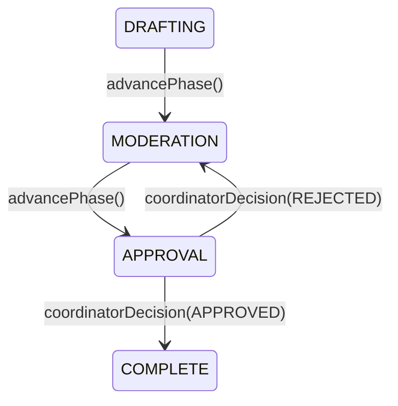
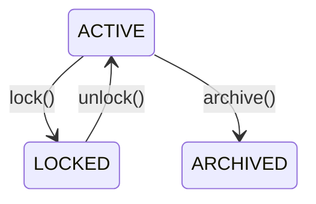
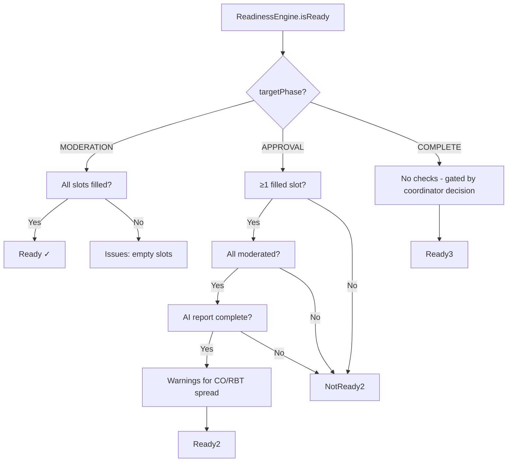
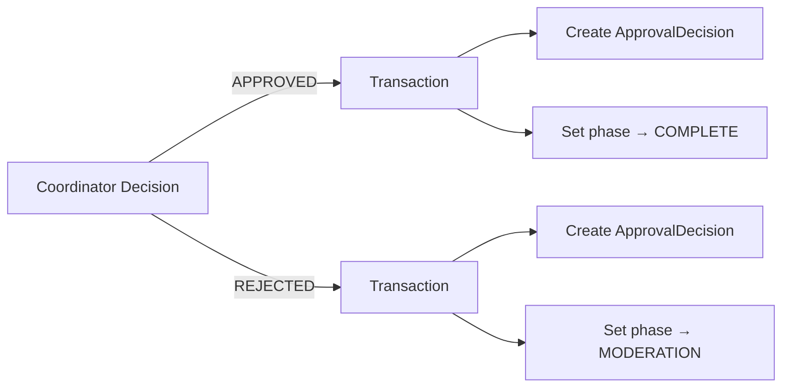
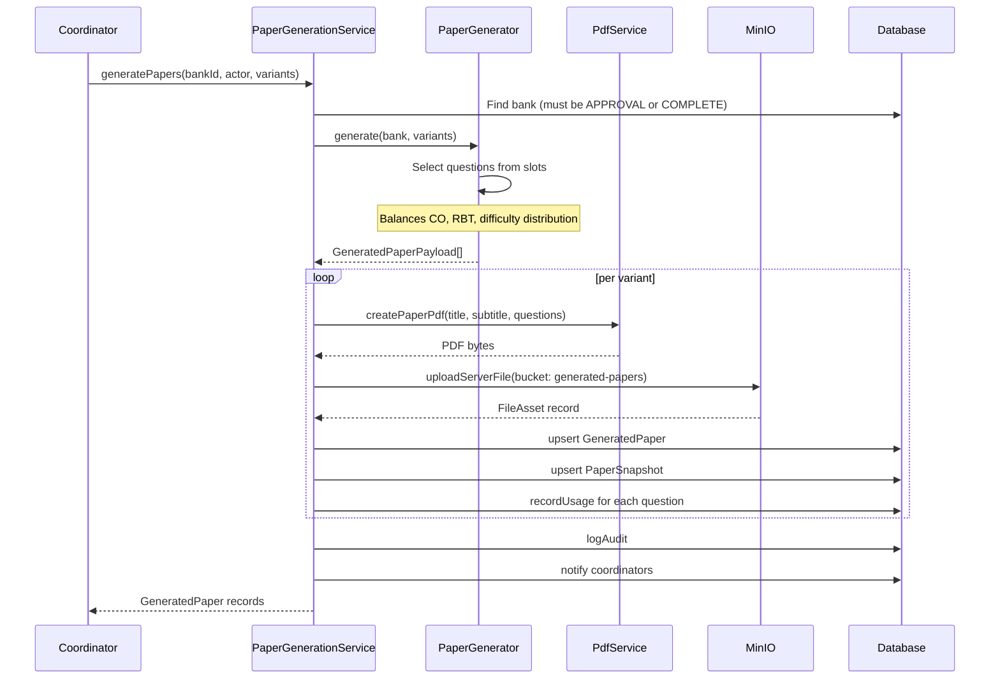
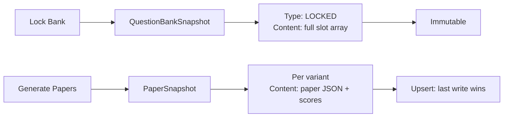
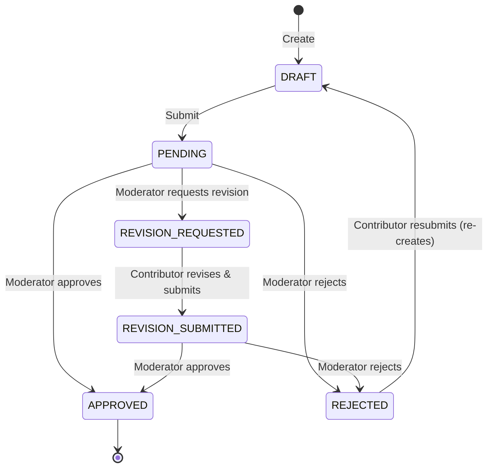

# Workflow

> The authoritative guide to question bank lifecycle, phase transitions, readiness, locking, approval, and paper generation.

---

## 1. Question bank lifecycle (phase model)

The QuestionBank has two independent state axes:

```
Axis 1: Phase (what the bank is doing)
  DRAFTING → MODERATION → APPROVAL → COMPLETE

Axis 2: RecordStatus (operational state)
  ACTIVE ←→ LOCKED
  (ARCHIVED for long-term retention)
```

These are orthogonal — you can have a bank in `APPROVAL` phase that is `LOCKED`, for example.

### Phase transition table



**Validation:** `isValidPhaseTransition()` in `src/modules/question-banks/transitions.ts` enforces this table. Invalid transitions return HTTP 409.

### RecordStatus transitions



**Note:** `LOCKED` is **not** terminal. The unlock API (`POST /api/question-banks/[id]/unlock`) is available to coordinators for emergency recovery.

---

## 2. Detailed phase walkthrough

### DRAFTING

The initial phase when a bank is created via `QuestionBankWorkflowService.initializeQuestionBank()`.

What happens:
- Bank created with `phase: DRAFTING`, `recordStatus: ACTIVE`
- `PaperPattern` created based on `ExamType`
- All slots generated (63 for ISE, 126 for ENDSEM)
- No questions assigned yet

Allowed actions:
- Assign questions to slots (coordinators, contributors)
- Unassign questions from slots
- Create new `QuestionLibraryItem` entries
- Submit questions for moderation

Readiness check (`ReadinessEngine.isReady(bankId, MODERATION)`):
- All slots must be filled (no empty slots)

### MODERATION

All slots are filled. Moderators review questions.

What happens:
- `ModeratorBankAssignment` controls which moderators can act on this bank
- Moderators approve, reject, or request revision on individual questions
- Rejected questions can be replaced
- Revised questions return via revision submission

Allowed actions:
- Moderate questions (moderators)
- Replace rejected questions (coordinators/contributors)
- Advance to `APPROVAL` when ready

Readiness check (`ReadinessEngine.isReady(bankId, APPROVAL)`):
- At least 1 slot filled
- All filled slots have moderation decisions
- AI report completed (AI analysis run by coordinator)
- Coverage warnings generated for CO/RBT spread

### APPROVAL

Moderation is complete, AI analysis is done, papers are generated.

Key actions:
- Trigger AI analysis (`POST /api/question-banks/[id]/reports`)
- Generate papers (`POST /api/question-banks/[id]/papers`)
- Coordinator makes decision

Coordinator decision outcomes:
- **APPROVED:** Bank transitions to `COMPLETE`. `ApprovalDecision` created.
- **REJECTED:** Bank loops back to `MODERATION` for revisions. `ApprovalDecision` created.

### COMPLETE

Terminal phase. Bank is fully approved.

Allowed actions:
- Dean review (paper variant selection)
- Export (PDF, DOCX, ZIP)
- Lock (creates QuestionBankSnapshot)
- No further question or slot modifications

---

## 3. ReadinessEngine rules

`src/modules/readiness/engine.ts` — `ReadinessEngine.isReady(questionBankId, targetPhase)`



Key rule: **Readiness does NOT auto-advance.** The coordinator must explicitly call `advancePhase()` or `coordinatorDecision()`. The readiness check is advisory — a coordinator can advance even with warnings (but not with blocking issues).

---

## 4. Locking behavior

### Lock (setting RecordStatus to LOCKED)

Triggered by: `PATCH /api/question-banks/[id]/lock` (coordinator only)

Preconditions (enforced in `QuestionBankWorkflowService.lockQuestionBank()`):
1. Bank must not already be `LOCKED`
2. Exam cycle must be `ACTIVE`
3. Exam cycle must have `endDate` set

Lock effects:
1. `recordStatus` set to `LOCKED`, `lockedAt` set to current time
2. `QuestionBankSnapshot` created with `SnapshotType.LOCKED` — captures full slot array, phase, status, version
3. All mutations rejected by `ensureQuestionBankMutable()` guard
4. Read operations still work

### Unlock

Triggered by: `POST /api/question-banks/[id]/unlock` (coordinator only)

Sets `recordStatus` back to `ACTIVE`, clears `lockedAt`. No snapshot is created for unlock.

---

## 5. Approval behavior

Triggered by: `POST /api/question-banks/[id]/coordinator-decision` (coordinator only)



Same transaction creates both the decision record and updates the phase. No partial updates.

**ApprovalDecision fields:**
- `decision`: APPROVED or REJECTED
- `remark`: Optional string
- `decidedById`: FK to User
- `decidedAt`: Auto-set to current time

Invariant: ApprovalDecision is write-once. No update or delete path.

---

## 6. Rejection loopback behavior

When a coordinator **rejects** a bank during `APPROVAL` phase:

1. `ApprovalDecision` created with `REJECTED` + optional remark
2. Bank phase set to `MODERATION`
3. The bank returns to a state where moderators can act again
4. Questions retain their individual approval/revision states
5. Coordinator can advance back to `APPROVAL` when issues are resolved

This loopback is a first-class transition in `transitions.ts`:
```
APPROVAL → MODERATION  (always valid, no special gating)
```

---

## 7. Paper generation lifecycle



### Variant generation

Three variants (A, B, C) are generated simultaneously. Each variant:
- Selects one question per slot position
- Bewteen 21 (ISE) and 54 (ENDSEM) questions depending on module count
- Is scored for coverage, difficulty distribution, quality, and duplicate risk
- Gets a recommendation string

### Scoring

| Metric | Calculation |
|---|---|
| Coverage score | (covered modules / 6) × 100 |
| Difficulty score | Spread-based (higher spread = lower score) |
| Quality score | Text length + teaching index coverage |
| Duplicate risk | Text similarity detection (≥0.84 = hit) |

---

## 8. Snapshot lifecycle



**QuestionBankSnapshot** — created once on lock. Captures the authoritative slot assignment grid. Immutable after creation.

**PaperSnapshot** — created/updated each time papers are generated. Uses `upsert` so the latest generation replaces the previous snapshot for the same variant. The `GeneratedPaper` table retains historical data.

---

## 9. Question lifecycle



A question enters the system as `DRAFT`, is submitted as `PENDING`, and is then moderated. The moderator can approve, reject, or request revision. Once `APPROVED`, the question is eligible for paper inclusion.

---

## 10. Full end-to-end flow

```mermaid
flowchart TD
    subgraph Setup
        A1[COE: Create AcademicYear] --> A2[COE: Create Semester]
        A2 --> A3[COE: Create ExamCycle\n(department-scoped)]
        A3 --> A4[COE: Activate ExamCycle]
    end

    subgraph Preparation
        B1[Coordinator: Create Subject] --> B2[Coordinator: Link to ExamCycle]
        B2 --> B3[Coordinator: Initialize QuestionBank]
        B3 --> B4[Coordinator: Assign Moderator]
    end

    subgraph Contribution
        C1[Contributor: Create QuestionLibraryItem] --> C2[Assign to Slot]
        C2 --> C3[Submit for Moderation]
    end

    subgraph Moderation
        D1[Moderator: Review Questions] --> D2{Decision}
        D2 -->|Approve| D3[Question APPROVED]
        D2 -->|Reject| D4[Question REJECTED]
        D2 -->|Request Revision| D5[Contributor Revises]
        D5 --> D1
    end

    subgraph Approval
        E1[Coordinator: Advance to APPROVAL] --> E2[Trigger AI Analysis]
        E2 --> E3[Generate Papers]
        E3 --> E4{Coordinator Decision}
        E4 -->|Approve| E5[Phase → COMPLETE]
        E4 -->|Reject| E6[Phase → MODERATION]
        E6 --> D1
    end

    subgraph Finalization
        F1[Coordinator: Lock Bank] --> F2[Dean: Review Papers]
        F2 --> F3[Dean: Select Variants]
        F3 --> F4[COE: Export Packet]
    end

    Preparation --> Contribution
    Contribution --> Moderation
    Moderation --> Approval
    Approval --> Finalization
```
