# System Workflow Diagrams

> **Purpose:** Visual reference for understanding how the EMQPGS examination management system works end-to-end.
> **Audience:** Developers, architects, and domain stakeholders.
> **Status:** Accurate as of 2026-06-17.

---

## 1. Entity Relationship Diagram

Shows all core entities and their relationships. This is the data model that underpins every workflow.

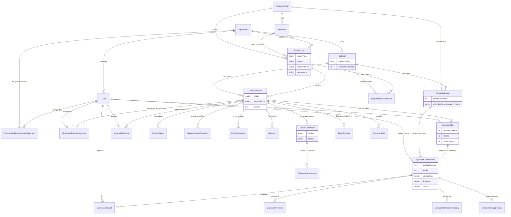

---

## 2. Academic Year & Semester Creation

The COE creates an academic year once per calendar year. The system auto-generates all 8 semesters.

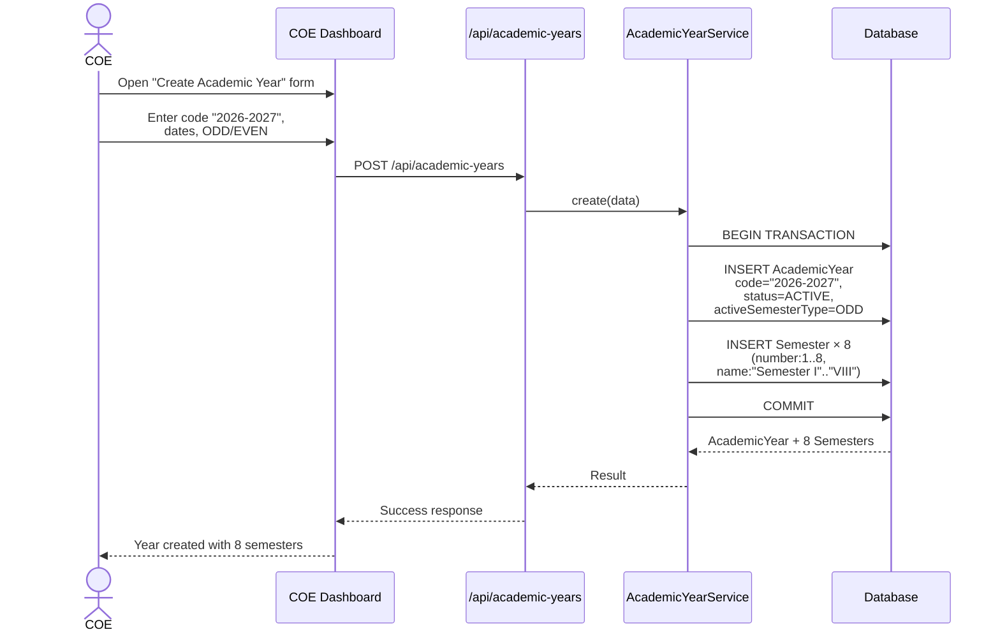

**Key points:**
- 8 semesters (1–8) are auto-generated in the same transaction
- `activeSemesterType` (ODD/EVEN) determines which semesters the UI shows by default
- Semesters are reference data — they never change status independently

---

## 3. Exam Cycle Creation

The COE creates exam cycles per (semester, examType, department). This is the trigger that starts the entire question bank workflow.

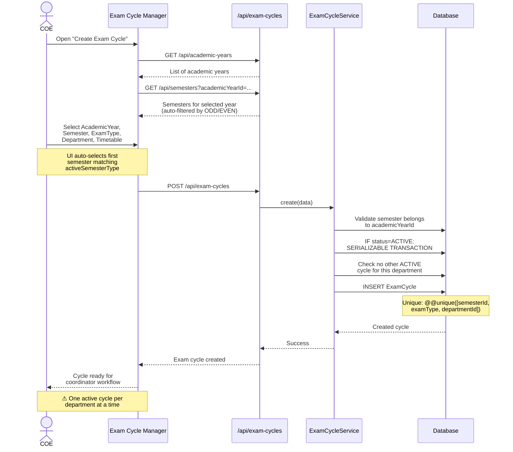

**Key points:**
- Unique constraint: one cycle per (semester, examType, department)
- Only COE can create exam cycles
- Each department can have exactly 1 ACTIVE cycle at a time
- An exam cycle without linked subjects cannot have question banks

---

## 4. Subject → Exam Cycle → Question Bank Initialization

Coordinators create subjects, link them to exam cycles, and initialize question banks.

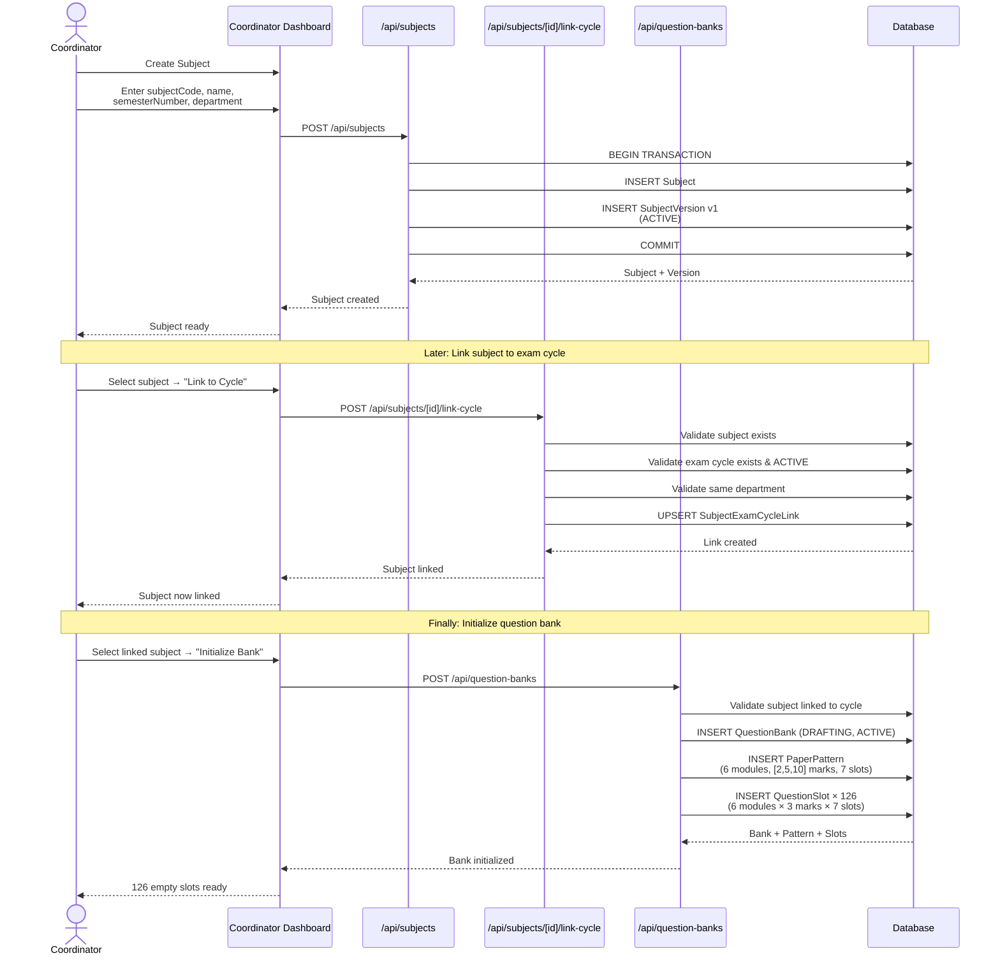

**Key points:**
- Subject + SubjectVersion v1 are created atomically in a transaction
- Linking requires same department on subject and cycle
- Question bank creation auto-generates PaperPattern and all slots
- 126 slots for ENDSEM (6 modules × 3 marks × 7 slots), 63 for ISE

---

## 5. Question Lifecycle

Questions flow through a state machine from creation to approval.

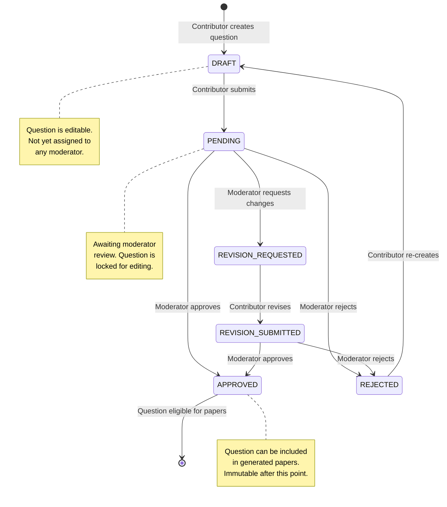

**Key points:**
- Questions are scoped to a SubjectVersion, not a Subject directly
- Once APPROVED, questions are immutable and eligible for paper generation
- REJECTED questions can be re-created as new DRAFTs
- Moderation events are recorded per question for audit

---

## 6. Question Bank Phase Flow

The bank progresses through four workflow phases. Two axes control state: phase (what's happening) and record status (operational state).

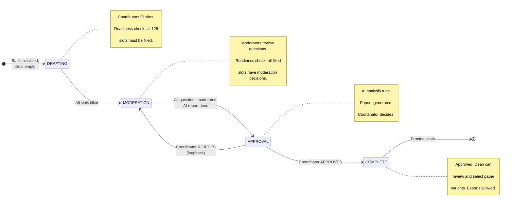

### Orthogonal State: RecordStatus

Independently of phase, a bank can be locked or archived:

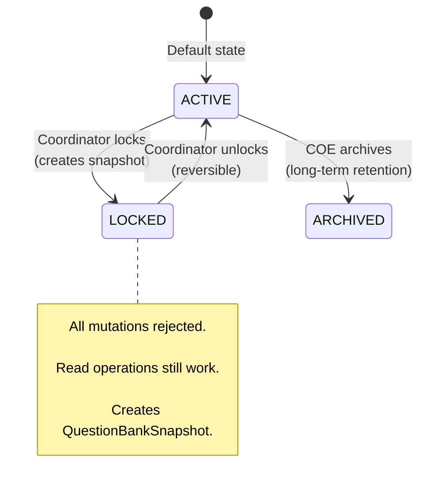

**Key points:**
- Phase and RecordStatus are orthogonal — a bank can be APPROVAL + LOCKED simultaneously
- ReadinessEngine is **advisory only** — coordinator manually advances
- Loopback from APPROVAL → MODERATION is first-class
- Locking creates an immutable snapshot (slot assignments frozen in time)

---

## 7. Paper Generation Flow

Once a bank reaches APPROVAL phase, the coordinator can trigger paper generation.

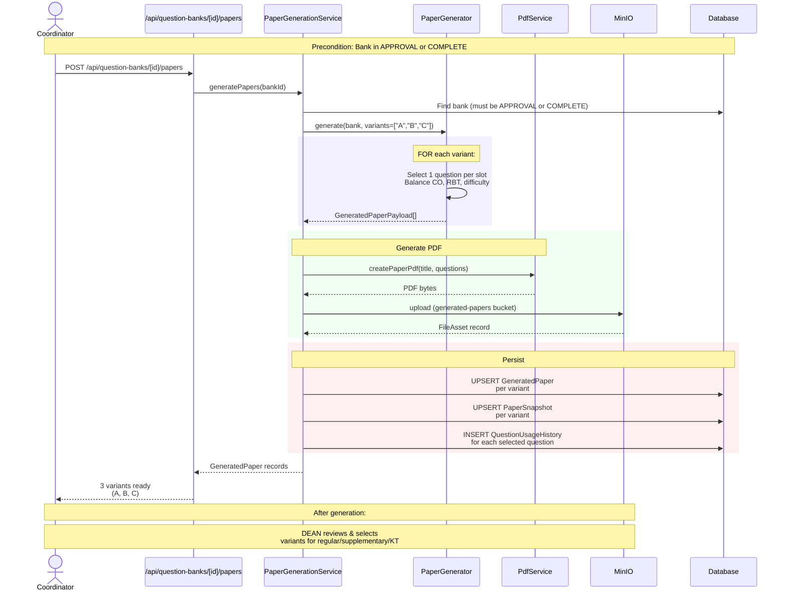

**Key points:**
- 3 variants (A, B, C) are generated simultaneously
- Each variant selects one question per slot, balancing CO/RBT/difficulty
- PDFs uploaded to MinIO `generated-papers` bucket
- PaperSnapshot is upserted (last write wins per variant)
- Usage history is recorded per question

---

## 8. Coordinator Decision Flow

After papers are generated, the coordinator approves or rejects the bank.

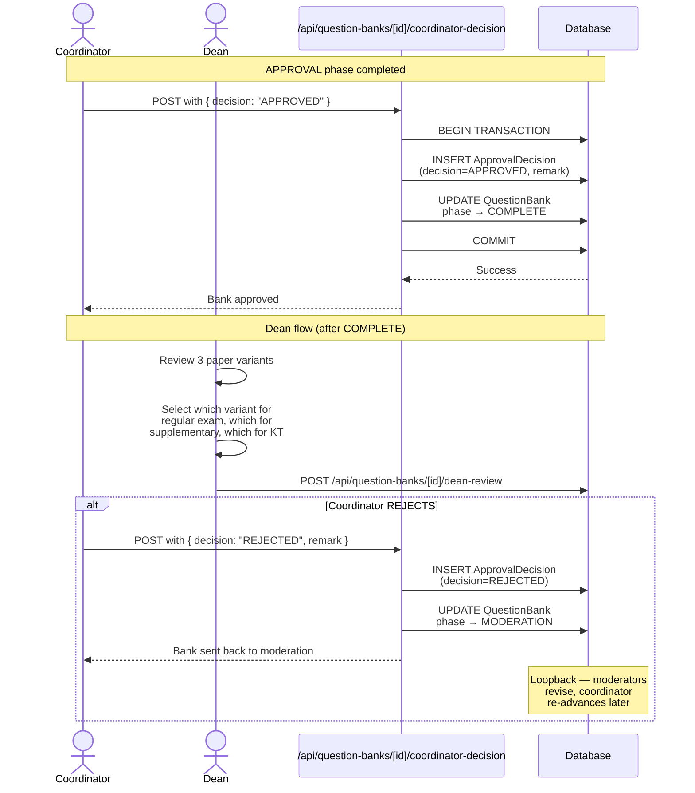

**Key points:**
- ApprovalDecision is write-once (immutable audit record)
- Decision + phase update happen in the same transaction
- Rejection loopback sends bank back to MODERATION for revision
- Dean review is separate — occurs after COMPLETE phase

---

## 9. Complete End-to-End Workflow

The full lifecycle from academic structure setup to final export.

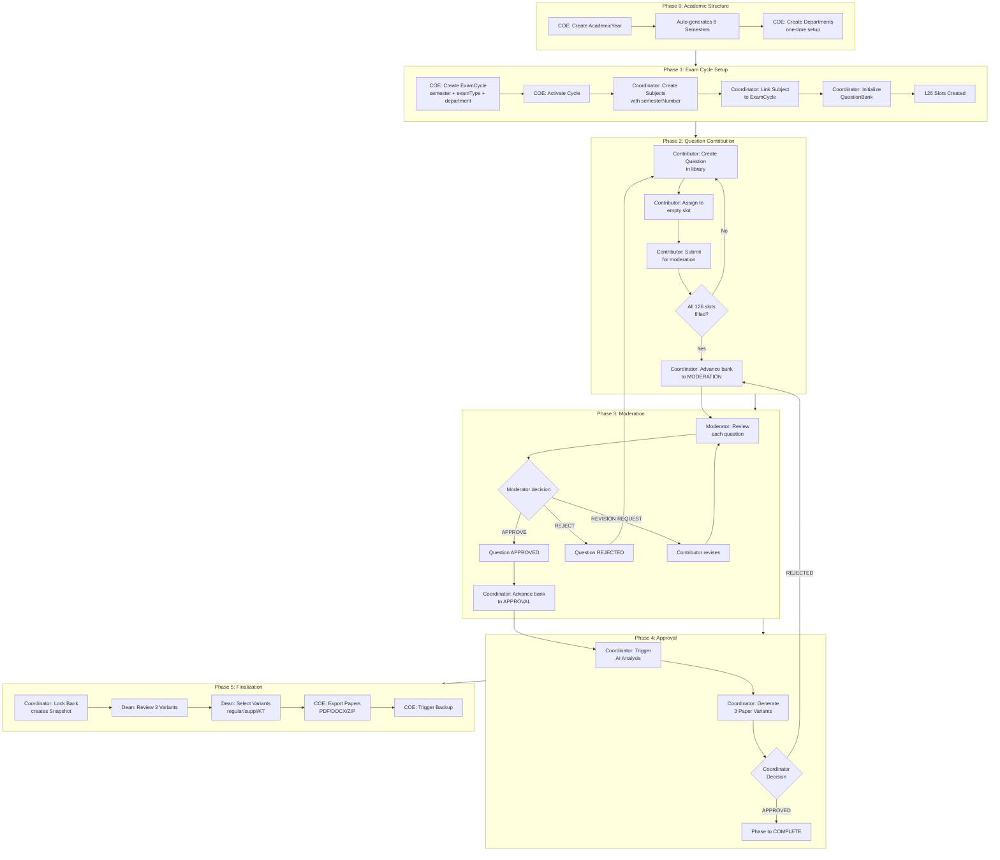

**Key points:**
- 5 distinct phases, each gated by a human decision
- No automatic transitions — all advances are manual
- Each phase has a ReadinessEngine check that reports issues
- The entire cycle repeats every semester for every department

---

## 10. Implicit Batch Progression Over 4 Years

The system does not track batches explicitly. Progression is implicit through which exam cycles are created.

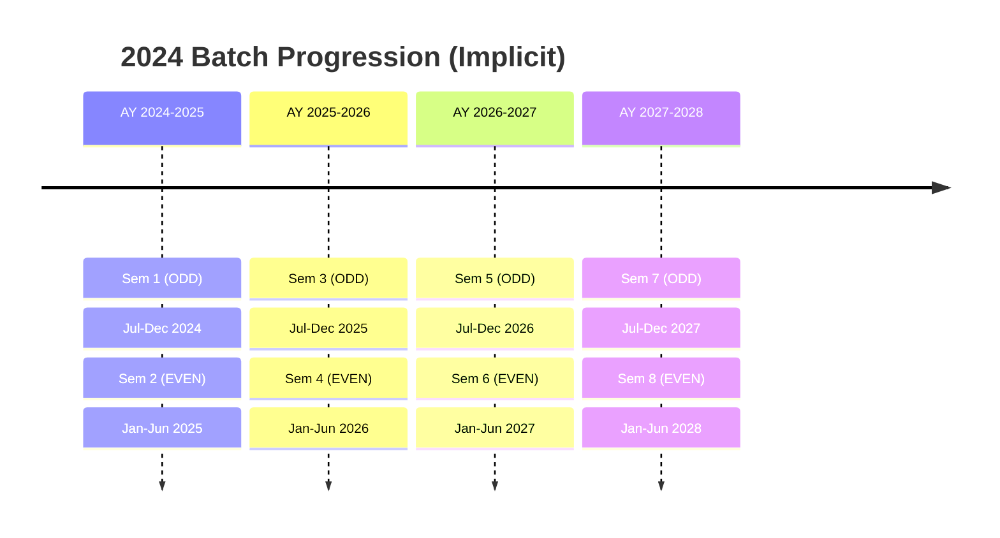

**Each transition requires the COE to:**
1. Create a new AcademicYear (if needed)
2. Create ExamCycles for each department at the new semester
3. Coordinators link subjects and initialize banks

**What happens to the old data:**
- Previous exam cycles remain in the database (historical)
- Previous question banks remain in their terminal phase
- Snapshots preserve the state at lock time
- Nothing is deleted or archived automatically

---

## 11. Actor Responsibility Matrix

Who does what in the workflow.

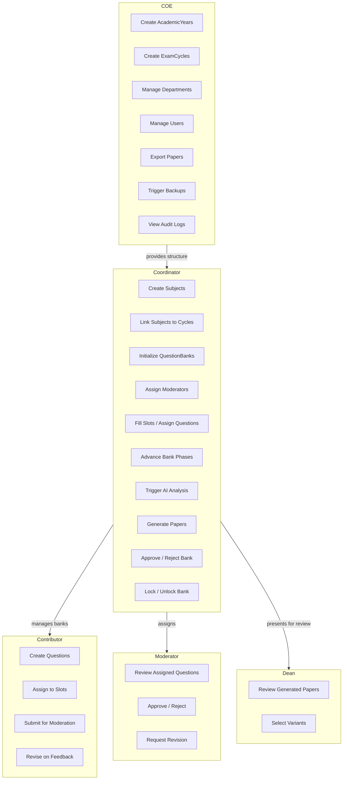

---

## 12. Data Flow Summary

How data moves through the system from creation to final output.

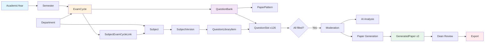

---

## Quick Reference: Slot Template Structure

| Exam Type | Modules | Marks per Module | Slots per (Module, Marks) | Total Slots |
|---|---|---|---|---|
| ENDSEM | 6 | 2, 5, 10 | 7 | 126 |
| SUPPLEMENTARY | 6 | 2, 5, 10 | 7 | 126 |
| KT | 6 | 2, 5, 10 | 7 | 126 |
| ISE_1 | 3 | 2, 5, 10 | 7 | 63 |
| ISE_2 | 3 | 2, 5, 10 | 7 | 63 |

---

## Quick Reference: Unique Constraints

| Entity | Constraint | Purpose |
|---|---|---|
| ExamCycle | `@@unique([semesterId, examType, departmentId])` | One cycle per (semester, type, dept) |
| QuestionBank | `@@unique([subjectId, examCycleId])` | One bank per subject per cycle |
| QuestionSlot | `@@unique([questionBankId, moduleNumber, marks, slotNumber])` | One slot position per bank |
| Subject | `@@unique([subjectCode, departmentId])` | Code unique per department |
| SubjectExamCycleLink | `@@unique([subjectId, examCycleId])` | Subject linked once per cycle |
| Semester | `@@unique([academicYearId, number])` | One semester number per year |
